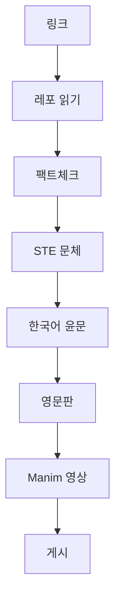

<a href="https://neocello-ku.github.io/how-it-works">Read in English</a>

트렌드 노트는 링크 하나에서 시작합니다. X 게시물, GitHub 레포, 릴리스 페이지 중 하나입니다. 자동화 파이프라인이 그 링크를 한영 두 편의 글과 두 편의 짧은 영상으로 만듭니다. 이 페이지는 단계마다 무엇을 하고 무엇을 검사하는지 설명합니다.

글의 초안은 AI가 씁니다. 대신 모든 주장을 독자가 직접 열어볼 수 있는 출처에 대어보도록 짰습니다.

## 1. 원문 읽기

- X 게시물은 fxtwitter 공개 API로 읽습니다. 로그인하지 않습니다.
- 레포는 얕게 클론합니다. README, 설치 파일, 예제 스크립트, 라이선스만 읽습니다.
- 게시물에 레포가 없으면, 그 글이 쓰는 라이브러리의 공식 레포·문서·최신 릴리스를 대조합니다. 릴리스에 들어 있는지는 문서가 아니라 릴리스 파일로 확인합니다.

## 2. 팩트체크

게시물의 주장마다 표 한 줄을 만듭니다. 주장, 레포나 문서의 실제 내용, 판정입니다.

| 판정 | 뜻 |
|---|---|
| 일치 | 출처도 같은 말을 합니다. |
| 조건 있음 | 맞지만 특정 크기·환경·측정에서만 그렇습니다. |
| 근거 없음 | 출처가 뒷받침하지 않거나, 아직 할 수 없습니다. |

게시물의 숫자는 다시 계산합니다. 게시물의 최상급 표현은 글에 옮기지 않습니다.

**새로운 정도**도 매깁니다. 기법, 인프라, 제품 세 층을 따로 봅니다. 기법은 수십 년 됐어도 제품은 새로울 수 있습니다.

## 3. STE 문체로 쓰기

글은 [ASD-STE100](https://www.asd-ste100.org/)의 80% 수준을 따릅니다. 항공기 정비 매뉴얼을 위해 만든 단순 기술 영어 표준입니다. 한국어판은 이 규칙을 한국어에 맞게 옮겨 씁니다.

- 설명 문장은 60자 이하, 지시 문장은 45자 이하입니다.
- 한 문장에 한 내용, 한 개념에 한 이름입니다.
- 조건을 먼저 씁니다. "GPU가 2장이면, ~하세요."
- 번역투와 과장어를 쓰지 않습니다.

다음 단계로 가기 전에 스크립트가 모든 문장을 검사합니다.

## 4. 한국어 윤문

언어 모델이 쓴 한국어에는 기계가 쓴 티가 납니다. 번역투, 겹치는 쉼표, 단조로운 리듬 같은 것입니다. 그래서 한국어 가이드에만 오픈소스 윤문 도구 [humanize-korean](https://github.com/epoko77-ai/im-not-ai)을 돌립니다.

윤문 뒤에 검사 두 가지를 다시 합니다.

- 보호 검사: 코드 블록, 도표, URL, 숫자, 헤딩, 표 줄 수가 바뀌지 않았는지 봅니다.
- STE 검사: 윤문이 문장을 합쳐 길이를 넘겼으면 다시 나눕니다.

## 5. 영문판

영문 글은 줄 단위 번역이 아니라 처음부터 영어로 씁니다. 섹션, 팩트체크 줄, 판정은 한글판과 같습니다. 영어용 STE 검사를 따로 통과해야 합니다.

## 6. Manim 영상

글마다 언어별로 2분 안팎의 영상이 있습니다. [Manim](https://www.manim.community/)으로 1080p로 렌더링합니다.

영상은 손으로 만든 애니메이션이 아닙니다. 먼저 글에서 짧은 대본을 뽑습니다. 그 대본이 고정된 장면 템플릿 8종을 채웁니다. 제목, 흐름, 연쇄, 단계, 코드, 표, 막대, 요약입니다. 0에서 시작하지 않는 막대그래프에는 확대 표시를 붙입니다. 글자가 화면 밖으로 나가는지 프레임을 뽑아 확인합니다.

## 7. 게시

글은 [Quartz](https://quartz.jzhao.xyz/)로 만든 이 사이트에 올라가고, GitHub Pages로 서비스됩니다. 영어가 메인 사이트이고 한국어는 `/ko` 아래에 있습니다. 대문은 팩트체크 줄을 직접 읽어서, 맨 위 숫자가 늘 현재 합계입니다.

폰에서도 새 글을 요청할 수 있습니다. Slack 봇에 링크를 보내면, 같은 스레드로 글과 영상과 링크가 돌아옵니다.

## 하지 않는 것

- 코드를 실행하지 않습니다. 설치 명령은 README에서 옮긴 것이고, 직접 돌려 보지는 않았습니다. 실제 장비에서 돌려 보는 것이 다음 단계입니다.
- "일치"는 출처가 게시물과 같은 말을 한다는 뜻입니다. 독립 기관이 결과를 재현했다는 뜻은 아닙니다.
- 출처도 틀리거나, 글을 쓴 뒤 바뀔 수 있습니다. 그래서 모든 글에 출처 링크를 답니다.
