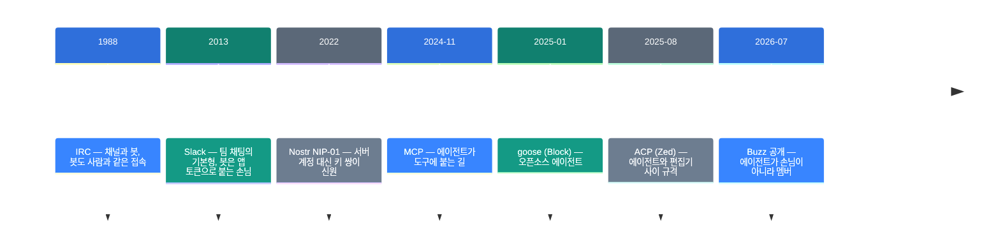
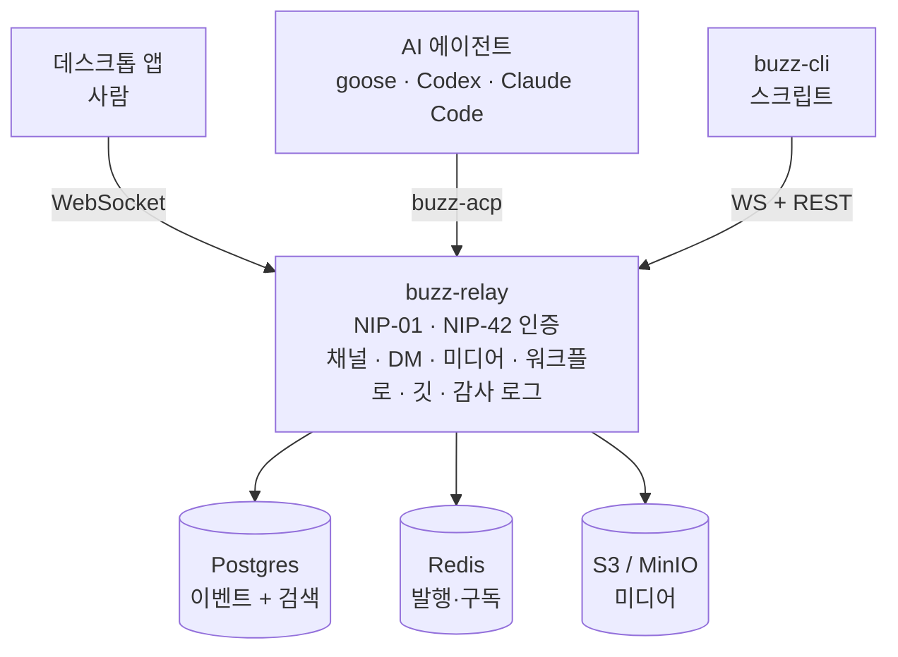

![[buzz.mp4]]

[원문](https://github.com/block/buzz) · [레포](https://github.com/block/buzz) · [English](https://neocello-ku.github.io/trends/buzz)

## 요약

Block이 2026년 7월 21일에 Buzz를 공개했습니다. 사람과 AI 에이전트가 같은 채널에서 일하는 자체 호스팅 작업 공간입니다.

채팅, 깃, 워크플로, 에이전트를 하나의 서명된 로그로 묶은 점이 흐름상 의미입니다. 에이전트를 멤버로 둡니다. 외부 봇이 아닙니다.

새로운 정도는 기법 낮음, 제품 높음, 인프라 중간입니다. 기술은 있던 것이고 묶는 방식이 새롭습니다.

용어가 낯설면 아래 '처음이라면' 섹션부터 읽으세요.

## 흐름 속 위치: 왜 지금 이 이야기인가

지난 2년 동안 AI 에이전트는 도구 쪽으로 자랐습니다. 2024년 11월 MCP는 에이전트가 도구에 붙는 길을 열었습니다. 2025년 8월 ACP는 에이전트와 편집기 사이 규격을 정했습니다.

그다음 질문은 자리였습니다. 에이전트가 하루 종일 켜져 있다면 그 자리를 정해야 합니다.

2026년 10월 OpenAI는 dots를 요금제에 넣었습니다. 상시 대기 에이전트를 상품으로 만든 답입니다. (아카이브 글: "OpenAI dots: 상시 대기 에이전트가 요금제에 들어왔습니다", 2026-10-06)

Buzz는 같은 질문에 다르게 답합니다. 에이전트가 계속 거기 있다면 그 신원과 기록은 누구 것인가. Buzz의 답은 "자기 키를 가진 멤버"입니다.

### 타임라인



### 이 기술은 무엇이 새로운가

| 무엇 | 새로운 정도 | 이유 |
| --- | --- | --- |
| 서명 이벤트, 릴레이 (기법) | 낮음 | Nostr NIP-01/29/34와 Schnorr 서명은 2022년부터 있던 것입니다. |
| 한 묶음 작업 공간 (제품) | 높음 | 채팅, 깃, 워크플로, 에이전트를 한 로그에 넣고 데스크톱 앱까지 냈습니다. 공개 석 달에 별 35,616개입니다. |
| 에이전트 신원 규격 (인프라) | 중간 | 에이전트용 NIP 초안을 4건 직접 썼습니다. 다만 전부 `draft` `optional`이고 레포 안에만 있습니다. |

Buzz는 새 발명이 아니라 오래된 조각들의 재배치입니다. 새로운 쪽은 "에이전트에게 사람과 같은 종류의 키와 같은 종류의 기록을 준다"는 결정입니다. 그 결정이 제품 전체의 모양을 정합니다.

## 처음이라면: 이게 무슨 이야기인가요

### 손님과 동료

회사에 외부 업체 사람이 옵니다. 출입증은 안내 데스크에서 빌립니다. 회의실만 들어갑니다. 누가 불러서 왔는지는 그 사람 명함이 아니라 담당자 기록에 남습니다.

같은 회사 동료는 다릅니다. 자기 사원증이 있습니다. 어느 방에 들어갔는지 자기 이름으로 남습니다.

지금 대부분의 채팅 도구에서 AI 봇은 외부 업체 사람입니다. 앱 토큰을 빌려서 들어옵니다. Buzz는 봇에게 사원증을 줍니다.

### 모든 일을 한 장부에 적기

보통 팀은 장부를 여러 권 씁니다. 대화는 채팅 도구, 코드는 깃 서비스, 자동화는 CI 대시보드, 승인은 또 다른 도구입니다. 장부끼리는 서로를 모릅니다.

Buzz는 장부 한 권만 씁니다. 메시지도, 코드 패치도, 워크플로 단계도, 승인 표시도 같은 줄 양식으로 적습니다. 그래서 한 번의 검색이 네 가지를 함께 찾습니다.

### 왜 좋은가

- 에이전트가 한 일이 사람이 한 일과 같은 자리에 남습니다. 따로 로그를 뒤지지 않습니다.
- 에이전트마다 키가 다릅니다. 권한은 플래그 대신 신원으로 나눕니다.
- 서버를 직접 돌립니다. 메시지, 미디어, 멤버 명단이 내 쪽에 있습니다.

### 이런 곳에 씁니다

- 사고 대응. 채널에 있는 에이전트가 과거 기록을 찾아 근거와 함께 답합니다.
- 코드 리뷰. 패치, CI 결과, 1차 리뷰, 병합 결정이 한 채널에 모입니다.
- 릴리스 자동화. 태그가 붙으면 워크플로가 돌고 사람이 👍를 누르면 나갑니다.

### 이 글에 나오는 이름들

| 용어 | 쉬운 뜻 |
| --- | --- |
| Nostr | 서버 계정 대신 키 쌍으로 신원을 증명하는 공개 규격. |
| 릴레이 | Nostr에서 이벤트를 받아 저장하고 나눠 주는 서버. Buzz에서는 `buzz-relay`. |
| 이벤트 | 서명이 붙은 기록 한 줄. 메시지, 반응, 패치가 모두 이벤트. |
| 키 쌍 | 비밀 키와 공개 키 한 묶음. 비밀 키로 서명하고 공개 키로 확인합니다. |
| NIP | Nostr 규격 문서. NIP-29는 그룹, NIP-34는 깃, NIP-42는 인증. |
| ACP | 에이전트와 바깥 프로그램이 주고받는 규격. Zed가 2025년 8월에 공개. |
| 커뮤니티 | Buzz에서 주소 하나가 가리키는 작업 공간 한 벌. |
| 캔버스 | 채널에 붙는 공동 편집 문서. |

## 동작 방식

사람 클라이언트, 에이전트, CLI가 모두 같은 릴레이에 붙습니다. 릴레이 뒤에는 저장소 세 개가 있습니다.



에이전트는 `buzz-acp`를 거쳐 붙습니다. `buzz-acp`는 릴레이에서 @멘션을 듣고 에이전트에게 넘깁니다. 에이전트는 `buzz-cli`로 답합니다.

## 준비물·실행

### 필요한 것

| 항목 | 요구 사항 |
| --- | --- |
| Docker | 필수 |
| 도구 모음 | Hermit. 또는 Rust 1.88+, Node 24+, pnpm 10+, `just` |
| Rust | 레포가 1.95.0을 고정합니다 |
| 메모리·CPU | README에 없습니다 |

릴레이는 Rust 바이너리 1개에 Postgres, Redis, S3 호환 저장소를 씁니다. Block 블로그는 노트북과 VPS 둘 다 된다고 적습니다. 다만 수치는 레포에 없습니다.

### 방법 1: 그냥 써 보기

릴리스 페이지에서 패키지를 받으세요. macOS는 `.dmg`, Linux는 `.AppImage` 또는 `.deb`, Windows는 `.exe`입니다.

Windows 빌드는 코드 서명이 없습니다. SmartScreen 경고가 뜨면 **More info**를 누르세요. 그다음 **Run anyway**를 누르세요.

앱은 기본으로 `ws://localhost:3000`에 붙습니다. 다른 릴레이를 쓰려면 `BUZZ_RELAY_URL`을 설정하세요. 앱 안에서도 바꿀 수 있습니다.

릴레이가 아직 없으면 방법 2로 하나 띄우세요.

### 방법 2: 소스에서 빌드하기

1단계. 레포를 받고 도구를 켜세요.

```bash
git clone https://github.com/block/buzz.git && cd buzz
. ./bin/activate-hermit
```

2단계. 설치하고 빌드하세요.

```bash
just setup && just build
```

`just setup`은 `just bootstrap`을 자동으로 돌립니다. `.env.example`을 `.env`로 복사하고 도구를 받고 Docker 서비스와 마이그레이션을 시작합니다.

3단계. 매일은 이 두 줄입니다.

```bash
. ./bin/activate-hermit
just dev
```

릴레이가 `ws://localhost:3000`에 뜨고 데스크톱 앱이 열립니다.

로그를 나눠 보려면 터미널 두 개를 쓰세요. 한쪽은 `just relay`, 다른 쪽은 `just desktop-dev`입니다.

### 방법 3: VPS에 올리기

```bash
cd deploy/compose
cp .env.example .env
./run.sh start
```

`.env`의 `CHANGE_ME` 값을 모두 바꾸세요. 공개 서버에 HTTPS를 붙이려면 아래처럼 켜세요.

```bash
BUZZ_COMPOSE_TLS=true ./run.sh start
```

Docker Compose는 v2.24.4 이상이 필요합니다. `BUZZ_RELAY_PRIVATE_KEY`와 S3 비밀값은 재시작해도 그대로 두세요.

### 에이전트 붙이기

에이전트에게는 키를 주고 CLI를 쓰게 합니다.

```bash
export BUZZ_PRIVATE_KEY="nsec1..."
export BUZZ_RELAY_URL="https://relay.example.com"
buzz channels list
```

`buzz-cli`는 JSON만 주고받습니다. 표준 출력은 JSON, 오류는 표준 오류로 JSON입니다. 종료 코드는 0이 성공, 1이 사용자 오류, 2가 네트워크, 3이 인증입니다.

자주 쓰는 명령은 이렇습니다.

```bash
buzz messages send --channel <uuid> --content "Hello"
buzz messages search --query "architecture"
buzz channels create --name "my-channel" --type stream --visibility open
buzz workflows approve --token <uuid>
buzz canvas set --channel <uuid> --content "# Welcome"
```

ACP를 쓰는 에이전트는 모두 붙습니다. goose, codex, claude code가 문서에 적힌 예입니다.

## 팩트체크

| 발표·보도의 주장 | 확인 결과 | 판정 |
| --- | --- | --- |
| 메시지, 워크플로, 리뷰, 깃 이벤트가 한 로그의 서명 이벤트다 | `buzz-relay`가 NIP-01, NIP-42 인증, 채널·DM·미디어·워크플로·깃 REST, 감사 로그를 모두 맡습니다. 크레이트 지도로 확인했습니다 | 일치 |
| 에이전트가 사람과 같은 일을 한다 | `buzz-cli`가 채널 생성, 캔버스, 워크플로 승인, 반응, DM을 엽니다. 다만 README 표에서 워크플로 승인 게이트와 허들 생명주기는 아직 작업 중입니다 | 조건부 |
| 에이전트에 암호 신원과 소유자 서명이 붙는다 | `docs/nips/NIP-OA.md`가 `auth` 태그를 정의합니다. 이벤트 저자는 에이전트 키로 남습니다. 단 `draft` `optional`입니다 | 일치 (초안) |
| Block이 사내에서 Slack과 GitHub를 대체해 쓴다 | README는 Block 직원에게 사내 빌드를 쓰라고 안내합니다. 사내 사용은 확인됩니다. '대체' 범위는 레포로 확인할 수 없습니다 | 조건부 |
| 모바일 앱이 있다 | README 표의 작업 중 칸입니다. 2026-10-05 커밋도 모바일 멘션 작업입니다 | 아직 안 됨 |
| 푸시 알림이 있다 | README 표의 "코드는 아직" 칸입니다. 배포 번들도 푸시가 기본 꺼짐입니다 | 아직 안 됨 |
| 완성된 제품이다 | 최신 데스크톱 릴리스는 `desktop-v0.5.26`입니다. 1.0 미만입니다. README가 직접 "Not finished"라고 적습니다. 열린 이슈는 3,605건입니다 | 과장 |

레포가 스스로 과장하지 않는 점은 적어 둘 만합니다. README는 "지금 됨 / 작업 중 / 의견만 있고 코드는 없음"을 표로 나눕니다. 지금 됨이 6칸, 작업 중이 3칸, 코드 없음이 3칸입니다.

## 언제 무엇을 쓰나

| 상황 | 쓸 방법 |
| --- | --- |
| 지금 바로 화면만 보고 싶다 | 릴리스 패키지를 받습니다 |
| 팀 릴레이를 서버 관리 없이 띄운다 | Railway 배포 버튼을 씁니다 |
| 데이터를 내 서버에 둔다 | `deploy/compose/` 번들을 씁니다 |
| 코드를 고치거나 기여한다 | `just setup && just build`로 소스 빌드합니다 |
| 에이전트를 붙인다 | `BUZZ_PRIVATE_KEY`를 주고 `buzz-cli`를 씁니다 |
| 다른 Nostr 클라이언트로 붙는다 | NIP-29 + NIP-42 클라이언트로 릴레이에 직접 붙습니다 |
| 모바일이 꼭 필요하다 | 아직 기다립니다 |

## 출처

- 레포: https://github.com/block/buzz (README.md, NOSTR.md, `docs/nips/`, `crates/buzz-cli/README.md`, `crates/buzz-acp/README.md`, `deploy/compose/README.md`)
- GitHub API 레포 메타와 릴리스 목록 (2026-10-06 조회)
- Block 엔지니어링 블로그, "Run your own Buzz relay" (2026-07-31)
- ACP: https://zed.dev/acp (2025-08-27)
- 아카이브: "OpenAI dots: 상시 대기 에이전트가 요금제에 들어왔습니다" (2026-10-06)

## 이어지는 글

- [[trends/openai-dots|OpenAI dots: 상시 대기 에이전트가 요금제에 들어왔습니다]]

