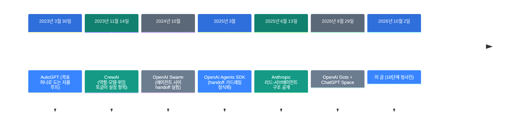
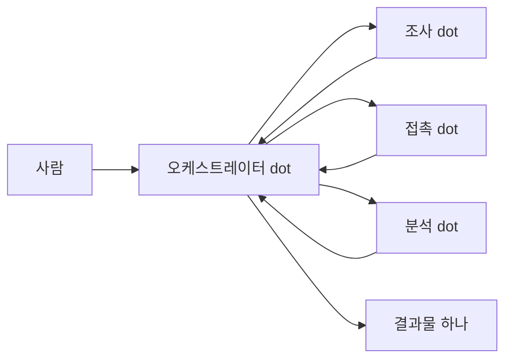
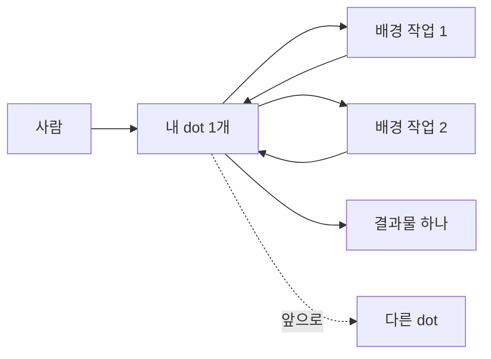

![[dots-blueprint.mp4]]

[원문](https://x.com/0xwhrrari/status/2106021402197319848) · [English](https://neocello-ku.github.io/trends/dots-blueprint)

## 요약

2026년 10월 2일 rari가 OpenAI Dots 운영 설계 10단계를 올렸습니다.

흐름으로 보면 2023년 멀티에이전트 패턴을 2026년 제품 이름으로 다시 쓴 글입니다. 결론부터 말하면 10단계 중 2개는 오늘 제품에 없는 기능을 전제합니다. 용어가 낯설면 아래 "처음이라면" 섹션부터 읽으세요.

## 흐름 속 위치: 왜 지금 이 이야기인가

에이전트 여러 명을 팀으로 묶는 설계는 2023년부터 있었습니다. 바뀐 것은 설계가 아니라 그걸 담는 그릇입니다. 2026년 9월 29일 OpenAI가 Dots를 내면서 그릇이 관리형 상품이 됐습니다.

이 글은 그 사흘 뒤에 나왔습니다.

두 번째 단계를 보세요. CrewAI의 에이전트 속성은 역할, 목표, 배경, 모델, 도구, 위임 토글이었습니다. 이 글의 2단계와 8단계가 그 목록과 거의 같습니다.

다섯 번째 단계도 같습니다. Anthropic은 2025년 6월에 리드 에이전트가 서브에이전트를 띄우는 구조를 공개했습니다. 이 글의 3단계와 4단계가 그 구조입니다.

### 이 기술은 무엇이 새로운가

| 무엇 | 새로운 정도 | 이유 |
| --- | --- | --- |
| 10단계 설계 (기법) | 낮음 | 오케스트레이터-워커와 승인 경계는 2023~2025 공개 패턴입니다. |
| 오늘 실행 가능성 (제품) | 낮음 | dot은 1인당 1개입니다. 모델을 고르는 설정은 없습니다. |
| Dots와 Space (인프라) | 중간 | 상주 에이전트와 공유 작업 공간을 하나로 묶었습니다. |

새 발명이 아닙니다. 2023년 패턴에 2026년 제품 이름을 붙인 글입니다. 그리고 10단계 중 2개는 지금 못 하는 일입니다.

다만 인프라 칸의 공은 OpenAI 몫입니다. 글의 몫이 아닙니다.

### 지난 글과 이어서 보면

지난 글 [OpenAI dots: 상시 대기 에이전트가 요금제에 들어왔습니다](/trends/openai-dots)를 2026-10-06에 썼습니다. 그 글이 이번 글의 전제가 되는 제품을 다룹니다.

[Open Dot: OpenAI Dots를 내 맥에서 돌리기](/trends/open-dot)도 같은 날 썼습니다. 그 글은 같은 제품을 내 컴퓨터로 옮기는 쪽이었습니다.

세 글을 나란히 놓으면 이렇게 읽힙니다. 첫 글은 제품이고 둘째 글은 복제이고 이번 글은 사용법 주장입니다. 셋 다 기법은 새롭지 않다는 결론이 같습니다.

## 처음이라면: 이게 무슨 이야기인가요

### AI 직원 한 명과 AI 회사는 다릅니다

챗봇은 질문에 답합니다. 에이전트는 답 대신 일을 합니다. 메일을 읽고 일정을 잡고 웹사이트에 로그인합니다.

직원이 한 명이면 일을 순서대로 합니다. 여러 명이면 팀장이 일을 쪼개서 나눠 줍니다. 이 글은 두 번째 그림을 그립니다.

OpenAI가 아직 한 명만 판다는 게 문제입니다.

### 왜 한 명보다 여러 명이 낫다고 할까요

- 조사 범위가 넓을 때 각자 다른 방향을 동시에 팝니다.
- 워커마다 자기 맥락만 봅니다. 긴 대화 하나에 섞이지 않습니다.
- 사람이 결과를 복사해서 옮기는 일이 사라집니다.

### 이런 곳에 씁니다

- 경쟁사 10곳을 하룻밤에 조사하고 표 한 장으로 받기
- 아침마다 메일함과 일정을 읽고 할 일 목록 만들기
- 사건이 생기면 조사하고 초안까지 써 두기

### 이 글에 나오는 이름들

| 용어 | 쉬운 뜻 |
| --- | --- |
| dot | 이름과 성격을 붙여 쓰는 상주 에이전트 한 명. |
| 에이전트 | 답만 하지 않고 실제 작업을 대신 하는 프로그램. |
| 오케스트레이터 | 일을 쪼개서 나눠 주고 결과를 합치는 팀장 역할. |
| 워커 | 쪼개진 일 하나를 맡아서 하는 담당자 역할. |
| 위임 | 팀장이 담당자에게 일을 넘기는 행동. |
| 맥락 격리 | 담당자마다 자기 일에 필요한 내용만 보게 막는 것. |
| 플러그인 | dot이 외부 앱을 쓰게 붙이는 연결 장치. |
| Custom Rules | 어떤 행동을 묻고 어떤 행동을 막을지 적는 규칙. |
| Auto-review | 행동 전에 규칙과 대조하는 별도 검사 장치. |
| 선제 조사 | 시키지 않아도 dot이 배경에서 읽고 메모하는 일. |
| ChatGPT Space | 사람과 dot이 같은 문서를 함께 고치는 공유 공간. |

## 동작 방식

글이 그린 구조는 이렇습니다.

오늘 Dots에서 실제로 되는 구조는 이렇습니다.

모양은 닮았습니다. 네모 안에 들어가는 것이 다릅니다.

글에서는 워커가 각각 독립된 dot입니다. 오늘은 워커가 내 dot 하나가 띄운 배경 작업입니다. 둘은 권한도 요금도 다릅니다.

배경 작업에도 승인 규칙과 Auto-review가 그대로 걸립니다. 이건 공식 문서가 밝힌 내용입니다.

## 오늘 할 수 있는 것과 없는 것

10단계를 그대로 따라 하면 두 곳에서 막힙니다. 막히는 지점을 먼저 보고 순서를 다시 짜세요.

### dot 하나에 실제로 설정하는 항목

| 항목 | 있나 | 내용 |
| --- | --- | --- |
| 이름·아바타·펫 | 있음 | 기본 핸들은 `@내이름-dot`입니다. |
| 목표 | 있음 | 설정 화면이 아니라 대화로 줍니다. |
| 연결 앱 | 있음 | 권한을 ChatGPT·Work·Codex와 **공유**합니다. |
| dot 전용 Slack 계정 | 있음 | 전용 이메일 주소는 출시 시점에 없습니다. |
| Custom Rules | 있음 | 4가지 중 하나를 고릅니다. 아래 표를 보세요. |
| 예약 작업 | 있음 | 대화로 걸고 Scheduled에서 고칩니다. |
| 이벤트 트리거 | 없음 | 공식 문서에 없습니다. |
| 모델 선택 | 없음 | GPT-6 Astra 하나입니다. |
| 업무 방식 항목 | 없음 | 메모리가 그 자리를 대신합니다. |

### Custom Rules의 네 가지 값

| 값 | 뜻 |
| --- | --- |
| 묻지 않고 실행 | 매번 그냥 합니다. |
| 사전 승인 시 실행 | 내가 프롬프트에서 명시했을 때만 합니다. |
| 실행 전 확인 | 할 때마다 묻습니다. |
| 사람에게 넘김 | dot이 멈추고 내가 직접 마칩니다. |

비밀번호 변경과 송금은 규칙과 무관하게 항상 사람이 합니다. 이 경계는 Custom Rules로 못 바꿉니다.

### 순서를 이렇게 바꾸세요

1. dot에 좁은 목표 하나를 주세요.
2. 필요한 앱만 좁게 연결하세요.
3. Custom Rules로 승인 경계를 먼저 정하세요.
4. 반복 작업은 대화로 예약하세요.
5. 공유할 내용은 ChatGPT Space 페이지에 두세요.
6. 위임은 한 dot 안에서만 쓰세요.

예약한 작업은 Scheduled에서 주기를 확인하세요. 배경 작업은 Activity View에서 보입니다.

글의 3단계와 8단계는 건너뛰세요. 오늘 그 두 가지는 제품에 없습니다.

## 팩트체크

게시물의 10단계를 공식 발표문과 공식 도움말 2편에 대조했습니다.

| 주장 | 확인 결과 | 판정 |
| --- | --- | --- |
| 1. 자기 브라우저·파일·메모리를 가진 상주 환경 | 공식 문서와 일치합니다. | 일치 |
| 2. dot마다 영역·전용 출처·업무 방식·승인 경계·트리거 | 5개 중 1개만 설정 항목입니다. | 과장 |
| 3. 오케스트레이터 dot이 전문가 dot에게 위임 | 오늘은 dot이 1인당 1개입니다. | 근거 없음 |
| 4. 격리 위임, 워커가 구조화된 결과를 반환 | 한 dot 안에서만 됩니다. | 조건부 |
| 5. Slack·Teams·Workspace·내부 API 연결 | 됩니다. 앱 목록은 비공개입니다. | 일치 |
| 6. 반복 루틴과 이벤트 트리거 | 반복만 됩니다. 이벤트 트리거는 없습니다. | 조건부 |
| 7. 되돌릴 수 있는 일만 자동화 | 제품 기본값이 이미 그렇습니다. | 일치 |
| 8. 일의 값어치에 모델을 맞춰라 | 모델을 고르는 설정이 없습니다. | 근거 없음 |
| 9. 회사 공유 메모리를 한 곳에 | dot 메모리로는 안 됩니다. Space가 합니다. | 조건부 |
| 10. 루프를 매출에 연결하라 | 제품 기능이 아니라 운영 제안입니다. | 제안 |
| 24시간 도는 AI 회사를 만든다 | 오늘 살 수 있는 dot은 1개입니다. | 과장 |

### 3단계: dot 팀은 아직 못 만듭니다

발표문은 "오늘은 첫 dot으로 시작한다"라고 씁니다. 그다음 문장이 "앞으로 dot 팀이 함께 일하는 모습을 그린다"입니다. 도움말도 "앞으로 dot을 더 추가할 수 있게 된다"라고 씁니다.

전담 역할을 맡은 specialist dots는 따로 있습니다. 단 그건 OpenAI 엔지니어가 직접 붙는 기업 파일럿입니다. 일반 사용자가 만들 수 없습니다.

추가 dot의 가격도 아직 공개되지 않았습니다.

### 8단계: 모델을 고를 수 없습니다

dot의 모델은 GPT-6 Astra 하나입니다. 발표문, 도움말, 개인정보 FAQ 어디에도 모델 선택이 없습니다.

이 습관이 어디서 왔는지는 분명합니다. CrewAI는 2023년 11월부터 에이전트마다 `model` 속성을 받았습니다. 직접 조립하던 시절에는 당연한 설정이었습니다.

관리형 상품이 되면서 그 손잡이가 사라졌습니다. 글은 사라진 손잡이를 돌리라고 말합니다.

### 2단계: 전용 출처를 못 줍니다

개인정보 FAQ가 분명히 적습니다. 플러그인 권한은 dot, ChatGPT, ChatGPT Work, Codex가 공유합니다.

그래서 "이 dot은 이 자료만 본다"를 만들 수 없습니다. 연결한 앱은 내 dot이 전부 봅니다. 쓸 수 있는 분리는 dot 전용 Slack 계정 하나입니다.

### 9단계: 메모리가 아니라 Space입니다

dot 메모리는 개별 항목을 볼 수도 고칠 수도 없습니다. 지우려면 dot 자체를 삭제해야 합니다. 회사 사양서를 넣을 곳이 아닙니다.

공유 작업 공간은 ChatGPT Space가 맡습니다. Dots와 같은 날 나왔고 Library를 대체합니다. 사람과 dot이 같은 페이지를 함께 고칩니다.

글은 Space를 언급하지 않습니다. 맞는 처방을 틀린 약병에 붙인 셈입니다.

### 비용은 아무도 모릅니다

Anthropic은 2025년 6월에 숫자 하나를 공개했습니다. 리드-서브에이전트 구조는 보통 대화의 약 15배 토큰을 썼습니다. 그 글의 결론은 "값어치 있는 작업에만 쓰라"였습니다.

Dots의 "깊은 작업" 할당량은 숫자가 공개되지 않았습니다. 확장 한도도 2026년 10월 말까지입니다.

그래서 10단계를 전부 돌렸을 때 얼마가 나오는지 계산할 방법이 없습니다.

### 그래도 맞는 말 세 가지

1. 자동화 경계를 "되돌릴 수 있는가"로 나눈 기준은 좋습니다. Dots 기본값도 같은 기준입니다.
2. 사람이 에이전트 사이에서 결과를 나르는 구조는 병목이 맞습니다.
3. "범용 도우미는 맥락이 없는 역할이다"라는 문장도 맞습니다.

## 언제 무엇을 쓰나

| 상황 | 방법 |
| --- | --- |
| 지금 당장 상주 에이전트를 써야 한다 | Dots 1개로 좁은 역할부터. 3·8단계는 빼세요. |
| 에이전트 여러 명을 지금 팀으로 묶어야 한다 | CrewAI나 Agents SDK로 직접 조립합니다. |
| 역할마다 모델과 비용을 다르게 가야 한다 | Dots로는 안 됩니다. 직접 조립 쪽입니다. |
| 사건이 생길 때 깨우는 트리거가 필요하다 | Dots에 없습니다. 외부 트리거 서비스를 붙이세요. |
| 사람과 에이전트가 같은 문서를 고쳐야 한다 | ChatGPT Space. dot 메모리가 아닙니다. |
| 월 100달러를 내기 전에 구조부터 보고 싶다 | 이 글의 2·4·7단계만 읽으세요. 그건 제품과 무관합니다. |

## 출처

- [게시물: rari, 2026-10-02](https://x.com/0xwhrrari/status/2106021402197319848)
- [OpenAI: Introducing dots](https://openai.com/index/introducing-dots/)
- [OpenAI 도움말: Getting started with your dot](https://help.openai.com/en/articles/20001530-getting-started-with-your-dot)
- [OpenAI 도움말: Dots privacy, security, and safety FAQs](https://help.openai.com/en/articles/20001529-dots-privacy-security-and-safety-faqs)
- [Anthropic: 멀티에이전트 리서치 구조 (2025-06-13)](https://www.anthropic.com/engineering/multi-agent-research-system)
- [CrewAI (2023-11-14)](https://en.wikipedia.org/wiki/CrewAI)
- [VentureBeat: Dots와 ChatGPT Space](https://venturebeat.com/technology/openai-launches-dots-always-on-ai-agent-coworkers-and-chatgpt-space-where-they-can-collaborate-with-human-teams)

## 이어지는 글

- [[trends/openai-dots|OpenAI dots: 상시 대기 에이전트가 요금제에 들어왔습니다]]
- [[trends/open-dot|Open Dot: OpenAI Dots를 내 맥에서 돌리기]]

