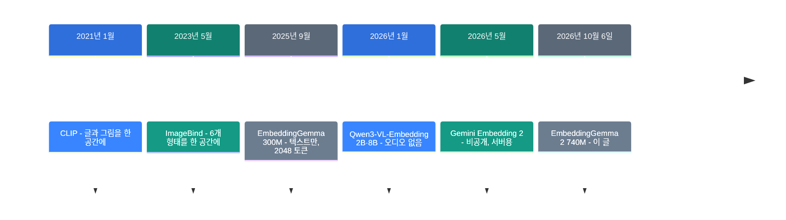
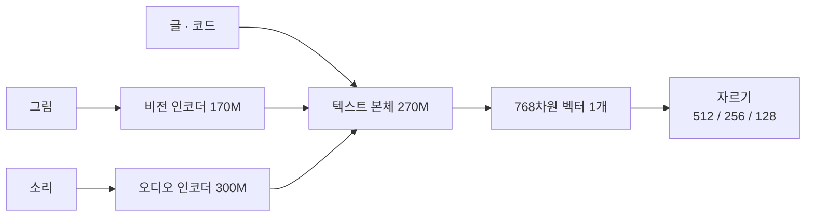

![[embeddinggemma-2.mp4]]

[원문](https://blog.google/innovation-and-ai/technology/developers-tools/embeddinggemma-2/) · [English](https://neocello-ku.github.io/trends/embeddinggemma-2)

## 요약

2026년 10월 6일, 구글이 EmbeddingGemma 2를 공개했습니다. 글, 코드, 그림, 영상, 소리를 같은 768차원 벡터 공간에 넣는 740M 모델입니다.

흐름으로 보면, CLIP이 연 "여러 형태를 한 공간에" 계보가 휴대폰 크기까지 내려온 자리입니다. 기법 자체는 새롭지 않습니다. 새로운 것은 크기와 라이선스입니다.

용어가 낯설면, 아래 "처음이라면" 섹션부터 읽으세요.

## 흐름 속 위치: 왜 지금 이 이야기인가

검색은 지금 두 방향으로 갈라지고 있습니다. 한쪽은 더 큰 모델을 서버에 두는 길입니다. 다른 한쪽은 작은 모델을 기기 안에 넣는 길입니다.

EmbeddingGemma 2는 두 번째 길에 섰습니다. 그런데 이번에는 글만이 아닙니다. 소리와 영상까지 같은 좌표계에 넣습니다.



이 글은 여섯 번째 단계에 있습니다. 비공개 모델이 5월에 보여 준 설계를, 5개월 뒤 공개 가중치로 내린 자리입니다.

### 이 기술은 무엇이 새로운가

| 무엇 | 새로운 정도 | 이유 |
| --- | --- | --- |
| 여러 형태를 한 공간에 (기법) | 낮음 | CLIP(2021)과 ImageBind(2023)에서 왔습니다. 차원 자르기(MRL)도 2022년 논문입니다. |
| 1B 미만 + 오디오 + Apache 2.0 (제품) | 높음 | 1B 미만 공개 모델이 소리까지 한 공간에 넣은 예를 찾지 못했습니다. 1세대는 Gemma 약관에 접근 승인까지 필요했습니다. |
| 인코더 떼었다 붙이기 (인프라) | 중간 | 쓰는 형태만 메모리에 올립니다. 다만 오디오 경로는 아직 런타임에 다 열려 있지 않습니다. |

이 모델은 새 발명이 아닙니다. 5년 된 아이디어가 휴대폰에 들어갈 크기로 줄고 승인 없이 쓸 수 있는 라이선스를 얻은 사건입니다.

지난 글과도 이어집니다. [Strata](/trends/strata)(2026-10-06)는 125B 모델을 게임용 PC로 끌어내렸습니다. 방향은 반대지만 목적지가 같습니다. [로컬 LLM에게 답을 고르게 하기](/trends/jev-local)(2026-10-06)는 로컬 모델에게 생성 말고 다른 일을 시켰습니다. 임베딩도 같은 계열입니다.

## 처음이라면: 이게 무슨 이야기인가요

### 임베딩은 뜻을 좌표로 바꾸는 일입니다

도서관을 떠올려 보세요. 사서는 책을 아무 데나 꽂지 않습니다. 요리책은 요리책 옆에, 여행책은 여행책 옆에 둡니다.

임베딩 모델은 이 일을 숫자로 합니다. 문장 하나를 숫자 768개로 바꿉니다. 뜻이 비슷하면 숫자도 비슷해집니다.

이 숫자 묶음을 **벡터**라고 부릅니다. 두 벡터가 얼마나 같은 쪽을 보는지 재면, 두 글이 얼마나 비슷한지 나옵니다.

### 이번 모델의 새로운 점은 '한 서가'입니다

지금까지는 글은 글끼리, 그림은 그림끼리 비교했습니다. 서가가 따로 있었습니다.

EmbeddingGemma 2는 서가를 하나로 합쳤습니다. "파도 소리"라고 적은 글과, 실제 파도 소리 녹음이 가까운 자리에 놓입니다.

그래서 말로 물어보고 영상을 찾을 수 있습니다. 녹음으로 물어보고 사진을 찾을 수도 있습니다.

### 좋은 점 3가지

- 기기 안에서 끝납니다. 사진과 녹음이 밖으로 나가지 않습니다.
- 작습니다. 텍스트만 쓰면 2억 7천만 개짜리 부분만 올립니다.
- 벡터를 짧게 자를 수 있습니다. 768개를 256개로 줄여도 글 검색 품질이 거의 그대로입니다.

### 이런 곳에 씁니다

- 휴대폰 사진첩에서 "비 오는 날 강아지"라고 쳐서 찾기
- 회의 녹음 3시간에서 한 대목을 말로 찾기
- 내 코드 저장소에서 설명문으로 함수 찾기

### 이 글에 나오는 이름들

| 용어 | 쉬운 뜻 |
| --- | --- |
| 임베딩 | 글이나 그림의 뜻을 숫자 목록으로 바꾼 것. |
| 벡터 | 그 숫자 목록. 여기서는 숫자 768개. |
| 차원 | 벡터에 든 숫자의 개수. |
| MRL | 벡터 앞부분만 남겨도 뜻이 유지되게 학습하는 방법. |
| 인코더 | 그림이나 소리를 모델이 읽을 형태로 바꾸는 부품. |
| 토큰 | 모델이 한 번에 세는 조각. 글자, 이미지 조각, 소리 구간. |
| 작업 접두사 | 입력 앞에 붙이는 짧은 안내문. 예: `task: search result \| query:` |
| bfloat16 | 숫자를 16비트로 줄여 담는 방식. 범위가 넓습니다. |
| MTEB · MMEB · MAEB | 글, 이미지, 소리 임베딩을 재는 공개 시험지. |

## 동작 방식

입력이 무엇이든 끝에는 벡터 하나만 남습니다.



세 인코더는 따로 떼어낼 수 있습니다. 쓰는 것만 올리면 메모리가 줄어듭니다.

| 쓰는 형태 | 크기 |
| --- | --- |
| 텍스트만 | 270M |
| 텍스트 + 그림 | 440M |
| 텍스트 + 소리 | 570M |
| 전부 | 740M |

한 입력 안에 여러 형태를 섞을 수도 있습니다. 글 안에 `<|image|>`, `<|video|>`, `<|audio|>`를 적으면 그 자리에 매체가 들어갑니다. 결과는 여전히 벡터 하나입니다.

### 8,192 토큰을 나눠 씁니다

모든 형태가 한 문맥 창을 같이 씁니다. 형태마다 값이 정해져 있습니다.

| 형태 | 비용 | 혼자 넣을 때 최대 |
| --- | --- | --- |
| 텍스트 | 서브워드 1개당 1토큰 | 8,192토큰 |
| 이미지 | 장당 280토큰 | 약 29장 |
| 영상 | 프레임당 140토큰 | 약 58프레임 |
| 오디오 | 초당 25토큰 | 약 327초 |

섞어 넣으면 예산을 나눠 씁니다. 영상은 기본값이 초당 1프레임입니다. 오디오는 16kHz 모노로 넣습니다.

## 준비물과 실행

### 준비물

| 항목 | 요구 사항 |
| --- | --- |
| 메모리 | 모델 카드에 요구 사항 표가 없습니다. bf16 가중치가 1.49GB이므로 2~3GB로 추정합니다. |
| Python 패키지 | sentence-transformers 6.1.0 이상, transformers 5.18 이상 |
| 정밀도 | bfloat16 또는 float32. float16은 쓰지 마세요. |
| 라이선스 | Apache 2.0. 접근 승인이 없습니다. |

### 1단계. 설치하세요

```bash
pip install -U "sentence-transformers[image,audio,video]" transformers
```

### 2단계. 글 두 개를 비교해 보세요

```python
from sentence_transformers import SentenceTransformer

model = SentenceTransformer("google/embeddinggemma-2")

query = "What causes the northern lights?"
document = "The northern lights are caused by charged particles from the sun."

query_emb = model.encode(query, prompt_name="SearchQuery")
doc_emb = model.encode(document, prompt_name="Document")
print(model.similarity(query_emb, doc_emb))
```

`prompt_name`은 작업 접두사를 고릅니다. 질의에는 `SearchQuery`, 문서에는 `Document`를 씁니다. 접두사를 빼도 돌아가지만 품질이 떨어집니다.

제목이 있는 문서는 직접 형식을 맞추세요. `title: {제목} | text: {본문}` 입니다. `prompt_name="Document"`는 제목 자리에 `none`을 넣습니다.

### 3단계. 쓰지 않는 인코더를 끄세요

```python
text_only = SentenceTransformer(
    "google/embeddinggemma-2",
    config_kwargs={"vision_config": None, "audio_config": None},
)
```

이것은 메모리를 줄입니다. 내려받는 용량은 줄지 않습니다. Hugging Face 저장소에는 1.49GB 파일 하나만 있습니다.

### 4단계. 말로 그림과 소리를 찾아보세요

```python
image_emb = model.encode({"image": "sunset_beach.jpg"})
audio_emb = model.encode({"audio": "ocean_waves.wav"})
query_emb = model.encode("ocean waves at sunset", prompt_name="SearchQuery")

print(model.similarity(query_emb, image_emb))
print(model.similarity(query_emb, audio_emb))
```

매체 입력에는 접두사를 붙이지 않습니다. 접두사는 글에만 붙입니다.

### 5단계. 벡터를 짧게 자르세요

```python
emb = model.encode(query, prompt_name="SearchQuery",
                   truncate_dim=256, normalize_embeddings=True)
```

`normalize_embeddings=True`를 꼭 켜세요. 벡터를 자르면 길이가 1이 아닙니다. 정규화를 빼면 오류 없이 순위만 나빠집니다.

질의와 문서는 차원이 같아야 합니다. 768차원 질의를 128차원 색인에 쓸 수 없습니다.

### 내려받기 없이 가볍게 쓰려면

Ollama에는 크기별 태그가 따로 있습니다.

```bash
ollama pull embeddinggemma-2:270m
ollama pull embeddinggemma-2:740m
```

llama.cpp용 GGUF는 텍스트와 매체를 파일로 나눕니다. 텍스트 Q8_0은 309.9MB입니다. 비전과 오디오를 담은 mmproj Q8_0은 554.8MB입니다.

## 팩트체크

| 발표문의 주장 | 확인 결과 | 판정 |
| --- | --- | --- |
| 1세대를 2천만 회 이상 내려받았다 | HF API 누적 2,079만 9,432회 (2026-10-07 조회) | 일치 |
| 740M = 텍스트 270M + 비전 170M + 오디오 300M | 가중치 파일 1,488.9MB ÷ 2바이트 ≈ 7.44억 | 일치 |
| 8K 문맥, 1세대의 4배 | 1세대 설정값 2048, 이번 8192. 정확히 4배 | 일치 |
| 오디오 5.5분 · 이미지 29장 · 영상 58프레임 | 직접 계산: 327.7초, 29.3장, 58.5프레임 | 일치 |
| 저장 공간 최대 6배 절감 | 768÷128 = 6. 단 128차원에서 MMEB가 59.01→45.65 | 조건부 |
| MTEB Code 68.76 → 78.68 | 모델 카드와 같습니다. 상승률 14.4% | 일치 |
| Apache 2.0, 상업 이용 가능 | 접근 승인 없음. 1세대는 Gemma 약관 + 승인 필요 | 일치 |
| 크기 대비 최고, 더 큰 모델도 따라잡는다 | MMEB v2 전체는 59.01입니다. Qwen3-VL-Embedding-2B는 73.2입니다 | 과장 |
| Pixel 11 Pro에서 191MB / 567MB | 블로그에만 있습니다. 양자화 방식을 밝히지 않았습니다 | 근거 미공개 |
| Ollama 등에서 바로 서빙 | 태그 17개 모두 입력이 Text 또는 Text, Image입니다 | 조건부 |
| 다국어 텍스트는 1세대 수준 유지 | 61.36 대 61.15. 차이 0.21점 | 일치 |

### 숫자를 조금 더 떼어 봅니다

"더 큰 모델도 따라잡는다"는 문장은 형태마다 다릅니다. 이미지와 영상에서는 맞지 않습니다. 2026년 1월에 나온 Qwen3-VL-Embedding-2B는 MMEB v2 전체 73.2입니다. 이 모델은 59.01입니다. 크기 차이는 약 2.7배입니다.

반대로 코드는 설득력이 있습니다. 비공개 상위 모델인 Gemini Embedding 2가 MTEB Code 84.0입니다. 이 모델은 78.68로, 93.7% 수준입니다. 크기는 비교가 안 될 만큼 작습니다.

오디오는 판정하기 이릅니다. MAEB 논문(2026년 2월)은 모델 53개를 쟀습니다. 거기서 Whisper-medium 전체 평균이 46.7%였습니다. 이 모델의 MAEB 점수는 49.39입니다. 다만 집계 방식이 달라서 순위를 단정할 수 없습니다.

텍스트만 쓸 생각이라면 다른 후보도 재 보세요. Qwen3-Embedding-0.6B는 다국어 점수로 64.33을 보고했습니다. 시험지 판이 달라 나란히 놓을 수는 없지만 글만 다룰 때 이 모델이 자동으로 1위는 아닙니다.

### 미리 알아 둘 함정 두 가지

- float16으로 돌리면 NaN이 나오거나 품질이 조용히 떨어집니다. 모델 카드가 직접 경고합니다.
- Ollama 태그 페이지는 문맥 창을 256K로 적고 있습니다. 모델 카드의 실제 값은 8,192 토큰입니다. 8K를 기준으로 설계하세요.

## 언제 무엇을 쓰나

| 상황 | 쓸 방법 |
| --- | --- |
| 기기 안에서 글만 검색한다 | 텍스트 전용 270M, 256차원 |
| 사진첩을 말로 찾는다 | 텍스트 + 비전 440M |
| 녹음을 말로 찾는다 | 텍스트 + 오디오 570M |
| 영상·이미지 검색 품질이 최우선이다 | 더 큰 전용 모델을 먼저 재 봅니다 |
| 벡터 저장 비용이 문제다 | 256차원으로 자릅니다. 128차원은 글에서만 |
| 서버에서 최고 품질이 필요하다 | 비공개 상위 모델을 씁니다 |

## 출처

- [Google 공식 발표: EmbeddingGemma 2](https://blog.google/innovation-and-ai/technology/developers-tools/embeddinggemma-2/)
- [Hugging Face 모델 카드: google/embeddinggemma-2](https://huggingface.co/google/embeddinggemma-2)
- [Google 개발자 가이드: EmbeddingGemma 2](https://developers.googleblog.com/embeddinggemma-2-the-developer-guide/)
- [Gemma 공식 문서](https://ai.google.dev/gemma/docs/embeddinggemma)
- [Ollama 라이브러리: embeddinggemma-2](https://ollama.com/library/embeddinggemma-2)
- [llama.cpp GGUF 빌드](https://huggingface.co/ggml-org/embeddinggemma-2-GGUF)
- [Qwen3-VL-Embedding 논문 (2026-01)](https://arxiv.org/abs/2601.04720)
- [Gemini Embedding 2 논문 (2026-05)](https://arxiv.org/abs/2605.27295)
- [MAEB 논문 (2026-02)](https://arxiv.org/abs/2602.16008)

## 이어지는 글

- [[trends/strata|Strata: 125B 모델을 게임용 PC에서]]
- [[trends/jev-local|로컬 LLM에게 글 대신 답을 고르게 하기]]

