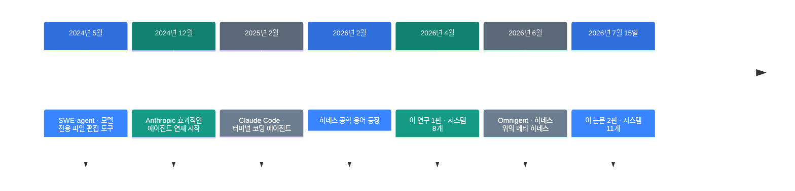
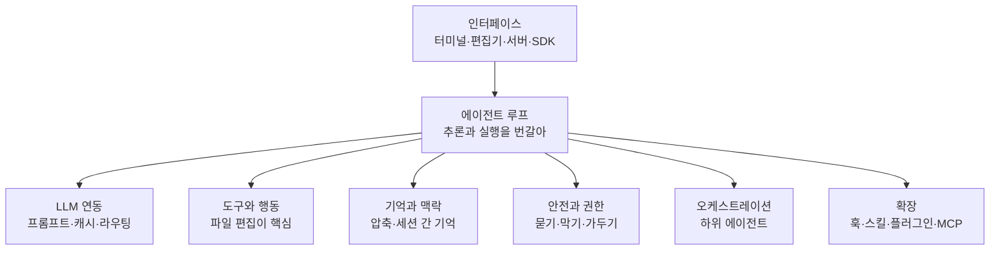

![[harness-engineering.mp4]]

[원문](https://x.com/polydao/status/2107347369763156099) · [English](https://neocello-ku.github.io/trends/harness-engineering)

## 요약

2026년 7월, 코딩 에이전트 11개의 소스 코드를 읽은 논문이 나왔습니다. Claude Code, Codex, Gemini CLI를 같은 7개 칸으로 나눠 비교합니다.

흐름으로 보면, "하네스 공학"이 말에서 근거로 넘어가는 장면입니다. 이 분야는 2026년 2월에 이름을 얻었고, 이 논문이 첫 대규모 소스 조사입니다.

결론부터 말하면, 새 기법은 없습니다. 새것은 11개 제품을 같은 자로 재서 권고 18개로 묶은 방법론입니다. 용어가 낯설면, 아래 "처음이라면" 섹션부터 읽으세요.

## 흐름 속 위치: 왜 지금 이 이야기인가

코딩 에이전트는 2024년부터 있었습니다. 그 뒤로 논의의 무게 중심이 옮겨 갔습니다.

2025년까지 사람들은 모델 점수를 이야기했습니다. 2026년에는 모델을 감싼 런타임을 이야기합니다. 그 런타임을 하네스라고 부릅니다.

이름이 붙은 것은 2026년 2월입니다. 그 뒤로 블로그 글과 안내서가 몇 주 만에 쏟아졌습니다. 제품 소스를 실제로 읽은 조사는 드물었습니다.



이 논문은 마지막 단계에 있습니다. 앞 단계들이 제품과 어휘를 만들었고, 이 논문은 그것을 셉니다.

같은 흐름의 지난 글이 둘 있습니다. [조사하는 AI 만들기](https://neocello-ku.github.io/trends/research-engineering)(2026년 10월 7일 글)는 조사 루프의 바깥쪽 규칙을 다뤘습니다. [OpenAI Dots 10단계 청사진](https://neocello-ku.github.io/trends/dots-blueprint)(2026년 10월 2일 글)은 설계안이 오늘 되는지 따졌습니다.

이 논문은 방향이 반대입니다. 이미 돌아가는 제품 11개를 읽어서 설계를 거꾸로 뽑습니다.

### 이 논문은 무엇이 새로운가

| 무엇 | 새로운 정도 | 이유 |
| --- | --- | --- |
| 하네스 개념과 7개 분해 (기법) | 낮음 | 새 알고리즘이 없습니다. 기존 제품의 소스를 읽고 정리한 서술 연구입니다. 정의 자체도 선행 연구에서 가져왔습니다. |
| 패턴 29개·권고 18개·90줄 스캐폴드 (방법론) | 높음 | 공급사 한 곳의 백서가 아닌 첫 근거 기반 실무 지침입니다. 권고마다 어느 시스템이 그렇게 했는지 이름을 답니다. |
| 같은 8개를 3개월 간격으로 두 번 디프 (측정) | 중간 | 통제된 종단 표본입니다. 다만 11개를 같은 과제로 돌린 비교는 없습니다. |

이 논문이 한 일은 모으기입니다. 흩어진 제품 결정을 한 장의 표로 세웠습니다.

## 처음이라면: 이게 무슨 이야기인가요

### 엔진과 자동차를 떠올려 보세요

엔진 성능표는 홍보에 쓰기 좋습니다. 마력과 토크가 숫자로 나옵니다.

그런데 같은 엔진을 얹어도 차는 다릅니다. 브레이크, 변속기, 안전벨트, 계기판이 다르기 때문입니다.

하네스는 엔진을 뺀 나머지 차입니다. 모델이 엔진이고, 하네스가 나머지 전부입니다.

### 왜 나머지가 중요한가

- 같은 모델을 써도 도구와 권한이 다르면 결과가 달라집니다.
- 모델이 멈출 줄 모르면 사람이 비용을 냅니다. 멈춤 조건은 하네스의 몫입니다.
- 모델은 맥락 창이 정해져 있습니다. 무엇을 넣고 뺄지는 하네스가 정합니다.

### 이런 곳에 씁니다

- 사내 코딩 에이전트를 직접 만들 때 무엇부터 넣을지 고르기
- 쓰던 도구를 바꿀지 판단할 때 비교 기준 세우기
- 자동화 루프에 안전 장치를 어디까지 넣을지 정하기

### 이 글에 나오는 이름들

| 용어 | 쉬운 뜻 |
| --- | --- |
| 하네스 | 모델을 감싸서 에이전트로 만드는 런타임. 모델을 뺀 전부입니다. |
| 에이전트 루프 | 생각하기와 행동하기를 번갈아 도는 반복문. 멈춤 조건도 여기 있습니다. |
| 도구 | 모델이 부를 수 있는 함수. 파일 읽기, 명령 실행 같은 것입니다. |
| 압축 | 대화가 길어지면 앞부분을 요약으로 갈아 끼우는 일. 영어로 compaction. |
| 스킬 | 지시문과 스크립트를 담은 폴더. `SKILL.md` 한 장이 중심입니다. |
| MCP | 외부 프로그램을 도구로 붙이는 규약. Slack, 데이터베이스 연결에 씁니다. |
| ACP | 편집기와 에이전트를 잇는 규약. 요즘은 하네스끼리 잇는 데도 씁니다. |
| 샌드박스 | 명령을 가둬서 돌리는 울타리. 운영체제 기능을 씁니다. |
| 메타 하네스 | 하네스 여러 개를 위에서 조율하는 층. 자기 편집 루프는 없습니다. |

## 동작 방식

논문은 하네스를 7개 칸으로 나눕니다. 11개 시스템이 모두 이 7개에 답을 냅니다.



비워 두는 것도 답입니다. Aider는 오케스트레이션이 아예 없습니다. 설계상 단일 에이전트입니다.

같은 칸이라도 폭이 세 자릿수로 벌어집니다.

| 칸 | 가장 작은 쪽 | 가장 큰 쪽 |
| --- | --- | --- |
| 루프 | Mini-SWE-Agent: bash 하나에 while 하나 | OpenHands: 영속 이벤트 로그 위의 이벤트 소싱 |
| LLM 연동 | Mini-SWE-Agent: 호출 1회, 템플릿 1개 | Hermes: 전송 계층 5개, 공급사 프로필 29개 |
| 도구 | Mini-SWE-Agent: bash만 | Claude Code: 타입 있는 도구 43개 |
| 기억 | Mini-SWE-Agent: 자르지 않는 선형 이력 | Codex: 에이전트가 관리하는 세션 간 기억 |
| 안전 | Mini-SWE-Agent: 비용과 단계 제한 | Codex: 정책 + LLM 승인 검토자 + OS 샌드박스 3종 |
| 오케스트레이션 | Aider: 없음 | Claude Code: 재귀 합성 |
| 확장 | Mini-SWE-Agent: 구조적 타이핑 | Pi: 전부가 확장인 런타임 |

여기서 논문의 첫 결론이 나옵니다. 루프가 정교해도 벤치마크 점수가 오르지는 않습니다.

Mini-SWE-Agent는 약 100줄로 7개 칸을 다 채웁니다. 그런데도 점수는 상위권과 같은 구간이라고 보고합니다.

정교함은 다른 것을 예측합니다. 안전, 사용 경험, 확장성입니다. 벤치마크는 이 셋을 재지 않습니다.

### 없는 것 두 가지

논문이 가장 공들인 대목은 11개 모두에 없는 것입니다.

약 400만 줄을 뒤져서 두 가지가 한 번도 안 나왔습니다.

| 없는 것 | 숫자 | 대신 쓰는 것 |
| --- | --- | --- |
| 에이전틱 프레임워크 (LangChain, LangGraph, AutoGen, CrewAI 등) | 0/11 | 직접 짠 비동기 루프와 공급사 SDK 호출 |
| 코드용 벡터 검색 (RAG) | 0/11 | `ripgrep`, glob, tree-sitter, 파일 탐색 |

Gemini CLI조차 구글 자사 프레임워크를 안 씁니다. 저자들은 이 결과가 믿기지 않아 반례를 몇 주 더 찾았다고 적었습니다.

코드의 성질 때문입니다. 코드에는 경로와 구문 트리라는 확정된 구조가 있습니다. 게다가 분 단위로 바뀌어서 색인이 금세 낡습니다.

### 확장 규약은 스킬이 이겼습니다

| 규약 | 채택 | 메모 |
| --- | --- | --- |
| 스킬 (`SKILL.md`) | 9/11 | Aider와 Mini-SWE-Agent만 빠졌습니다 |
| MCP | 8/11 | Pi가 스킬만 받고 MCP를 거절해 동률이 깨졌습니다 |
| ACP | 6/11 | 편집기 연결을 넘어 하네스끼리 잇는 데도 씁니다 |

## 준비물·실행

이 논문은 제품이 아닙니다. 설치할 것도, 받을 가중치도 없습니다.

| 항목 | 요구 사항 |
| --- | --- |
| 하드웨어 | 없음 |
| 읽을 것 | arXiv 2609.00006 (83쪽, 그림 7, 표 18) |
| 직접 쓸 것 | 16절 권고 18개, 16.10절의 90줄 스캐폴드 |
| 코드 저장소 | 없음 |

논문은 대신 만드는 순서를 줍니다. 권고는 실제로 부딪히는 차례대로 놓였습니다.

### 1단계. 선형 반복문으로 시작하세요

가장 단순한 `while` 하나면 됩니다. 미들웨어는 아직 넣지 마세요.

턴 단위 정책이 세 개를 넘으면 그때 나누세요. 턴 상한, 비용 상한, 자동 압축 같은 것입니다.

### 2단계. 도구는 bash 하나로 시작하세요

도구는 실패를 본 뒤에만 늘리세요. 늘리는 순서도 논문이 적어 놓았습니다.

출력이 잘리면 파일 읽기와 쓰기를 더합니다. bash 검색이 불편하면 grep과 glob을 더합니다. 전체 쓰기가 토큰을 버리면 부분 치환을 더합니다.

도구가 15개를 넘으면 지연 적재를 넣으세요. Claude Code에서 초기 프롬프트가 약 40% 줄었습니다.

### 3단계. 편집 계약을 모델 등급에 맞추세요

프런티어 모델은 정확 일치가 낫습니다. 찾을 문자열이 파일에 딱 한 번 있어야 통과시킵니다.

약한 모델이나 공개 모델은 느슨한 단계 매칭이 낫습니다. OpenCode는 9단계까지 내려갑니다.

어느 쪽이든 줄 번호로 편집하지 마세요. 모델은 줄 번호에서 더 많이 틀립니다.

### 4단계. 맥락 파일을 계층으로 찾으세요

`AGENTS.md` 같은 파일을 상위 폴더까지 거슬러 모읍니다. 위쪽 내용은 시스템 프롬프트 앞에 넣습니다.

하위 폴더 파일은 그 폴더를 건드릴 때만 넣습니다. 이웃 규약의 파일 이름도 같이 읽는 쪽이 요즘 추세입니다.

### 5단계. 압축은 한도보다 조금 아래에서 돌리세요

최근 대화 일부는 원문 그대로 남기세요. 요약은 앞 요약에 이어 붙이세요.

처음부터 다시 요약하면 초기 결정이 사라집니다. 같은 함수를 맥락 초과 오류에도 걸어 두세요.

### 6단계. 안전 규칙은 코드가 아니라 데이터로 쓰세요

개발자용 도구라면 승인 모드 세 가지면 충분합니다. 계획, 기본, 전부 허용입니다.

공유 환경이나 자동 실행이라면 OS 샌드박스까지 가세요. 전부 허용 모드를 만들더라도 바닥은 남기세요.

Hermes는 바닥 규칙 12개가 `--yolo`에서도 살아남습니다. 우회 플래그는 모듈을 읽을 때 고정합니다.

### 참고: 최소 하네스의 뼈대

논문 Listing 3은 약 90줄짜리 파이썬 스캐폴드입니다. 아래는 그 구조만 줄여 다시 쓴 것입니다.

```python
# 논문 16.10절의 구조를 요약한 스케치. 원문 코드가 아닙니다.
async def run(self, task: str) -> str:
    self.messages = [
        {"role": "system", "content": f"{SYSTEM}\n\n{discover_context()}"},
        {"role": "user", "content": task},
    ]
    while True:
        self.check_limits()        # 턴 상한, 비용 상한
        await self.maybe_compact() # 한도 아래에서 요약 교체
        resp = await self.model.complete(self.messages, tools=TOOL_SCHEMAS)
        self.messages.append(resp)
        if not resp.get("tool_calls"):
            return resp.get("content", "")
        for call in resp["tool_calls"]:
            self.messages.append(run_tool(call))
```

도구는 네 개면 시작할 수 있습니다. bash, 파일 읽기, 파일 쓰기, 부분 치환입니다.

## 팩트체크

게시물의 주장을 논문 본문과 맞춰 봤습니다.

| 주장 | 확인 결과 | 판정 |
| --- | --- | --- |
| Claude Code, Codex, Gemini CLI 등을 분해한다 | 맞습니다. 시스템 11개와 메타 하네스 1개를 7개 차원으로 나눕니다. | 일치 |
| Opus 5.5의 Claude Code를 다룬다 | 논문 전문에 "Opus"가 0회입니다. 모델이 아니라 하네스를 읽은 연구입니다. Claude Code 분석은 2026년 3월 소스 스냅샷 기준입니다. | 근거 없음 |
| 모두를 한 줄로 요약했다: agent = model + harness | 정의는 맞습니다. 다만 그 한 줄은 논문이 만들지 않았습니다. 2026년 초 LangChain 연재가 퍼뜨렸다고 논문이 밝힙니다. | 과장 |
| 하네스가 무엇인지 알게 된다 | 2절에 정의와 7개 칸이 있습니다. 아닌 것 네 가지도 구분합니다. | 일치 |
| 오늘의 코딩 에이전트 속을 알게 된다 | 6~12절이 시스템별 소스 분석입니다. | 일치 |
| 모두가 되풀이하는 패턴 | 패턴 29개는 맞습니다. 다만 29개를 11개가 다 쓰지는 않습니다. 미들웨어 파이프라인은 1개, 혈통 압축도 1개뿐입니다. | 과장 |
| 이 범주가 어디로 가는지 | 14절이 답입니다. 2026년 상반기에 도구에서 플랫폼으로 넘어갔다고 봅니다. | 일치 |
| 직접 만들기 위한 점검표 | 16절 권고 18개와 90줄 스캐폴드가 있습니다. 게시물 표현보다 구체적입니다. | 일치 |
| 모델이 머리기사를 갖고, 하네스가 작동 여부를 정한다 | 논문 결론은 더 조심스럽습니다. 루프의 정교함은 벤치마크를 예측하지 못합니다. 대신 운영 준비도를 예측합니다. | 과장 |
| 그 위에 loop와 graph engineering | loop engineering은 2026년 6월에 생긴 별개 용어입니다. 동의어가 아니라고 논문이 명시합니다. graph engineering은 본문에 0회입니다. | 과장 |
| 아티클 링크가 글 아래에 있다 | 공개 API의 링크 목록이 비어 있습니다. 첨부는 24초 동영상 하나입니다. 주소를 확인하지 못했습니다. | 확인 못 함 |

논문이 밝힌 한계도 같이 봐야 합니다.

- Claude Code만 공개 릴리스가 아닌 2026년 3월 스냅샷을 썼습니다. 재현성이 가장 약한 고리입니다.
- 프레임워크 부재 확인은 매니페스트와 import 검색까지입니다. 동적 적재와 변환 배포물은 안 봤습니다.
- 11개를 같은 과제 묶음으로 돌리지 않았습니다. 정성 비교입니다.
- 저자들은 재고성 주장과 구조 주장을 나눠 적었습니다. 도구 수와 버전은 몇 주면 낡습니다.

Rombaut의 오픈소스 스캐폴드 13개 분류가 같은 시기의 가장 가까운 독립 조사입니다. 프레임워크 부재 결론은 그쪽에서도 같게 나왔다고 논문이 적습니다.

## 언제 무엇을 쓰나

| 상황 | 방법 |
| --- | --- |
| 에이전트를 처음 만든다 | 선형 `while` 하나, bash 하나로 시작합니다 |
| 턴 정책이 세 개를 넘었다 | 미들웨어 파이프라인으로 나눕니다 |
| 도구가 15개를 넘었다 | 지연 적재와 도구 검색을 넣습니다 |
| 프런티어 모델만 쓴다 | 유일 문자열 정확 치환으로 편집합니다 |
| 공개 모델도 받는다 | 단계별 느슨한 매칭으로 편집합니다 |
| 코드를 찾아야 한다 | `ripgrep`과 tree-sitter를 씁니다. 임베딩은 쓰지 않습니다 |
| 내 컴퓨터에서만 돈다 | 승인 모드 세 가지면 충분합니다 |
| 공유 서버나 CI에서 돈다 | OS 샌드박스와 정책 파일, 감사 기록을 넣습니다 |
| 업무 절차를 담고 싶다 | 스킬로 씁니다 |
| 외부 시스템을 붙이고 싶다 | MCP로 붙입니다 |
| 편집기나 다른 하네스에 물리고 싶다 | ACP 서버를 엽니다 |
| 병렬로 나눌 일이 없다 | 단일 에이전트로 둡니다. 토큰이 약 15배 듭니다 |

## 출처

- [Harness Engineering: Anatomy, Architecture, and Evolution of Coding Agents (arXiv:2609.00006)](https://arxiv.org/abs/2609.00006)
- [논문 HTML 전문](https://arxiv.org/html/2609.00006v1)
- [원 게시물 (@polydao, 2026-10-06)](https://x.com/polydao/status/2107347369763156099)

## 이어지는 글

- [[trends/research-engineering|조사하는 AI 만들기: 증거 원장을 중심에 두는 설계]]
- [[trends/dots-blueprint|OpenAI Dots 10단계 청사진: 어디까지가 오늘 되는가]]

