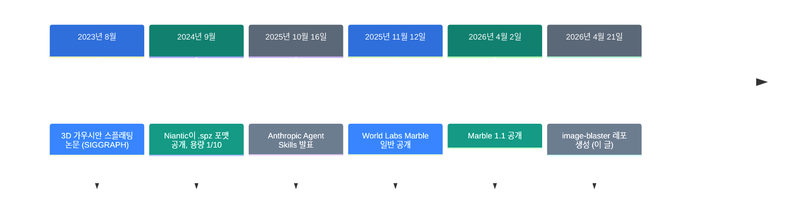
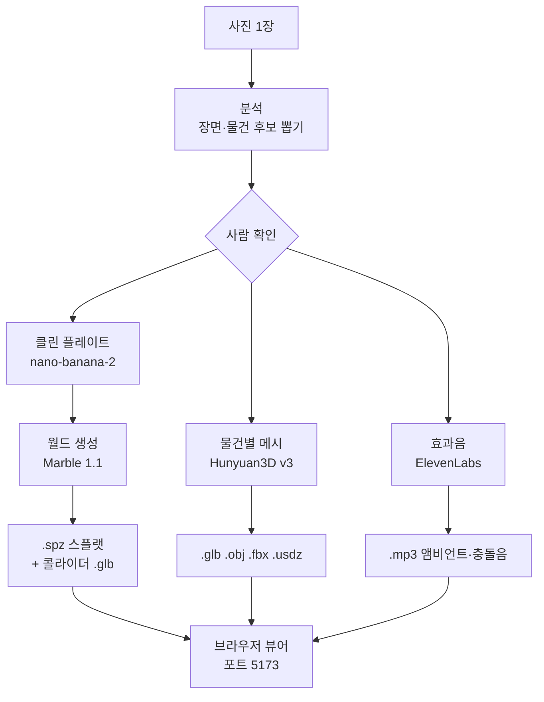

![[image-blaster.mp4]]

[원문](https://github.com/neilsonnn/image-blaster) · [레포](https://github.com/neilsonnn/image-blaster) · [English](https://neocello-ku.github.io/trends/image-blaster)

## 요약

2026년 4월, image-blaster가 나왔습니다. 사진 한 장을 넣으면 Claude Code가 돌아다닐 수 있는 3D 공간과 메시, 효과음을 만듭니다. 5개월 만에 별이 9,679개 붙었습니다.

새 모델은 하나도 없습니다. 이미 있는 상용 API 네 곳을 Claude 스킬이 순서대로 부를 뿐입니다. 2025년 10월에 Agent Skills가 생기자마자 가능해진 조립입니다.

결론부터 적습니다. 기법은 새롭지 않고 값은 한 번에 5달러쯤 듭니다. 볼 만한 것은 결과물이 아니라 규칙 파일입니다.

용어가 낯설면 아래 "처음이라면" 섹션부터 읽으세요.

## 흐름 속 위치: 왜 지금 이 이야기인가

사진으로 3D 공간을 만드는 일은 오래된 숙제였습니다. 조각은 2023년부터 하나씩 나왔습니다. 마지막 조각은 모델이 아니라 그릇이었습니다.



모델 쪽은 2025년 11월에 준비가 끝났습니다. "누가 순서대로 부르느냐"가 남은 문제였습니다. 스킬 폴더가 그 자리를 채웠습니다.

### 같은 시기에 비슷한 것

2026년에 비슷한 묶음이 여럿 나왔습니다. blender-kiln, Ludo MCP, 3D-Agent가 그렇습니다. 셋 다 Blender를 운전해서 메시를 만듭니다.

image-blaster는 결과물이 다릅니다. 먼저 돌아다닐 수 있는 공간을 만들고 그 안을 오브젝트와 소리로 채웁니다.

### 이 기술은 무엇이 새로운가

| 무엇 | 새로운 정도 | 이유 |
| --- | --- | --- |
| 생성 기법 | 낮음 | 새 모델도 새 알고리즘도 없습니다. 네 회사의 API를 그대로 부릅니다. |
| 스크립트와 파일 규칙 (인프라) | 중간 | 자체 코드는 .mjs 파일 21개입니다. 세대 인덱스와 중단 재개 설계는 쓸 만합니다. |
| 에이전트가 파이프라인이 되는 방식 (제품) | 높음 | 설치 없이 됩니다. Claude Code 하나가 화면과 오케스트레이터와 검수를 겸합니다. |

image-blaster의 값어치는 3D 결과물이 아닙니다. `.claude/` 폴더 안의 지시문 설계에 있습니다.

### 지난 글과 이어 보기

지난 글은 [Strata: 125B 모델을 게임용 PC에서 돌리기](/ko/trends/strata)였습니다. 2026년 10월 6일에 다뤘습니다.

방향이 정반대입니다. Strata는 클라우드의 큰 모델을 내 PC로 끌어내립니다. image-blaster는 내 PC에 아무것도 두지 않고 클라우드 네 곳을 엮습니다.

둘 다 같은 해에 별 1만 개 안팎을 받았습니다. 반대 방향 두 개가 같이 먹혔다는 뜻입니다.

## 처음이라면: 이게 무슨 이야기인가요

### 3D 공간을 만드는 두 가지 방법

영화 세트를 떠올려 보세요. 벽과 바닥은 한 번 지으면 움직이지 않습니다. 의자와 컵은 배우가 들고 다닙니다.

3D 공간도 같습니다. 움직이지 않는 배경과 집어 들 수 있는 물건은 다루는 법이 다릅니다. image-blaster는 이 둘을 갈라서 만듭니다.

### 배경: 점을 뿌려서 만듭니다

배경은 가우시안 스플래팅이라는 기법으로 만듭니다. 색과 투명도가 있는 작은 얼룩을 공중에 수십만 개 뿌립니다. 멀리서 보면 사진처럼 보입니다.

삼각형으로 벽을 세우는 옛 방식과 다릅니다. 모양을 깎는 대신 보이는 결과를 흉내 냅니다. 그래서 나뭇잎이나 유리처럼 깎기 어려운 것에 강합니다.

대신 약점이 있습니다. 얼룩 덩어리라서 물리 충돌이 없습니다. 그래서 따로 충돌용 뼈대를 하나 더 받습니다.

### 물건: 진짜 메시로 만듭니다

의자나 컵처럼 집어 들 물건은 다릅니다. 이쪽은 삼각형으로 된 진짜 메시로 만듭니다. 집고 던지고 부딪히게 하려면 면이 필요합니다.

### 플레이트: 물건을 지운 배경 사진

원본 사진에는 의자가 찍혀 있습니다. 의자를 따로 메시로 만들었는데 배경에도 의자가 남아 있으면 두 개가 됩니다.

그래서 원본에서 의자를 지운 사진을 먼저 만듭니다. 이것을 클린 플레이트라고 부릅니다. 영화 합성에서 쓰던 말입니다.

### 스킬: 에이전트에게 주는 작업 지시서

Claude 스킬은 마크다운 파일 하나입니다. 언제 쓰는지, 어떤 순서로 하는지를 글로 적어 둡니다.

Claude는 필요할 때만 그 파일을 읽습니다. 이 레포에는 그런 파일이 9개 있습니다.

### 왜 좋은가

- 3D 도구를 몰라도 사진 한 장으로 초안 공간이 나옵니다.
- 배경, 물건, 소리가 한 번에 같이 나옵니다.
- 중간에 끊겨도 요청 기록이 남아 돈을 다시 쓰지 않습니다.

### 이런 곳에 씁니다

- 게임 레벨이나 영상 로케이션의 초안 만들기
- 로봇이나 시뮬레이터에 쓸 연습용 공간
- 건축 렌더링을 돌아다닐 수 있게 바꾸기

### 이 글에 나오는 이름들

| 용어 | 쉬운 뜻 |
| --- | --- |
| 가우시안 스플랫 | 색 있는 얼룩을 공중에 뿌려 만든 3D 장면. |
| .spz | 그 얼룩을 담는 파일. PLY보다 약 10배 작습니다. |
| 메시 | 삼각형 면으로 된 보통의 3D 모델. |
| 콜라이더 | 부딪힘만 계산하는 보이지 않는 뼈대. |
| 클린 플레이트 | 물건을 지운 배경 사진. |
| PBR | 금속·거칠기 같은 재질 정보를 담은 텍스처. |
| GLB | 메시와 텍스처를 한 파일에 담은 3D 포맷. |
| 스킬 | 에이전트가 필요할 때 읽는 작업 지시서. |
| 월드 슬러그 | 작업 폴더 이름. `worlds/<슬러그>/`에 결과가 쌓입니다. |

## 동작 방식



### 돈 쓰기 전에 멈춥니다

분석 단계는 공짜입니다. Claude가 사진을 직접 보고 물건 후보를 적습니다.

그다음 멈춥니다. 어떤 물건을 만들지 사람이 고를 때까지 기다립니다. 유료 호출은 그 뒤에만 나갑니다.

"한 번에 다 해 줘"라고 말하면 원샷 모드로 갑니다. 이때는 멈추지 않고 끝까지 갑니다.

### 물건은 하나씩 따로 뽑습니다

물건 하나마다 먼저 레퍼런스 컷을 만듭니다. 원본에서 그 물건만 오려 흰 배경에 놓은 사진입니다.

규칙이 까다롭습니다. 한 덩어리로 묶지 않습니다. 식탁과 의자를 한 모델로 만들지 않습니다. 바닥이나 벽처럼 붙박이인 것은 아예 뽑지 않습니다.

기준은 간단합니다. 사람이 들거나 밀어서 옮길 수 있으면 물건입니다.

### 생성은 동시에, 스크립트는 하나씩

생성 요청은 백그라운드 에이전트로 띄웁니다. 월드와 메시와 소리가 같이 돕니다.

그런데 그 안의 스크립트는 절대 백그라운드로 돌리지 않습니다. 스크립트가 끝날 때까지 기다려 결과를 읽습니다. 병렬성은 에이전트가, 결과 수집은 스크립트가 맡는 구조입니다.

### 파일 이름이 상태입니다

산출물에는 세대 번호가 붙습니다. `0-room.png`가 원본이고 `1-room-plate.png`가 다음 세대입니다.

옆에는 숨은 요청 파일이 같이 놓입니다. `.1-room-plate-request.json`이 그것입니다. 여기에 프로바이더 응답이 남습니다.

파일만 빠졌을 때는 이 기록으로 다시 내려받습니다. 새 세대를 만들지 않으므로 돈이 다시 나가지 않습니다.

## 준비물과 실행

### 준비물

| 항목 | 요구 사항 |
| --- | --- |
| Claude Code | `curl -fsSL https://claude.ai/install.sh \| bash` |
| World Labs 키 | platform.worldlabs.ai. 최소 충전 5달러 |
| FAL 키 | fal.ai. 종량제 |
| bun | 뷰어 실행용 |
| ffmpeg | 효과음 후처리용. README에 안 적혀 있음 |
| GPU | 생성은 전부 원격. 결과를 보려면 WebGL2만 되면 됩니다 |

### 1단계. 레포를 받으세요

```bash
git clone https://github.com/neilsonnn/image-blaster
cd image-blaster
claude
```

### 2단계. 키를 건네세요

Claude에게 인사한 뒤 두 키를 채팅에 붙여 넣으세요. Claude가 `.env`를 만듭니다.

세션 시작 훅이 키를 먼저 확인합니다. 빠진 키가 있으면 발급 주소를 알려 줍니다.

### 3단계. 사진을 넣고 시키세요

사진을 `input/` 폴더에 넣으세요. 그다음 이렇게 말하세요.

```text
blast it and confirm each step with me
```

단계마다 멈춰서 확인을 받습니다. 처음에는 이 방식을 쓰세요.

뷰어는 자동으로 뜹니다. `bun install && bun run dev`가 돌고 브라우저가 열립니다.

### 4단계. 물건을 고르세요

Claude가 장면 설명과 물건 후보를 보여 줍니다. 여기서 만들 것만 고르세요.

고른 뒤부터 돈이 나갑니다. 물건 수가 값을 거의 다 정합니다.

### 결과가 쌓이는 곳

```text
worlds/<슬러그>/
  source/   원본 사진과 분석 JSON, 클린 플레이트
  output/
    world/  .spz 스플랫, 콜라이더 .glb, 파노라마
    sfx/    앰비언트 루프
    <물건>/ 메시 파일과 충돌음
```

### 세부 조정

```bash
--face-count 50000          면 수. 40000~1500000
--generate-type Geometry    흰 지오메트리만. 값이 가장 쌉니다
--generate-type LowPoly     폴리곤 줄이기
--enable-pbr false          재질 텍스처 끄기
```

기본값은 `--face-count 50000`, `--enable-pbr true`, `--generate-type Normal`입니다.

## 팩트체크

README에 비용 설명이 없습니다. 그래서 공식 가격표로 직접 계산했습니다.

| README의 주장 | 확인 결과 | 판정 |
| --- | --- | --- |
| 사진 한 장으로 만든다 | 한 장으로도 되지만 상한은 아닙니다. 여러 장을 읽어 하나로 합치는 경로가 있습니다 | 과소 표현 |
| 5분 안에 끝난다 | 시간은 못 쟀습니다. 기본 모드는 사람 확인에서 멈춥니다. 원샷 모드에서만 가능한 수치입니다 | 조건 있음 |
| 완전히 메시가 된 3D 환경 | 배경은 메시가 아닙니다. 보는 것은 스플랫이고, 메시는 충돌용 콜라이더 하나입니다 | 과장 |
| 3D 모델을 .glb와 .obj로 | 맞고 오히려 적게 적었습니다. FBX와 USDZ도 같이 내려받습니다 | 과소 표현 |
| 어느 게임 엔진에든 넣는다 | 임포터나 플러그인이 레포에 없습니다. .spz는 주요 엔진이 기본으로 못 읽습니다 | 조건 있음 |
| Claude 스킬, World Labs, FAL을 쓴다 | 맞습니다. FAL은 중개자입니다. 실제 모델은 구글, OpenAI, 텐센트, ElevenLabs 것입니다 | 일치 |
| 한 번에 드는 값 | README에 아무 말이 없습니다. 물건 5개 장면 기준 약 5달러입니다 | 근거 없음 |

### 배경은 메시가 아닙니다

이 점이 가장 중요합니다. README는 "완전히 메시가 된 3D 환경"이라고 적습니다.

월드 생성 스크립트가 실제로 받는 것은 네 가지입니다. `.spz` 스플랫, 파노라마, 썸네일, 그리고 콜라이더 메시 하나입니다.

콜라이더는 부딪힘만 계산하는 거친 뼈대입니다. 텍스처가 입혀진 배경 메시는 받지 않습니다.

실무에서는 이 차이가 큽니다. 스플랫은 보기에는 좋지만 편집이 어렵습니다. Blender에서 벽을 옮기거나 조명을 다시 굽는 작업에는 맞지 않습니다.

### 값 계산

| 항목 | 단가 | 근거 |
| --- | ---: | --- |
| Marble 1.1 월드 1회 | 1.20달러 | 1,500 크레딧 ÷ 1,250 |
| nano-banana-2 편집 1장 | 0.08달러 | fal 가격표 |
| Hunyuan3D 메시 1개 | 0.675달러 | 기본 0.375 + PBR 0.15 + 면 수 지정 0.15 |
| 앰비언트 루프 | 0.04달러 | 10초 2개 × 초당 0.002 |
| 물건 충돌음 1개 | 0.008달러 | 1초 4개 × 초당 0.002 |

물건 5개짜리 장면을 한 번 만들면 이렇게 됩니다.

| 단계 | 횟수 | 금액 |
| --- | ---: | ---: |
| 클린 플레이트 | 1 | 0.08 |
| 물건 레퍼런스 컷 | 5 | 0.40 |
| 월드 | 1 | 1.20 |
| 메시 | 5 | 3.38 |
| 앰비언트 | 1 | 0.04 |
| 충돌음 | 5 | 0.04 |
| 합계 | | 약 5.14달러 |

Claude 토큰값은 별도입니다. 물건을 3개로 줄이면 약 3.6달러, 8개면 약 7.4달러입니다.

눈여겨볼 것이 하나 있습니다. 메시 1개의 기본가는 0.375달러인데 실제로는 0.675달러가 나갑니다.

스킬이 PBR과 면 수를 항상 같이 넘기기 때문입니다. 둘 다 0.15달러짜리 할증입니다. 즉 기본 설정이 값을 1.8배로 올립니다.

흰 지오메트리만 필요하면 `--generate-type Geometry`를 쓰세요. 기본가가 0.225달러로 떨어집니다.

단서를 답니다. 면 수 할증이 fal 기본값과 다른 모든 값에 붙는지는 가격 페이지에 명시가 없습니다. 안 붙는다면 5개 장면 합계는 약 4.4달러가 됩니다.

### 정말 볼 것은 규칙 파일입니다

생성 품질은 네 회사 모델이 정합니다. 레포가 정하는 것은 순서와 금지 사항입니다. 이쪽이 더 배울 만합니다.

`.claude/rules/project.md`에 적힌 규칙 중 넷을 꼽습니다.

- **멈출 곳을 글로 박습니다.** 분석은 공짜, 생성은 유료. 그 경계에서 멈춥니다.
- **생성된 이미지를 읽지 말라고 적습니다.** 검수는 스크립트 출력과 파일 이름으로 합니다.
- **백그라운드는 에이전트 단위입니다.** 스크립트는 동기로 돌려 결과를 꼭 읽습니다.
- **재개를 설계에 넣었습니다.** 요청 JSON이 남아 파일만 다시 내려받습니다.

## 언제 무엇을 쓰나

| 상황 | 쓸 것 |
| --- | --- |
| 돌아다닐 수 있는 배경이 필요하다 | image-blaster |
| 깎아서 편집할 환경 메시가 필요하다 | 맞지 않음. 포토그래메트리나 수작업 |
| 물건 메시만 필요하다 | fal Hunyuan3D를 직접 호출 |
| Blender 안에서 끝내고 싶다 | blender-kiln 같은 MCP 묶음 |
| 언리얼이나 유니티에 바로 넣고 싶다 | 물건 메시만. 스플랫은 플러그인 확인 먼저 |
| 값을 아끼고 싶다 | 물건 수를 줄이고 `--generate-type Geometry` |

## 출처

- [image-blaster 레포](https://github.com/neilsonnn/image-blaster)
- [World Labs API 가격표](https://docs.worldlabs.ai/api/pricing)
- [World Labs 모델 목록](https://docs.worldlabs.ai/marble/models)
- [fal Hunyuan3D v3 모델 페이지](https://fal.ai/models/fal-ai/hunyuan3d-v3/image-to-3d)
- [fal 가격표](https://fal.ai/pricing)
- [Anthropic Agent Skills 발표](https://www.anthropic.com/news/skills)
- [Agent Skills 엔지니어링 글](https://www.anthropic.com/engineering/equipping-agents-for-the-real-world-with-agent-skills)
- [Niantic SPZ 포맷 공개](https://scaniverse.com/news/spz-gaussian-splat-open-source-file-format)
- [Marble 1.1 공개 보도](https://radiancefields.com/world-labs-releases-marble-1.1-and-marble-1.1-plus)
- [VP Land 기사 (2026-05-16)](https://www.vp-land.com/stories/image-blaster-turns-one-image-into-a-full-3d-scene-using-claude-code)

## 이어지는 글

- [[trends/strata|Strata: 125B 모델을 게임용 PC에서]]

