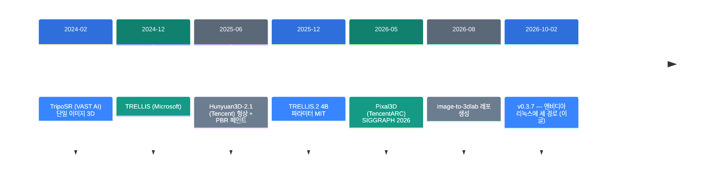
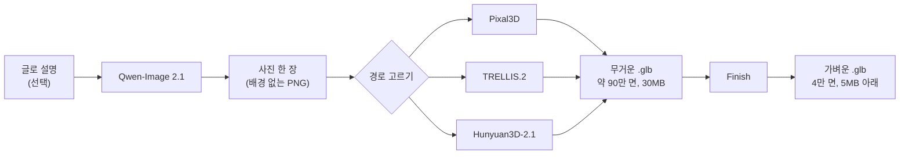

![[image-to-3dlab.mp4]]

[원문](https://github.com/Bingeljell/image-to-3dlab/releases/tag/v0.3.7) · [레포](https://github.com/Bingeljell/image-to-3dlab) · [English](https://neocello-ku.github.io/trends/image-to-3dlab)

## 요약

2026년 10월 2일, image-to-3dlab이 v0.3.7을 냈습니다. 사진 한 장을 3D 모델로 바꾸는 경로 세 개가 리눅스 + NVIDIA 카드에서 돌아갑니다. 지금까지는 애플 실리콘 맥이 주 무대였습니다.

이 레포는 모델을 하나도 만들지 않습니다. 남이 만든 3D 모델 네 종류를 뷰어 하나와 CLI 하나 뒤에 모읍니다. 그래서 새로운 것은 기법이 아니라 묶음입니다.

한국에서 읽는다면 숫자가 달라집니다. 세 경로 중 Hunyuan3D-2.1은 한국이 라이선스 대상에서 빠져 있습니다. 쓸 수 있는 것은 두 개입니다. 용어가 낯설면, 아래 "처음이라면" 섹션부터 읽으세요.

## 흐름 속 위치: 왜 지금 이 이야기인가

사진 한 장으로 3D 모델을 만드는 기술은 2024년부터 빠르게 좋아졌습니다. 2026년의 질문은 품질이 아닙니다. "내 기계에서 돌릴 수 있나"입니다.



### 지난 글과 이어지는 곳

지난 글 "image-blaster: 사진 한 장을 3D 공간으로"와 같은 분야입니다. 2026년 10월 6일 글입니다. 두 레포 모두 사진 한 장을 3D로 바꾸고, 둘 다 Hunyuan3D를 부릅니다.

다른 점은 돈과 장소입니다. image-blaster는 클라우드 API를 불러서 장면 하나에 약 5달러를 씁니다. image-to-3dlab은 모든 계산을 내 기계에서 합니다. 대신 가중치 15~20GB를 내려받고 설치에 시간을 씁니다.

### 이 기술은 무엇이 새로운가

| 무엇 | 새로운 정도 | 이유 |
| --- | --- | --- |
| 생성 기법 | 낮음 | 모델을 하나도 만들지 않습니다. README가 직접 적습니다: "이 레포는 아무것도 학습하지 않고 아무것도 발명하지 않는다." |
| 백엔드 6개를 한 묶음으로 (제품) | 높음 | 모델 네 종류, 경로 여섯 개를 뷰어 하나 뒤에 모았습니다. 설치는 명령 한 줄입니다. 비슷한 공개 묶음을 찾지 못했습니다. |
| 재현 가능한 설치와 출처 기록 (인프라) | 중간 | 커밋과 패키지 버전을 핀으로 고정합니다. 결과마다 해시와 라이선스 분류를 적은 파일을 남깁니다. |

정리하면, 이 릴리스는 발명이 아닙니다. 흩어진 연구 코드를 한 사람이 쓸 수 있는 도구로 묶은 작업입니다. v0.3.7은 그 묶음을 맥 밖으로 내보낸 릴리스입니다.

## 처음이라면: 이게 무슨 이야기인가요

### 사진 한 장에는 뒷면이 없습니다

의자 사진을 한 장 찍었다고 해 보세요. 앞면은 보이지만 뒷면은 보이지 않습니다. 사람은 뒷면을 쉽게 상상합니다. 다리가 네 개 있고 뒤에도 등받이가 있겠거니 합니다.

이미지-투-3D 모델은 그 상상을 대신합니다. 보이는 면은 사진에서 가져옵니다. 보이지 않는 면은 학습한 내용으로 채웁니다. 결과는 게임 엔진에 바로 넣을 수 있는 `.glb` 파일입니다.

### 왜 내 기계에서 돌리나요

- 사진이 밖으로 나가지 않습니다. 회사 자산이나 미공개 디자인을 다룰 때 중요합니다.
- 건당 요금이 없습니다. 백 번을 돌려도 전기값만 듭니다.
- 설정을 바꿔 가며 반복할 수 있습니다. 같은 씨앗으로 같은 결과가 나옵니다.

### 이런 곳에 씁니다

- 인디 게임의 소품과 캐릭터 초안 만들기
- 제품 사진을 3D 미리보기로 바꾸기
- 공간 시안에 넣을 더미 오브젝트 채우기

### 이 글에 나오는 이름들

| 용어 | 쉬운 뜻 |
| --- | --- |
| 백엔드 | 실제 계산을 하는 모델과 코드 묶음. 이 랩에는 여섯 개가 있습니다. |
| 경로(route) | 그 백엔드를 쓰는 한 가지 길. 같은 모델도 맥용과 엔비디아용이 다릅니다. |
| 가중치 | 모델이 학습한 숫자 덩어리. 보통 수 기가바이트짜리 파일입니다. |
| `.glb` | 3D 모델 파일 형식. 유니티, 언리얼, 블렌더가 읽습니다. |
| PBR | 물리 기반 렌더링. 금속, 거칠기 같은 재질 정보를 함께 담습니다. |
| 리토폴로지 | 면이 너무 많은 모델을 적은 면으로 다시 짜는 일. |
| 출처 기록(provenance) | 결과 파일 옆에 남는 기록. 설정, 해시, 라이선스가 들어갑니다. |
| 게이트 모델 | 받기 전에 제작사 승인이 필요한 모델. DINOv3이 그렇습니다. |

## 동작 방식

랩은 세 단계로 나뉩니다. 그림 만들기, 3D 만들기, 마무리입니다.



Finish 단계는 네 가지 일을 합니다. 면 수를 줄이고, 원하면 다시 칠하고, 원본 사진의 픽셀을 되돌려 붙이고, 텍스처를 압축합니다.

픽셀 매치가 이 레포의 특징입니다. 생성 모델은 사진의 글자와 로고를 비슷한 모양으로 다시 그립니다. 픽셀 매치는 사진이 볼 수 있는 모든 면에 원래 픽셀을 그대로 옮깁니다.

## 준비물과 실행

### 준비물

| 항목 | 내용 |
| --- | --- |
| 기계 | 애플 실리콘 맥(32GB 권장) 또는 리눅스 + NVIDIA 카드 |
| VRAM | 24GB로 테스트했습니다. Pixal3D는 제작자가 16GB에서 돌린다고 적혀 있습니다 |
| CUDA 툴킷 | TRELLIS.2 확장과 Hunyuan 래스터라이저를 컴파일할 때 필요합니다 |
| Blender | 4.2 이상. Finish와 리깅에 씁니다 |
| 디스크 | 경로당 15~20GiB |
| 그 밖에 | `uv`, Python 3.11 |

Windows는 테스트가 거의 없습니다. TRELLIS.2와 Hunyuan3D-2.1은 Windows를 아예 막아 두었습니다. WSL은 레포 어디에도 나오지 않습니다.

### 1단계. 설치

```bash
curl -fsSL https://raw.githubusercontent.com/Bingeljell/image-to-3dlab/main/install.sh | bash
```

이 명령은 코드와 Python 3.11을 깔고 뷰어를 엽니다. 모델 가중치는 받지 않습니다. 설치 폴더는 `~/image-to-3dlab`입니다.

스크립트나 에이전트로 돌린다면 질문을 끄세요.

```bash
curl -fsSL https://raw.githubusercontent.com/Bingeljell/image-to-3dlab/main/install.sh \
  | bash -s -- --yes --dir ~/lab
```

다시 띄울 때는 설치 폴더에서 `./lab`을 실행하세요.

### 2단계. 경로 하나 설치

뷰어의 Setup & Status 화면에서 버튼을 누르면 됩니다. 명령으로도 같은 일을 합니다.

```bash
python scripts/bootstrap_pixal3d.py
python scripts/bootstrap_trellis_cuda.py
```

Pixal3D부터 시작하세요. README가 권하는 기본 경로입니다.

TRELLIS.2는 DINOv3 인코더를 씁니다. 이 모델은 메타가 직접 승인합니다. 먼저 허깅페이스에서 접근을 신청하세요. 승인에 시간이 걸리므로 가장 먼저 하세요.

### 3단계. 모델 만들기

뷰어의 Generate 3D 화면에 배경 없는 PNG를 넣습니다. CLI로도 됩니다.

```bash
python scripts/pixal3d_generate.py input.png output.glb --seed 42
```

TRELLIS.2는 설치 폴더 안의 전용 파이썬을 씁니다.

```bash
vendor/trellis-cuda/.venv/bin/python \
  scripts/trellis_cuda_generate.py input.png output/out.glb
```

### 4단계. 마무리

```bash
python scripts/retopo_repaint.py generated.glb source.png finished.glb \
  --faces 40000 --skip-paint
```

`--skip-paint`를 빼면 다시 칠하는 단계가 들어갑니다. 시간이 몇 초에서 약 6분으로 늘어납니다.

## 팩트체크

| 릴리스 노트의 주장 | 확인 결과 | 판정 |
| --- | --- | --- |
| 세 경로가 리눅스 + NVIDIA에서 설치되고 실행된다 | CHANGELOG는 두 경로를 RTX 3090에서 끝까지 테스트했다고 적습니다. 그런데 README는 최신 v0.3.9에서도 두 경로를 "실제 하드웨어에서 아직 테스트하지 않음"이라고 적습니다. 문서 두 개가 어긋납니다 | 조건부 |
| Hunyuan3D-2.1이 24GB 카드에서 형상과 페인트를 한 번에 한다 | 설치 스크립트가 숫자를 적습니다. 형상 약 10GB, 페인트 약 21GB입니다. 형상을 내린 뒤 페인트를 올리므로 24GB면 됩니다 | 일치 |
| EU, 영국, 한국에서는 라이선스가 없다 | 사실입니다. 코드가 Hunyuan을 "지역 제한"으로 분류하고 경고를 띄웁니다. 다만 설치나 실행을 막지는 않습니다. 판단은 사용자 몫입니다 | 일치 |
| Pixal3D는 미리 만든 빌드라 컴파일이 없다 | 드라이버 575 이상일 때만입니다. 그 아래는 직접 컴파일합니다. 또 미리 만든 빌드는 8스텝이 아니라 12스텝으로 돕니다 | 조건부 |
| 설치 명령 하나로 뷰어가 열린다 | 맞습니다. 설치 스크립트가 마지막에 뷰어를 띄웁니다. 다만 `uv`가 없으면 설치 동의를 한 번 묻습니다 | 일치 |
| 모든 다운로드가 크기와 라이선스를 말하고 먼저 묻는다 | 맞습니다. 경로마다 파일 이름과 바이트 수가 코드에 적혀 있습니다. `--yes`가 없으면 스크립트가 출력 후 멈춥니다 | 일치 |
| Hunyuan3D-2.1 내려받기 약 19.5GB | 직접 더해 봤습니다. 8.03 + 6.89 + 4.55 + 0.07 + 0.21 = 19.75GiB입니다. CHANGELOG의 19.7GB가 맞고 README가 낮습니다 | 조건부 |
| TRELLIS.2 내려받기 약 15GB | 직접 더해 봤습니다. 약 16.7GiB입니다. README가 1.7GiB 낮게 적었습니다. 코드 주석도 같은 문제를 적어 두었습니다 | 조건부 |
| "2026년 10월 기준 가장 완전한 오픈소스 이미지-투-3D 파이프라인" | 레포 설명문의 문구입니다. 비교 기준도 비교 대상도 없습니다. 확인할 방법이 없습니다 | 근거 없음 |

## 언제 무엇을 쓰나

### 경로 고르기

| 상황 | 경로 |
| --- | --- |
| 처음 써 본다 | Pixal3D. 한 번에 끝나고 색이 덜 바랩니다 |
| 품질이 가장 중요하다 | TRELLIS.2. 대신 맥에서 15~35분 걸립니다 |
| 글자나 로고가 들어간 물체 | Pixal3D + Finish의 픽셀 매치 |
| 평면 일러스트가 원본이다 | TRELLIS.2를 피하세요. 색이 심하게 바랩니다 |
| 사진이 없다 | Generate Image 탭에서 Qwen-Image 2.1로 만듭니다 |

### 한국에서 쓸 수 있는 것

| 경로 | 한국에서 | 비고 |
| --- | --- | --- |
| Pixal3D | 가능 | MIT + DINOv3 라이선스. 상업 조건부 |
| TRELLIS.2 | 가능 | MIT + DINOv3 라이선스. 상업 조건부 |
| Hunyuan3D-2.1 (NVIDIA) | 불가 | Tencent 커뮤니티 라이선스에서 한국 제외 |
| Hunyuan3D-MLX 두 경로 | 불가 | 가중치가 같은 라이선스입니다 |
| Stable Fast 3D | 맥 전용 | 상업 등록이 필요합니다 |
| Qwen-Image 2.1 | 비상업만 | 모델 실행이 비상업 전용입니다 |

레포 자체 코드는 Apache-2.0입니다. 제한은 전부 남의 모델 가중치에서 옵니다.

## 출처

- 릴리스 v0.3.7: https://github.com/Bingeljell/image-to-3dlab/releases/tag/v0.3.7
- 레포: https://github.com/Bingeljell/image-to-3dlab (Apache-2.0)
- CHANGELOG 0.3.7 구간, README.md, `viewer/backend_catalog.py`, `image_to_3dlab/provenance.py`
- TRELLIS.2 공개(2025년 12월 16일): https://comfyui-wiki.com/en/news/2025-12-18-microsoft-trellis2-3d-generation
- Pixal3D: https://github.com/TencentARC/Pixal3D
- 지난 글: image-blaster (2026년 10월 6일)

## 이어지는 글

- [[trends/image-blaster|image-blaster: 사진 한 장을 3D 공간으로]]

