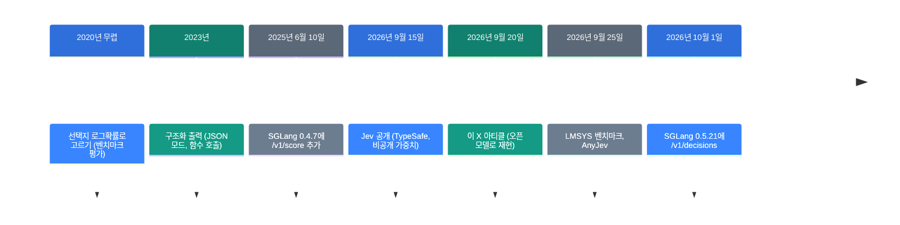
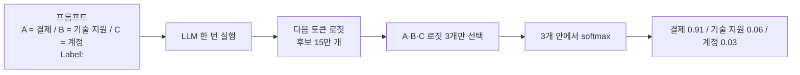

![[jev-local.mp4]]

[원문](https://x.com/_avichawla/status/2101563610644496464) · [레포](https://github.com/sgl-project/sglang) · [English](https://neocello-ku.github.io/trends/jev-local)

## 요약

2026년 9월 15일, TypeSafe가 Jev를 공개했습니다. 글을 쓰지 않고 판단만 내리는 비공개 모델입니다. 닷새 뒤 나온 이 X 아티클은 같은 추론 방식을 오픈 모델로 재현합니다.

흐름으로 보면 "LLM에게 잘 쓰게 하기"에서 "잘 고르게 하기"로 넘어가는 장면입니다. 기법 자체는 2020년 무렵 벤치마크 평가 방식과 같습니다. 이 계산이 추론 서버의 기본 기능이 된 것이 새롭습니다.

용어가 낯설면 아래 "처음이라면" 섹션부터 읽으세요.

## 흐름 속 위치: 왜 지금 이 이야기인가

소프트웨어 안의 LLM 호출은 대부분 새 글이 필요하지 않습니다. 답 목록을 코드가 이미 알고 있기 때문입니다. 티켓 분류, 리뷰 판정, 서류 심사가 그렇습니다.



이 아티클은 다섯 번째 칸에 있습니다. Jev가 나온 뒤 한 주 동안 관련 레포 1,865개가 새로 생겼습니다. Kev 4B, LLM2Jev, AnyJev가 같은 시기의 재현물입니다.

지난 글 [Strata: 125B 모델을 게임용 PC에서 돌리기](/trends/strata)가 있습니다. 2026년 10월 6일 글이고 큰 모델을 내 PC에 올리는 방법이었습니다. 이 글은 그다음 질문입니다. 올린 모델을 어떻게 불러야 값싸고 확실한가입니다.

### 이 기술은 무엇이 새로운가

| 무엇 | 새로운 정도 | 이유 |
| --- | --- | --- |
| 라벨 로짓 + 제한 softmax (기법) | 낮음 | 2020년 무렵부터 벤치마크 평가에 쓰던 계산입니다. |
| 결정 전용 모델 Jev (제품) | 중간 | 계산은 옛것입니다. 보정과 전용 학습을 붙인 것이 새롭습니다. 비공개라 확인할 수 없습니다. |
| `/v1/decisions` (인프라) | 중간 | 클라이언트가 하던 라벨 배정과 1토큰 검사를 서버가 맡았습니다. Jev 공개 16일 만입니다. |

정리하면 새 발명이 아닙니다. 평가용 계산이 제품 이름을 얻고 2주 만에 추론 서버의 기본 기능이 된 흐름입니다. 배울 것은 신기술이 아니라 호출 방식의 선택입니다.

## 처음이라면: 이게 무슨 이야기인가요

### LLM은 '다음 말 맞히기' 기계입니다

휴대폰 자판의 자동 완성을 떠올려 보세요. "오늘 저녁 뭐"까지 치면 "먹지?"를 추천합니다. LLM도 원리가 같습니다.

LLM은 지금까지의 글을 보고 다음 조각 하나를 고릅니다. 그 조각을 붙이고 다시 다음 조각을 고릅니다. 긴 답변은 이 과정을 수백 번 반복한 결과입니다. 이 조각을 **토큰**이라고 부릅니다.

### 고르기 전에 모든 후보에 점수를 매깁니다

모델은 다음 조각을 고를 때 아는 토큰 전부에 점수를 줍니다. Qwen2.5의 후보는 15만 개가 넘습니다. 이 점수가 **로짓**입니다. 높을수록 다음에 올 가능성이 큽니다.

### 서술형 시험과 객관식 시험

LLM에게 일을 시키는 방법은 두 가지입니다. 시험에 비유하면 쉽습니다.

- **서술형**: "이 문의는 어느 팀 담당인가요?"라고 묻습니다. 모델이 문장을 씁니다. 코드가 그 문장에서 답을 찾아냅니다. 시간이 걸리고 가끔 목록에 없는 답이 나옵니다.
- **객관식**: "A 결제, B 기술 지원, C 계정 중 고르세요"라고 묻습니다. 답을 쓰기 직전 자리에서 A·B·C 점수만 읽습니다. 모델은 한 글자도 쓰지 않습니다.

이 가이드는 객관식 방법을 다룹니다.

### 객관식 방법이 좋은 이유

- 모델을 한 번만 실행합니다. 토큰을 하나도 생성하지 않습니다.
- 답이 항상 목록 안에 있습니다. 엉뚱한 문장이 끼어들지 않습니다.
- 확신의 정도가 숫자로 나옵니다. 예: 결제 91%, 기술 지원 6%, 계정 3%.

### 이런 곳에 씁니다

- 고객 문의를 담당 팀으로 나누기
- 리뷰가 긍정인지 부정인지 판정하기
- 지원서나 경비 청구가 기준에 맞는지 거르기

### 이 글에 나오는 이름들

| 용어 | 쉬운 뜻 |
| --- | --- |
| 토큰 | 모델이 글을 읽고 쓰는 최소 조각. 단어 하나 또는 단어 일부. |
| 로짓 | 다음 토큰 후보마다 모델이 매긴 점수. |
| softmax | 점수들을 합이 100%인 비율로 바꾸는 계산. |
| 라벨 | 선택지에 붙인 짧은 표시. 여기서는 A, B, C. |
| SGLang | 모델을 내 컴퓨터에서 서버로 띄워 주는 오픈소스 프로그램. |
| 엔드포인트 | 서버에 요청을 보내는 주소. 예: `/v1/score` |
| Jev | TypeSafe가 2026년 9월에 낸 비공개 결정 모델. 원문은 이 방식을 흉내 냅니다. |

## 동작 방식: 생성과 점수는 어떻게 다른가

고객 티켓을 결제, 기술 지원, 계정 중 한 팀으로 보낸다고 하겠습니다. 보통 방식은 모델이 문장이나 JSON을 만듭니다. 그다음 코드가 그 글자에서 답을 꺼냅니다.

점수 방식은 아무것도 만들지 않습니다. 선택지마다 1토큰 라벨을 붙이고 그 라벨들의 점수만 읽습니다.



세 로짓이 8.2, 5.5, 4.8이면 확률은 0.91, 0.06, 0.03입니다. 이 값은 세 선택지 안에서 나눈 비율입니다. 맞을 확률이 아닙니다.

구조화 출력과는 다릅니다. 구조화 출력도 형식을 강제하지만 여는 중괄호부터 토큰을 하나씩 만듭니다. 점수 방식은 그 생성을 아예 건너뜁니다.

### 지켜야 할 규칙 네 가지

- 라벨은 반드시 1토큰이어야 합니다. `"A"`와 `" A"`는 다른 토큰입니다.
- 맞는 답이 목록에 없을 수 있으면 `OTHER` 선택지를 넣으세요.
- 0.91은 정답률이 아닙니다. 정답이 붙은 예시로 따로 재세요.
- 자동 처리 기준은 코드에 두세요. 예: 1위가 0.80 이상, 2위와 0.20 이상 차이.

## 준비물과 실행

| 항목 | 요구 사항 |
| --- | --- |
| GPU | CUDA GPU 1장. 필요한 메모리는 원문에 없습니다. |
| Python | 가상 환경을 권합니다. |
| SGLang | 0.5.10.post1 (원문 기준) 또는 0.5.21 (더 쉬운 길) |
| 모델 | Qwen/Qwen2.5-0.5B-Instruct (원문의 예시) |

원문의 예시 모델은 bf16 가중치가 약 1GB입니다. 8GB 카드로 충분합니다. 이 수치는 제 계산이고 원문에는 없습니다.

### 방법 1. `/v1/score`로 직접 만들기

#### 1단계. 설치하고 서버를 켜세요

```bash
python3 -m venv .venv
source .venv/bin/activate
pip install "sglang[all]==0.5.10.post1" "requests==2.34.2"
python -m sglang.launch_server \
  --model-path Qwen/Qwen2.5-0.5B-Instruct \
  --host 127.0.0.1 --port 30000
```

처음 실행할 때 모델을 내려받습니다. 서버는 포트 30000에서 기다립니다. 다음 단계는 다른 터미널에서 하세요.

#### 2단계. 스크립트를 `decide.py`로 저장하세요

```python
import requests

URL = "http://127.0.0.1:30000"
MODEL = "Qwen/Qwen2.5-0.5B-Instruct"

CHOICES = {
    "A": "billing and payments",
    "B": "technical support",
    "C": "account access",
}
ticket = "I was charged twice for the same subscription."

options = "\n".join(f"{k} = {v}" for k, v in CHOICES.items())
prompt = (
    f"Ticket:\n{ticket}\n\n"
    "Question:\nWhich category matches the ticket?\n\n"
    f"Allowed labels:\n{options}\n\n"
    "Return only the label.\nLabel:\n"
)


def token_id(label):
    r = requests.post(
        f"{URL}/tokenize",
        json={"model": MODEL, "prompt": label, "add_special_tokens": False},
        timeout=30,
    )
    r.raise_for_status()
    ids = r.json()["tokens"]
    if len(ids) != 1:
        raise ValueError(f"{label!r} is {len(ids)} tokens: {ids}")
    return ids[0]


label_ids = [token_id(k) for k in CHOICES]

r = requests.post(
    f"{URL}/v1/score",
    json={
        "model": MODEL,
        "query": prompt,
        "items": [""],
        "label_token_ids": label_ids,
        "apply_softmax": True,
    },
    timeout=120,
)
r.raise_for_status()
scores = r.json()["scores"][0]

probs = {name: round(p, 3) for name, p in zip(CHOICES.values(), scores)}
print(max(probs, key=probs.get), probs)
```

`token_id` 함수가 라벨이 1토큰인지 확인하고 아니면 멈춥니다. `items`가 빈 문자열이면 프롬프트 바로 다음 자리를 읽습니다.

#### 3단계. 실행하세요

```bash
python decide.py
```

원문의 결과는 결제 0.678, 기술 지원 0.311, 계정 0.011입니다. 하드웨어와 정밀도에 따라 값이 조금 달라집니다. 기준이 0.70이면 이 티켓은 사람 검토로 갑니다.

### 방법 2. `/v1/decisions`로 더 쉽게

SGLang 0.5.21에 `/v1/decisions`가 들어갔습니다. 2026년 10월 1일 릴리스입니다. 이 경로는 채팅 템플릿 적용, 라벨 배정, 1토큰 검사를 서버에서 합니다. 그래서 `/tokenize` 단계가 사라집니다.

```bash
pip install "sglang[all]==0.5.21" "requests==2.34.2"
python -m sglang.launch_server \
  --model-path Qwen/Qwen2.5-0.5B-Instruct \
  --host 127.0.0.1 --port 30000
```

```python
import requests

r = requests.post(
    "http://127.0.0.1:30000/v1/decisions",
    json={
        "input": "I was charged twice for the same subscription.",
        "questions": [
            {
                "id": "team",
                "type": "choice",
                "question": "Which team should handle this ticket?",
                "options": [
                    {"name": "billing", "description": "Payments and subscriptions"},
                    {"name": "technical", "description": "Bugs and integrations"},
                    {"name": "account", "description": "Login and access"},
                ],
            }
        ],
    },
    timeout=60,
)
r.raise_for_status()
print(r.json()["answers"]["team"])
```

응답의 `choice`가 1위 선택지입니다. `probabilities`는 선택지별 확률입니다. `label_mass`는 어휘 전체에서 라벨들이 차지한 확률의 합입니다. 이 값이 낮으면 모델이 제시된 선택지 밖을 더 선호한다는 뜻입니다.

질문 형식은 세 가지입니다. `choice`는 선택지 2~26개, `score`는 단계 2~10개, `yes_no`는 예/아니요입니다. 공식 문서가 검증했다고 밝힌 모델은 Qwen3.8-27B와 Qwen3.5-35B-A3B 둘뿐입니다. 다른 모델은 요청마다 서버가 검사하고 조건에 맞지 않으면 400을 돌려줍니다.

주의할 점이 하나 있습니다. 공식 문서는 아직 "릴리스에 들어가기 전까지는 nightly를 설치하라"고 씁니다. 하지만 0.5.21 wheel 안에 이미 들어 있습니다. 문서가 릴리스보다 뒤처졌습니다.

## 팩트체크

| 원문의 주장 | 확인 결과 | 판정 |
| --- | --- | --- |
| 로짓 8.2, 5.5, 4.8 → 0.91, 0.06, 0.03 | 직접 계산 0.9086, 0.0611, 0.0303 | 일치 |
| 로짓 25.278, 24.498, 21.189 → 0.678, 0.311, 0.011 | 직접 계산 0.677762, 0.310879, 0.011359 | 일치 |
| Qwen2.5-0.5B에서 A·B·C는 토큰 32, 33, 34 | vocab.json에서 확인 | 일치 |
| `"A"`와 `" A"`는 다를 수 있다 | vocab.json에 `" A"`가 없습니다 | 일치 |
| `/v1/score`가 라벨 점수를 돌려준다 | 0.5.10.post1 wheel에서 확인 | 일치 |
| 점수 방식이 생성보다 빠르다 | 원문에 측정 수치가 없습니다. 비교 상대는 32토큰을 만듭니다 | 수치 근거 없음 |
| Jev를 만든다 (제목) | 본문이 추론 경로만 재현한다고 직접 밝힙니다 | 제목이 과장 |

속도는 조건을 나눠야 합니다. 긴 답을 만드는 방식과 비교하면 점수 방식이 확실히 빠릅니다. 답 1토큰만 만드는 방식과 비교하면 이야기가 달라집니다.

LMSYS가 2026년 9월 25일에 독립 측정을 냈습니다. H200 한 장, 선택지 16개, 낮은 부하 기준입니다. Qwen3-8B는 묶음 점수(MIS)가 20.6ms였습니다. 1토큰 생성은 54.1ms, 낱개 점수(SIS)는 53.1ms였습니다. 낱개 점수와 1토큰 생성이 거의 같습니다.

같은 글은 단서도 답니다. 점수 방식의 이점은 부하가 오를 때 커지고 낮은 부하에서 늘 빠르지는 않습니다. 선택지가 2개면 작은 모델에서는 낱개 점수가 묶음 점수보다 조금 빠릅니다.

제가 코드에서 따로 확인한 것이 있습니다. `/v1/decisions`는 `--enable-mis`로 켠 서버를 거부합니다. 즉 벤치마크의 대표 숫자인 묶음 점수는 이 경로로 바로 얻지 못합니다.

점수 방식의 확실한 이점은 속도보다 계약입니다. 요청한 라벨의 점수가 항상 돌아옵니다. 1토큰 생성은 상위 후보에서 라벨이 빠질 수 있습니다.

## 언제 무엇을 쓰나

| 상황 | 쓸 방법 |
| --- | --- |
| 답 목록을 미리 안다 | 점수 방식 (이 가이드) |
| 답을 미리 알 수 없다 | 일반 생성 |
| 형식만 맞추면 된다 | 구조화 출력 |
| 선택지가 많고 요청량이 많다 | 점수 방식 (이점이 가장 큼) |
| 선택지 2개, 요청량이 적다 | 둘 다 비슷. 측정해서 고르기 |

## 출처

- [원문 X 아티클: Build your own Jev (100% local)](https://x.com/_avichawla/status/2101563610644496464)
- [SGLang 저장소](https://github.com/sgl-project/sglang)
- [SGLang 문서: Decision models](https://docs.sglang.io/docs/supported-models/decision_models)
- [SGLang 문서: Native APIs](https://docs.sglang.io/docs/basic_usage/native_api)
- [SGLang PyPI 릴리스 목록](https://pypi.org/project/sglang/)
- [LMSYS: Scaling decision models with SGLang (2026-09-25)](https://www.lmsys.org/blog/2026-09-25-sglang-decision-models)
- [Jev 소개 (DataCamp)](https://www.datacamp.com/blog/system-one-models-jev)
- [Jev in the Wild (arXiv 2609.30216)](https://arxiv.org/pdf/2609.30216)

## 이어지는 글

- [[trends/strata|Strata: 125B 모델을 게임용 PC에서]]

