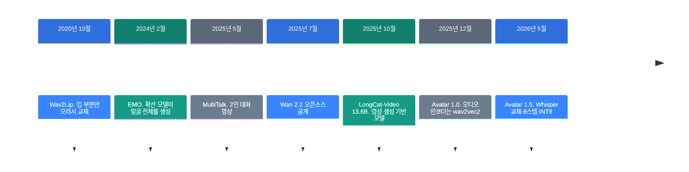
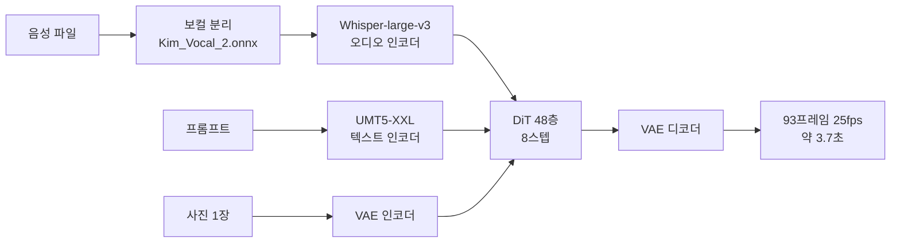

![[longcat-avatar-15.mp4]]

[원문](https://x.com/Dontgiveup_26/status/2106524415353909566) · [레포](https://github.com/meituan-longcat/LongCat-Video) · [English](https://neocello-ku.github.io/trends/longcat-avatar-15)

## 요약

2026년 5월 21일, 메이투안이 LongCat-Video-Avatar 1.5를 공개했습니다. 사진과 음성을 넣으면 그 사람이 말하는 영상이 나옵니다. 가중치까지 MIT 라이선스로 풀었습니다.

이 공개가 흐름에서 갖는 의미는 간단합니다. 말하는 사람 영상 기술이 연구 단계를 지나 제품 단계로 넘어갔다는 신호입니다.

결론부터 말하면 새 기법은 없습니다. 저자들도 기술 보고서에서 구조의 참신함보다 공학과 제품 완성도에 집중했다고 밝혔습니다. 상용 서비스급 묶음이 통째로 열린 점이 새롭습니다. 용어가 낯설면 아래 "처음이라면" 섹션부터 읽으세요.

## 흐름 속 위치: 왜 지금 이 이야기인가

사람 얼굴을 음성에 맞춰 움직이는 기술은 6년째 이어집니다. 초기 방법은 영상의 입 부분만 오려서 바꿔 붙였습니다. 지금은 모델이 사람과 배경을 통째로 새로 그립니다.



이 글은 마지막 단계입니다. 여기서 두 갈래가 합쳐집니다.

첫째는 영상 생성 기반 모델입니다. LongCat-Video는 Wan의 VAE와 구글 UMT5-XXL 텍스트 인코더를 씁니다. 데모 코드와 README 감사의 글에서 확인했습니다.

둘째는 2인 대화 기술입니다. Avatar의 프로젝트 페이지 주소가 `meigen-ai.github.io`입니다. MultiTalk를 만든 MeiGen-AI 팀이 이 모델에 참여했습니다.

### 이 기술은 무엇이 새로운가

| 무엇 | 새로운 정도 | 이유 |
| --- | --- | --- |
| 모델 구조 (기법) | 낮음 | 오디오 인코더 교체, 증류, INT8은 모두 있던 기법입니다. 저자들도 구조 참신함을 내세우지 않습니다. |
| 공개 묶음 (제품) | 높음 | 2인 대화, 애니메이션·동물, 긴 영상을 한 번에 내고 가중치도 MIT입니다. 비교 대상이 HeyGen과 Kling Avatar 2.0입니다. |
| 돌리는 비용 (인프라) | 중간 | DiT 연산 횟수를 약 19배, DiT 가중치를 절반으로 줄였습니다. 그래도 GPU 2장이 필요합니다. |

지난 글 두 편과 이어집니다. [Strata](https://neocello-ku.github.io/trends/strata)(2026-10-06)는 큰 모델을 작은 GPU에 넣는 이야기였습니다. 여기서도 같은 수법인 INT8 양자화가 나옵니다. [image-blaster](https://neocello-ku.github.io/trends/image-blaster)(2026-10-06)는 사진 한 장을 3D로 바꿨습니다. 이 글은 사진 한 장을 영상으로 바꿉니다.

정리하면 이 공개는 새 발명이 아닙니다. 흩어져 있던 기법들이 하나의 묶음으로 정리되고 상용 수준의 완성도를 얻은 장면입니다.

## 처음이라면: 이게 무슨 이야기인가요

### 말하는 영상을 만드는 두 가지 방법

연극 무대로 비유하면 쉽습니다.

- **옛날 방법**: 배우가 이미 연기한 영상이 있습니다. 거기서 입만 오려 내고 새 대사에 맞는 입을 그려 붙입니다. 입은 맞지만 표정과 몸짓은 옛날 그대로입니다.
- **지금 방법**: 배우 사진 한 장과 대사 녹음만 줍니다. 모델이 그 장면을 처음부터 새로 그립니다. 고개도 끄덕이고 손짓도 합니다.

Avatar 1.5는 지금 방법입니다.

### 모델이 소리를 이해하는 부분

모델은 소리 파일을 바로 읽지 못합니다. 소리를 숫자 묶음으로 바꿔 주는 부품이 필요합니다. 이 부품을 **오디오 인코더**라고 부릅니다.

1.0은 wav2vec2를 썼습니다. 1.5는 OpenAI의 Whisper-large-v3로 바꿨습니다. Whisper는 받아쓰기용으로 만든 모델입니다. 말소리를 더 정확히 구분합니다.

### 왜 이 공개가 좋은가

- 음성 하나와 사진 하나만 있으면 영상이 나옵니다. 영상 소재가 필요 없습니다.
- 상업적으로 써도 됩니다. MIT 라이선스라 가중치도 자유롭게 쓸 수 있습니다.
- 두 사람이 번갈아 말하는 영상을 지원합니다. 대담이나 인터뷰 형식이 됩니다.

### 이런 곳에 씁니다

- 안내 음성을 사람이 말하는 영상으로 바꾸기
- 팟캐스트 녹음을 두 사람 대화 영상으로 바꾸기
- 캐릭터 그림에 목소리를 입혀 짧은 영상 만들기

### 이 글에 나오는 이름들

| 용어 | 쉬운 뜻 |
| --- | --- |
| DiT | 영상을 실제로 그리는 본체 모델. Diffusion Transformer의 줄임말. |
| VAE | 영상을 작은 숫자 묶음으로 줄이고 다시 되돌리는 부품. |
| 텍스트 인코더 | 프롬프트 문장을 숫자로 바꾸는 부품. 여기서는 UMT5-XXL. |
| 오디오 인코더 | 소리를 숫자로 바꾸는 부품. 1.5에서는 Whisper-large-v3. |
| 스텝 | 흐릿한 상태에서 영상을 다듬는 횟수. 많을수록 느립니다. |
| 증류 | 많은 스텝이 내던 결과를 적은 스텝으로 흉내 내도록 가르치는 방법. |
| INT8 | 숫자 하나를 1바이트로 줄여 저장하는 방식. 메모리가 절반이 됩니다. |
| 세그먼트 | 한 번에 만드는 영상 조각. 여기서는 93프레임입니다. |

## 동작 방식

입력은 세 가지입니다. 프롬프트 문장, 사진 한 장, 음성 파일입니다.



음성은 먼저 보컬만 분리합니다. 배경 음악이 섞이면 입 모양이 흔들리기 때문입니다. 보컬이 잡히지 않으면 실행이 멈춥니다.

영상이 더 길어야 하면 세그먼트를 이어 붙입니다. 다음 세그먼트는 앞 세그먼트의 마지막 13프레임을 보고 만듭니다. 그래서 장면이 끊기지 않습니다.

길이 공식은 데모 코드에 그대로 있습니다.

```
길이(초) = 93/25 + (세그먼트 수 - 1) × 80/25
```

세그먼트 1개면 3.72초, 5개면 16.5초입니다.

## 준비물과 실행

### 준비물

| 항목 | 요구 사항 |
| --- | --- |
| GPU | CUDA GPU 2장. README의 아바타 예제가 모두 2장 기준입니다. |
| VRAM | README에 없음. 직접 계산한 값은 장당 약 33GB입니다. |
| Python | 3.10 (conda 환경 권장) |
| PyTorch | 2.6.0 + cu124 |
| 디스크 | 약 158GB (두 저장소 합계) |

VRAM 계산 근거는 아래 팩트체크 8번에 있습니다.

### 1단계. 레포를 받고 환경을 만드세요

```shell
git clone --single-branch --branch main https://github.com/meituan-longcat/LongCat-Video
cd LongCat-Video
conda create -n longcat-video python=3.10
conda activate longcat-video
```

### 2단계. 의존성을 설치하세요

```shell
pip install torch==2.6.0+cu124 torchvision==0.21.0+cu124 torchaudio==2.6.0 \
  --index-url https://download.pytorch.org/whl/cu124
pip install ninja
pip install psutil
pip install packaging
pip install flash_attn==2.7.4.post1
pip install -r requirements.txt
conda install -c conda-forge librosa
conda install -c conda-forge ffmpeg
pip install -r requirements_avatar.txt
```

### 3단계. 가중치 두 벌을 받으세요

```shell
pip install "huggingface_hub[cli]"
huggingface-cli download meituan-longcat/LongCat-Video \
  --local-dir ./weights/LongCat-Video
huggingface-cli download meituan-longcat/LongCat-Video-Avatar-1.5 \
  --local-dir ./weights/LongCat-Video-Avatar-1.5
```

기반 레포 가중치도 꼭 받아야 합니다. 데모 코드가 토크나이저와 텍스트 인코더, VAE를 `LongCat-Video` 폴더에서 읽습니다.

### 4단계. 한 사람 말하는 영상을 만드세요

```shell
torchrun --nproc_per_node=2 run_demo_avatar_single_audio_to_video.py \
  --context_parallel_size=2 \
  --checkpoint_dir=./weights/LongCat-Video-Avatar-1.5 \
  --stage_1=ai2v \
  --input_json=assets/avatar/single_example_1.json \
  --use_distill --model_type avatar-v1.5 --use_int8
```

`--use_distill`은 1.5에서 필수입니다. 빼면 스텝이 50으로 돌아갑니다. `--use_int8`은 1.5에서만 됩니다.

입력 JSON 형식은 예제 파일 그대로입니다.

```json
{
  "prompt": "A western man stands on stage under dramatic lighting...",
  "cond_image": "assets/avatar/single/man.png",
  "cond_audio": { "person1": "assets/avatar/single/man.mp3" }
}
```

### 5단계. 더 길게 만들려면 세그먼트를 늘리세요

```shell
torchrun --nproc_per_node=2 run_demo_avatar_single_audio_to_video.py \
  --context_parallel_size=2 \
  --checkpoint_dir=./weights/LongCat-Video-Avatar-1.5 \
  --stage_1=ai2v \
  --input_json=assets/avatar/single_example_1.json \
  --num_segments=5 --ref_img_index=10 --mask_frame_range=3 \
  --use_distill --model_type avatar-v1.5 --use_int8
```

5세그먼트는 약 16.5초입니다. 음성이 짧으면 코드가 무음을 덧붙입니다.

### 6단계. 2인 대화를 만들려면 스크립트를 바꾸세요

```shell
torchrun --nproc_per_node=2 run_demo_avatar_multi_audio_to_video.py \
  --context_parallel_size=2 \
  --checkpoint_dir=./weights/LongCat-Video-Avatar-1.5 \
  --input_json=assets/avatar/multi_example_1.json \
  --use_distill --model_type avatar-v1.5 --use_int8
```

입력 JSON에 `person1`과 `person2`를 넣습니다. `audio_type`이 `para`면 두 음성을 겹쳐 섞습니다. 길이가 같아야 합니다. `add`면 차례로 이어 붙입니다. 길이가 달라도 됩니다.

### 쓸 만한 선택지

| 상황 | 쓸 옵션 |
| --- | --- |
| 입 모양이 덜 맞을 때 | `--audio_guidance_scale` 3~5 (증류 모드에서는 1.0 고정) |
| 같은 동작이 반복될 때 | `--ref_img_index=30` 또는 `--mask_frame_range` 올리기 |
| 화질을 올릴 때 | `--resolution 720p` (768×1280) |
| VRAM이 모자랄 때 | `--use_int8` (1.5 전용) |

## 팩트체크

원문 게시물의 주장을 레포와 대조했습니다.

| 원문 주장 | 확인 결과 | 판정 |
| --- | --- | --- |
| 1. 색감 왜곡 0% | README 문구는 "without color drifting or quality degradation"입니다. 0%라는 수치도, 측정값도 없습니다. | 과장 |
| 2. 수 분짜리 영상 무한 연장 | 기반 모델 데모의 기본값은 11세그먼트이고 주석은 "1 minute video"입니다. 아바타는 세그먼트당 3.2초입니다. 늘릴 수는 있지만 "무한"은 근거가 없습니다. | 조건부 |
| 3. T2V·I2V·립싱크를 13.6B 모델 하나로 통합 | 13.6B가 통합한 것은 T2V·I2V·이어붙이기 셋입니다. 립싱크는 별도 가중치입니다. 아바타 DiT는 약 15.9B이고 따로 받습니다. | 과장 |
| 4. Veo3·PixVerse·Wan 2.2와 대등하거나 능가 | README 자체 평가에서 텍스트→영상 종합은 Veo3 3.48 > LongCat 3.38입니다. 이미지→영상은 LongCat 3.17로 비교군 중 최저입니다. 게다가 이 표는 2025년 기반 모델 수치입니다. | 과장 |
| 5. Whisper-large-v3를 오디오 인코더로 채택 | 맞습니다. 코드가 `WhisperModel`을 쓰고 체크포인트에 `whisper-large-v3`가 있습니다. 설정의 `audio_channel` 1280도 맞습니다. | 일치 |
| 6. 2인 대화 지원 | 맞습니다. 예제 JSON과 `audio_type` 두 가지가 있습니다. 다만 품질을 뒷받침할 측정값은 없습니다. | 조건부 |
| 7. 8스텝 증류로 속도 향상 | 스텝이 50에서 8로 줄고 CFG도 꺼집니다. DiT 평가 횟수로는 약 19배입니다. 초 단위 측정값은 공개되지 않았습니다. | 조건부 |
| 8. INT8로 VRAM 부담 감소 | DiT 가중치가 31.71GB에서 15.89GB로 줍니다. 다만 텍스트 인코더와 Whisper는 그대로라 장당 약 33GB가 남습니다. | 조건부 |
| 9. MIT 라이선스로 상업적 이용 가능 | 맞습니다. LICENSE가 MIT이고 README가 가중치도 MIT라고 밝힙니다. | 일치 |
| 10. 허깅페이스에서 바로 받아 통합 | 받을 수는 있습니다. 다만 기반 레포까지 받아야 하고 두 저장소 합계가 약 158GB입니다. | 조건부 |

### 속도 숫자는 어떻게 나왔나

`--use_distill`을 켜면 코드가 세 값을 덮어씁니다. 스텝은 8, 텍스트 CFG는 1.0, 오디오 CFG는 1.0입니다.

두 CFG가 모두 1.0이면 분류기 없는 유도가 꺼집니다. CFG가 켜져 있으면 한 스텝에 DiT를 3번 평가합니다. 꺼지면 1번입니다.

```
전: 50스텝 × 3회 = 150회
후:  8스텝 × 1회 =   8회
```

약 18.8배입니다. 단, 이것은 DiT 평가 횟수 비교입니다. 실제 걸린 시간이 아닙니다.

### VRAM 숫자는 어떻게 나왔나

허깅페이스 파일 크기로 계산했습니다. INT8 파일이 bf16 파일의 정확히 절반이라 원본이 bf16 저장임을 알 수 있습니다.

| 부품 | 크기 |
| --- | --- |
| DiT INT8 | 15.89 GB |
| 증류 LoRA | 2.52 GB |
| UMT5-XXL (bf16 변환) | 11.37 GB |
| Whisper-large-v3 | 3.09 GB |
| VAE | 0.26 GB |
| **합계** | **33.13 GB** + 활성값 |

데모는 전부 GPU에 올리고 CPU로 내리지 않습니다. `--context_parallel_size`는 공간 축을 나누는 방식이라 가중치는 GPU마다 복사됩니다. GPU를 2장 써도 장당 33GB는 그대로 필요합니다.

### 독립 측정은 아직 없습니다

기술 보고서는 상용 서비스 세 개와 비교합니다. HeyGen, OmniHuman 1.5, Kling Avatar 2.0입니다. 사례 500여 개를 썼습니다. 그러나 저자들이 직접 한 평가입니다. README의 점수표도 "our internal benchmark"라고 적혀 있습니다. 2026년 10월 6일 기준으로 제3자 벤치마크는 찾지 못했습니다.

## 언제 무엇을 쓰나

| 상황 | 쓸 방법 |
| --- | --- |
| 음성에 맞는 말하는 영상이 필요하다 | Avatar 1.5 (이 가이드) |
| 텍스트나 사진으로 일반 영상이 필요하다 | 기반 모델 LongCat-Video |
| 기존 영상을 더 길게 잇고 싶다 | `run_demo_video_continuation.py` |
| GPU가 1장뿐이다 | 상용 API 또는 더 작은 모델 |
| 라이선스 제약이 중요하다 | Avatar 1.5 (MIT, 가중치 포함) |

## 출처

- [LongCat-Video 레포](https://github.com/meituan-longcat/LongCat-Video)
- [Avatar 1.5 프로젝트 페이지](https://meigen-ai.github.io/LongCat-Video-Avatar-1.5-Page/)
- [Avatar 1.5 기술 보고서 (arXiv 2605.26486)](https://arxiv.org/abs/2605.26486)
- [LongCat-Video 기술 보고서 (arXiv 2510.22200)](https://arxiv.org/abs/2510.22200)
- [Avatar 1.5 가중치 (Hugging Face)](https://huggingface.co/meituan-longcat/LongCat-Video-Avatar-1.5)
- [MultiTalk 레포 (MeiGen-AI)](https://github.com/MeiGen-AI/MultiTalk)
- [Wav2Lip 논문 (ACM MM 2020)](https://arxiv.org/abs/2008.10010)
- [원문 게시물](https://x.com/Dontgiveup_26/status/2106524415353909566)

## 이어지는 글

- [[trends/strata|Strata: 125B 모델을 게임용 PC에서]]
- [[trends/image-blaster|image-blaster: 사진 한 장을 3D 공간으로]]

