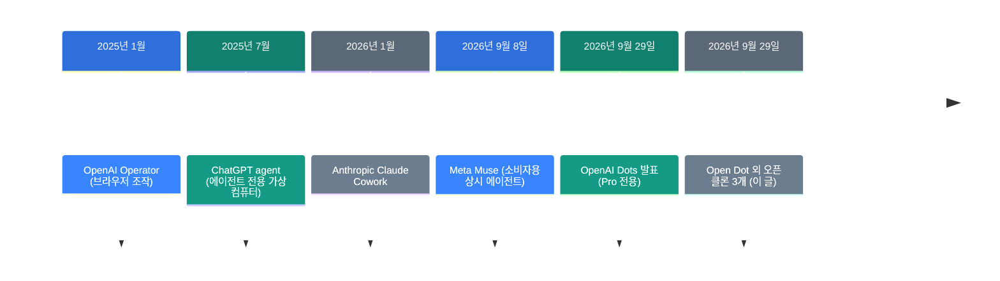
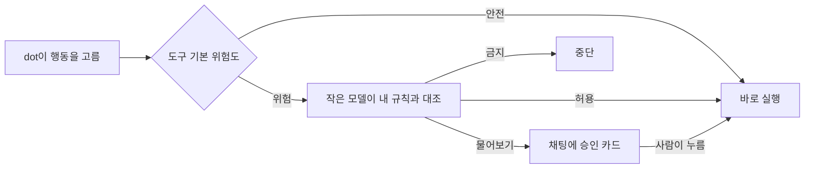

![[open-dot.mp4]]

[원문](https://x.com/KaranVaidya6/status/2105334408932954604) · [레포](https://github.com/composio-community/open-dot) · [English](https://neocello-ku.github.io/trends/open-dot)

## 요약

Composio 팀이 2026년 9월 29일 Open Dot을 공개했습니다. OpenAI Dots와 같은 일을 하는 맥 데스크톱 앱이고 모델은 내 API 키를 씁니다.

흐름으로 보면 유료 구독 상품이 나온 날 바로 붙은 오픈 클론 세 개 중 하나입니다. 결론부터 말하면 기술은 새롭지 않고 조립 속도가 새롭습니다. 다만 "같은 능력"은 아직 아닙니다. 용어가 낯설면 아래 "처음이라면" 섹션부터 읽으세요.

## 흐름 속 위치: 왜 지금 이 이야기인가

2026년 9월 29일 OpenAI가 Dots를 냈습니다. 월 100달러부터 시작하는 요금제에만 들어갔습니다. 그 가격표가 오픈소스 쪽의 방아쇠가 됐습니다.



이 글은 마지막 단계입니다. 앞의 네 단계는 능력을 하나씩 늘리는 이야기였습니다. 마지막 단계는 그 능력을 누가 소유하느냐의 이야기입니다.

세 클론의 레포 생성 시각이 그 속도를 보여 줍니다. Open Dot이 16시 34분입니다. CopilotKit의 OpenDots는 17시 13분입니다. feder-cr의 dots는 23시 06분입니다. 발표 당일 7시간 안에 전부 올라왔습니다.

### 이 기술은 무엇이 새로운가

| 무엇 | 새로운 정도 | 이유 |
| --- | --- | --- |
| 에이전트 루프 (기법) | 낮음 | OpenAI Responses API의 내장 `computer`·`web_search` 도구를 그대로 부릅니다. |
| 맥 데스크톱 앱 (제품) | 중간 | 하루 만에 앱, 브라우저 프로필, 암호 금고, 승인 카드, 음성 통화를 묶었습니다. |
| 앱 연결과 샌드박스 (인프라) | 낮음 | 새 인프라가 없습니다. Composio, E2B, Playwright, SQLite를 빌려 썼습니다. |

정리하면 발명이 아닙니다. 조립입니다. 가치는 조립물 자체가 아니라 조립 속도에 있습니다. 유료 상품이 나온 날 바로 대안이 나올 수 있다는 사실이 이 사건의 내용입니다.

### 지난 글과 이어서 보면

지난 글 [OpenAI dots: 상시 대기 에이전트가 요금제에](/trends/openai-dots)를 2026-10-06에 썼습니다.

그 글이 바로 Open Dot이 복제하려는 원본을 다룹니다.

그 글의 결론은 "기법은 2025년 그대로, 바뀐 것은 상주와 과금"이었습니다. Open Dot은 그중 과금만 걷어냅니다. 상주는 걷어내지 못했습니다. 이유는 아래 팩트체크에 적었습니다.

## 처음이라면: 이게 무슨 이야기인가요

### dot은 '내 일을 대신 하는 직원 한 명'입니다

챗봇은 질문에 답을 합니다. dot은 답 대신 일을 합니다. 메일함을 열어 읽고 일정을 잡고 웹사이트에 로그인해서 양식을 채웁니다.

OpenAI는 이 직원을 자기 서버에 두고 월세처럼 돈을 받습니다. Open Dot은 같은 직원을 내 맥에 두자는 제안입니다. 대신 전기 요금, 즉 API 사용료를 내가 냅니다.

### 왜 내 맥에 두려고 할까요

- 돈을 쓴 만큼만 냅니다. 구독은 안 써도 매달 나갑니다.
- 모델을 고를 수 있습니다. OpenAI 대신 Kimi나 Qwen을 쓸 수 있습니다.
- 채팅 기록과 비밀번호가 내 디스크에 남습니다.

### 이런 곳에 씁니다

- 평일 아침 8시에 메일함과 일정을 요약해서 알림으로 받기
- 은행에서 메일이 오면 dot을 깨워서 정해 둔 일을 시키기
- 로그인이 필요한 사이트에서 반복 작업을 맡기기

### 이 글에 나오는 이름들

| 용어 | 쉬운 뜻 |
| --- | --- |
| dot | 이름과 성격을 붙여 쓰는 에이전트 한 명. |
| 에이전트 | 답만 하지 않고 실제 작업을 대신 하는 프로그램. |
| 루틴 | 정해진 시각에 dot을 깨우는 예약 작업. |
| 트리거 | 메일 도착 같은 사건이 생기면 dot을 깨우는 장치. |
| Composio | 앱 1,500개의 로그인과 호출을 대신 처리해 주는 서비스. |
| E2B | 인터넷 너머에 리눅스 컴퓨터를 빌려 주는 서비스. |
| 컴퓨터 사용 | 모델이 화면을 보고 직접 클릭하고 입력하는 기능. |
| 승인 카드 | 위험한 행동 전에 채팅에 뜨는 허락 요청 상자. |
| 키체인 | 맥이 비밀 값을 잠가 두는 기본 금고. |

## 동작 방식

dot이 행동을 하나 하려 할 때마다 규칙 검사를 거칩니다. 도구마다 기본 위험도가 붙어 있고 내가 쓴 규칙이 그 위에 올라갑니다.



규칙은 "dot이 메일에 답장하려 할 때는 먼저 물어봐" 같은 문장으로 씁니다. 여러 규칙이 겹치면 "금지"가 먼저 이기고 그다음이 "물어보기"입니다. 검사 모델이 응답하지 않으면 안전한 쪽으로 기울어 물어봅니다.

## 준비물·실행

### 준비물

- 애플 실리콘 맥. 빌드 타깃이 macOS arm64 하나뿐입니다.
- Node 22 이상, pnpm, Google Chrome.
- OpenAI API 키 또는 OpenRouter 키. 음성 통화를 쓰려면 OpenAI 키가 필요합니다.
- 선택: Composio 프로젝트 키(트리거용), E2B 키(클라우드 컴퓨터용).

### 맥 앱으로 설치

레포를 받으세요. 그다음 아래를 실행하세요.

```bash
pnpm install
pnpm desktop:build
```

`dist/Open Dot-<버전>-arm64.dmg`가 나옵니다. 공증을 안 했으니 첫 실행은 앱을 우클릭하고 **Open**을 누르세요.

### 소스에서 실행

```bash
cp .env.example .env.local
pnpm install
npx playwright install chromium
pnpm dev
```

브라우저에서 `http://localhost:3100`을 여세요. 데스크톱 창까지 띄우려면 `pnpm desktop:dev`를 따로 실행하세요.

### 설정 화면에서 할 일

1. OpenAI 키나 OpenRouter 키를 붙여 넣으세요. 키는 암호화해서 저장됩니다.
2. Composio에 사인인해서 쓸 앱을 연결하세요. 사인인은 기본 브라우저에서 열립니다.
3. 트리거를 쓰려면 프로젝트 키를 따로 받으세요. platform.composio.dev에서 앱도 다시 연결합니다.

### 주요 환경 변수

| 변수 | 기본값 | 하는 일 |
| --- | --- | --- |
| `OPENAI_API_KEY` | 없음 | 모델과 음성 통화 |
| `OPENROUTER_API_KEY` | 없음 | Kimi, DeepSeek, Qwen, GLM |
| `COMPOSIO_API_KEY` | 없음 | 트리거용 프로젝트 키 |
| `DOTS_MODEL` | 키로 쓸 수 있는 최상위 모델 | dot이 쓰는 주 모델 |
| `DOTS_COMPUTER_TOOL` | `computer` | `off`로 두면 화면을 보지 않고 페이지만 읽습니다 |
| `E2B_API_KEY` | 없음 | dot마다 클라우드 컴퓨터 |
| `DOTS_DATA_DIR` | `.data/` | 채팅, 금고, 브라우저 프로필 저장 위치 |

## 팩트체크

게시물의 주장과 레포의 실제 내용을 대조했습니다.

| 주장 | 확인 결과 | 판정 |
| --- | --- | --- |
| 같은 능력을 1/10 비용으로 | README에 비용 숫자가 없습니다. 아래 계산 참조. | 조건부 |
| 같은 능력 | 앱이 닫히거나 맥이 자면 루틴과 트리거가 건너뜁니다. | 아님 |
| dot마다 전용 브라우저, 로그인 유지, 안전 | 코드와 일치합니다. | 일치 |
| Gmail, 캘린더와 1,500개 앱 | 숫자는 맞습니다. 트리거는 별도 키가 필요합니다. | 조건부 |
| 전화를 걸어 말하면서 시킨다 | 됩니다. 음성은 OpenAI 키만 됩니다. | 조건부 |
| 무료 오픈소스 | LICENSE 파일이 없습니다. | 아님 |

### 비용 1/10을 직접 계산했습니다

ChatGPT Pro는 월 100달러부터입니다. 그 1/10은 월 10달러입니다.

gpt-5.5 요금은 입력 100만 토큰 5달러, 출력 100만 토큰 30달러입니다. 입력과 출력을 10대 1로 쓴다고 가정하면 월 10달러는 입력 약 120만 토큰입니다. 하루로 나누면 약 4만 토큰입니다.

컴퓨터 사용은 한 턴마다 스크린샷과 페이지 텍스트를 같이 보냅니다. 하루 4만 토큰은 짧은 루틴을 한두 번 돌릴 분량입니다. 게다가 시스템 프롬프트를 매 턴 다시 만들어서 프롬프트 캐시가 잘 맞지 않습니다.

그러니 1/10은 가벼운 사용에서만 맞습니다. 하루 종일 돌리면 구독보다 비쌀 수 있습니다.

### "상시 대기"가 빠졌습니다

이게 가장 큰 차이입니다. 예약 작업은 croner 크론 작업으로 돌아가고 그 크론은 내 맥의 Node 프로세스 안에 있습니다.

README도 같은 말을 합니다. 루틴과 트리거는 앱이 열려 있을 때만 돕니다. 맥이 자는 동안 걸린 루틴은 그냥 건너뜁니다.

E2B 키를 넣어도 이건 안 바뀝니다. E2B가 빌려 주는 것은 dot이 쓰는 컴퓨터입니다. 깨우는 시계는 여전히 내 맥에 있습니다. OpenAI Dots는 시계까지 클라우드에 있습니다.

### 라이선스가 없습니다

2026년 10월 6일 기준 레포에 LICENSE 파일이 없습니다. GitHub API도 라이선스를 비어 있다고 보고합니다.

라이선스가 없으면 기본 저작권이 그대로 적용됩니다. 보는 것과 포크는 GitHub 약관으로 됩니다. 고쳐서 쓰거나 다시 배포할 권리는 없습니다.

같은 날 나온 다른 클론 둘은 MIT를 붙였습니다. 별 수도 그쪽이 많습니다. CopilotKit의 OpenDots가 3,697개입니다. feder-cr의 dots가 2,620개입니다. Open Dot은 578개입니다.

## 언제 무엇을 쓰나

| 상황 | 방법 |
| --- | --- |
| 맥을 늘 켜 두고 가벼운 자동화만 한다 | Open Dot. 구독비가 안 나갑니다. |
| 자는 동안에도 일이 돌아가야 한다 | OpenAI Dots. 시계가 클라우드에 있습니다. |
| 코드를 고쳐서 내 제품에 넣고 싶다 | MIT인 CopilotKit/OpenDots나 feder-cr/dots. |
| OpenAI 말고 다른 모델을 써야 한다 | Open Dot에 OpenRouter 키. 화면 클릭은 포기합니다. |
| 민감한 앱 자격 증명을 밖에 두면 안 된다 | 셋 다 안 맞습니다. Composio 경유를 먼저 확인하세요. |

## 출처

- [게시물: Karan Vaidya, 2026-09-30](https://x.com/KaranVaidya6/status/2105334408932954604)
- [레포: composio-community/open-dot](https://github.com/composio-community/open-dot)
- [Composio 요금](https://composio.dev/pricing)
- [gpt-5.5 요금](https://openrouter.ai/openai/gpt-5.5)
- [ChatGPT 요금](https://www.eesel.ai/blog/chatgpt-pricing)

## 이어지는 글

- [[trends/openai-dots|OpenAI dots: 상시 대기 에이전트가 요금제에 들어왔습니다]]

