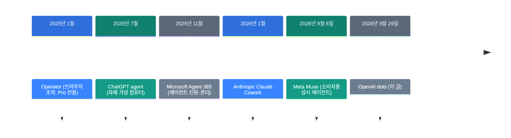
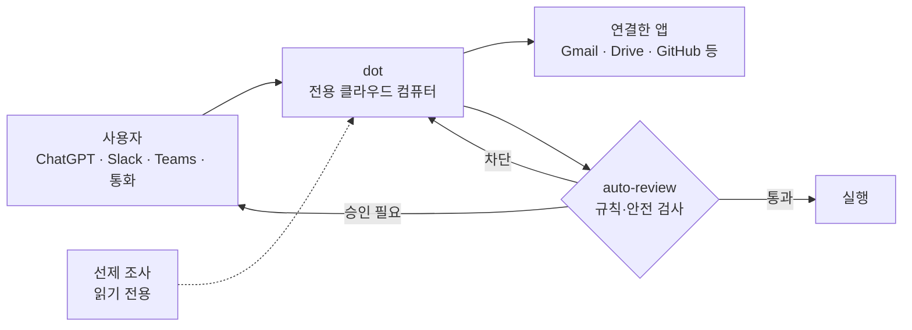

![[openai-dots.mp4]]

[원문](https://openai.com/index/introducing-dots/) · [English](https://neocello-ku.github.io/trends/openai-dots)

## 요약

2026년 9월 29일 DevDay에서 OpenAI가 dots를 냈습니다. 각 dot은 자기 클라우드 컴퓨터를 갖고 내가 보지 않는 동안에도 일을 이어 갑니다.

흐름으로 보면 2025년에 흩어져 있던 에이전트 부품을 구독 상품 하나로 묶은 일입니다. 결론부터 말하면 기법은 새롭지 않습니다. 새로운 것은 에이전트가 세션이 아니라 상주가 되었다는 점입니다. 용어가 낯설면 아래 "처음이라면" 섹션부터 읽으세요.

## 흐름 속 위치: 왜 지금 이 이야기인가

2025년 한 해 동안 에이전트 부품이 하나씩 나왔습니다. 브라우저를 조작하는 능력, 자기 가상 컴퓨터, 오래 걸리는 조사, 코드 작업이 따로 나왔습니다. 2026년에는 그 부품을 누가 먼저 하나로 묶느냐가 경쟁이 되었습니다.

이 발표는 마지막 단계에 있습니다. 에이전트가 자기 컴퓨터를 갖는 구조는 2025년 7월 ChatGPT agent에 이미 있었습니다. dots는 그 에이전트를 상주로 바꿨습니다. 그 전환 자체는 Meta Muse가 3주 먼저 했습니다.

### 이 기술은 무엇이 새로운가

| 무엇 | 새로운 정도 | 이유 |
| --- | --- | --- |
| 가상 컴퓨터 + 브라우저 루프 (기법) | 낮음 | 2025년 7월 ChatGPT agent와 뼈대가 같습니다. |
| 상주형 에이전트 상품 (제품) | 중간 | 다채널, 선제 조사, 음성 통화가 붙었습니다. 단 Muse가 3주 앞섰습니다. |
| 승인·신원 체계 (인프라) | 중간 | auto-review와 기업용 전용 신원이 생겼습니다. Agent 365의 흐름과 같습니다. |

정리하면 새 발명이 아닙니다. 2025년의 부품을 월 100달러짜리 구독 상품으로 묶은 결과입니다.

### 지난 글과 이어서 보면

이 아카이브의 지난 두 글은 반대쪽 끝에 있습니다. [Strata: 125B 모델을 게임용 PC에서](/trends/strata)는 2026-10-06 글입니다. 12GB 그래픽카드로 큰 모델을 돌렸습니다. [로컬 LLM에게 글 대신 답을 고르게 하기](/trends/jev-local)도 같은 날 글입니다. 작은 모델을 내 서버에서 판단기로 썼습니다.

둘 다 "내 하드웨어로 비용을 내린다"는 방향입니다. dots는 정반대입니다. 하드웨어가 전혀 필요 없고 대신 월 100달러부터 시작하는 구독을 냅니다. 같은 시기에 두 방향이 같이 굵어지고 있습니다.

## 처음이라면: 이게 무슨 이야기인가요

### 에이전트는 '대신 일하는 프로그램'입니다

보통 챗봇은 질문에 답만 합니다. 에이전트는 답 대신 일을 합니다. 웹사이트를 열고 양식을 채우고 파일을 만듭니다.

사람으로 치면 조언자와 대행자의 차이입니다. 조언자는 "이 서류를 내세요"라고 말합니다. 대행자는 서류를 대신 냅니다.

### 세션형과 상주형

지금까지의 에이전트는 세션형이었습니다. 창을 열고 일을 시키고 끝나면 닫습니다. 콜센터 상담 전화와 비슷합니다. 전화를 끊으면 관계가 끝납니다.

dots는 상주형입니다. 사무실 옆자리 동료에 가깝습니다. 내가 자리를 비워도 그 동료는 계속 일합니다. 내일 출근하면 어제 이야기를 기억하고 있습니다.

### 자기 컴퓨터를 갖는다는 뜻

각 dot은 OpenAI 서버 안에 자기 리눅스 컴퓨터와 Chrome 브라우저를 받습니다. 내 노트북과는 분리되어 있습니다. 내가 따로 연결해 주기 전에는 내 파일을 보지 못합니다.

이 구조는 사고 범위를 가두기 때문에 중요합니다. dot이 잘못된 명령을 실행해도 피해가 그 안에서 멈춥니다.

### 좋은 점 세 가지

- 일이 끊기지 않습니다. 내가 자는 동안에도 작업이 이어집니다.
- 부르는 곳이 여러 군데입니다. ChatGPT, Slack, Teams, 음성 통화에서 같은 dot을 씁니다.
- 맥락이 따라옵니다. ChatGPT에서 시작한 일을 Slack에서 이어서 말해도 됩니다.

### 이런 곳에 씁니다

- Slack에 버그 제보가 올라오면 바로 원인을 찾기
- 새 데이터가 들어올 때마다 분석을 다시 돌리고 이상한 값 확인하기
- 청구서나 견적처럼 정해진 서류를 준비해 놓고 승인만 받기

### 이 글에 나오는 이름들

| 용어 | 쉬운 뜻 |
| --- | --- |
| 에이전트 | 답만 하지 않고 실제 작업을 대신 하는 프로그램. |
| dot | OpenAI가 파는 상주형 에이전트 하나. 이름을 붙여서 씁니다. |
| GPT-6 Astra | dots를 움직이는 모델. 2026년 9월 기준 OpenAI의 최상위 모델. |
| 선제 조사 | 시키지 않아도 배경에서 자료를 읽고 메모를 남기는 기능. |
| 샌드박스 | 프로그램이 정해진 울타리 밖으로 못 나가게 막는 격리 환경. |
| auto-review | 행동을 실행하기 전에 규칙에 맞는지 검사하는 단계. |
| Custom Rules | 어떤 행동을 혼자 해도 되는지 내가 정하는 규칙. |
| 프롬프트 주입 | 웹페이지나 메일에 숨긴 명령으로 에이전트를 조종하는 공격. |
| 전문 dot | 회사가 고유 신원과 권한을 주고 특정 업무만 맡기는 dot. |

## 동작 방식

dot 하나가 일하는 경로는 네 칸으로 나뉩니다. 사용자가 목표를 줍니다. dot이 자기 컴퓨터에서 계획을 세웁니다. auto-review가 행동을 검사합니다. 통과한 것만 실행됩니다.

점선으로 그린 선제 조사는 따로 봅니다. 이 배경 작업은 읽기 전용 도구만 씁니다. 메시지를 보내거나 앱 내용을 고치지 못합니다. 공식 문서는 이 제한을 코드에서 강제한다고 밝힙니다.

왼쪽 위 화살표가 양방향인 점도 중요합니다. dot은 내 승인이 필요하면 먼저 말을 겁니다. 비밀번호 변경 같은 작업은 항상 사람이 직접 합니다.

## 준비물·실행

하드웨어는 필요 없습니다. 전부 OpenAI 클라우드에서 돕니다. 대신 요금제와 지역 조건이 있습니다.

| 항목 | 조건 |
| --- | --- |
| 요금제 | Pro 또는 Business Premium. Enterprise는 관리자가 켜면 베타 |
| 비용 | 첫 dot은 추가 비용 없음. 요금제 자체가 월 100달러부터 |
| 지역 | Pro는 EEA, 스위스, 영국 제외. Business Premium은 ChatGPT 전 지역 |
| 첫 설정 | ChatGPT 데스크톱 앱 또는 데스크톱 브라우저 |
| 모바일 | 첫 설정이 끝난 뒤에 쓸 수 있음 |

### 1단계. 데스크톱에서 첫 dot을 만드세요

ChatGPT 데스크톱 앱을 여세요. 그다음 dot을 만들고 이름을 붙이세요. 모바일 앱에서는 첫 설정이 되지 않습니다.

### 2단계. 앱을 연결하세요

설정의 플러그인 항목에서 쓸 앱을 고르세요. 연결은 ChatGPT, ChatGPT Work, Codex가 함께 씁니다.

한 가지 주의할 점이 있습니다. 연결을 끊으면 새 정보만 막힙니다. dot이 이미 읽은 내용은 그 dot의 맥락에 남습니다.

### 3단계. Custom Rules를 정하세요

어떤 행동을 혼자 해도 되는지 적으세요. 승인을 받게 하거나 아예 막을 수도 있습니다.

규칙이 너무 넓으면 거부됩니다. 외부 리뷰에서는 여러 규칙 중 2개만 통과했습니다. 좁고 구체적으로 쓰세요.

### 4단계. Activity View로 따라가세요

데스크톱 앱의 Activity View에 진행 중인 작업이 보입니다. 여기서 맥락을 더 주거나 방향을 바꾸세요. 멈추게 할 수도 있습니다.

### 5단계. 비밀번호는 보안 로그인으로 넣으세요

지원하는 사이트는 보안 로그인 양식을 씁니다. 이때 비밀번호가 모델 컨텍스트에 들어가지 않습니다.

반대로 문서나 메시지에 적어 둔 비밀번호는 모델이 그대로 봅니다. 공식 문서도 이 한계를 인정합니다.

## 팩트체크

| 발표문의 주장 | 확인 결과 | 판정 |
| --- | --- | --- |
| GPT-6 Astra 기반이고 dot마다 자기 클라우드 컴퓨터가 있다 | 발표문과 안전 문서가 일치합니다. 외부 리뷰도 그 컴퓨터 화면을 열어 확인했습니다. | 일치 |
| 첫 dot은 요금제에 추가 비용 없이 들어간다 | 맞습니다. 단 들어가는 요금제가 Pro 월 100달러부터입니다. | 일치 |
| 4,000개 넘는 앱에 연결된다 | 공식 수치뿐입니다. 목록이 공개되지 않아 독립 확인이 안 됩니다. | 조건부 |
| 언제 어디서나 손 닿는 곳에 있다 | Pro는 EEA, 스위스, 영국에서 못 씁니다. 첫 설정은 데스크톱에서만 됩니다. | 조건부 |
| 거의 모든 일을 맡아서 한다 | 외부 10개 작업 평균 8.8/10, 최저 7.0입니다. | 과장 |
| 사용자가 늘 통제한다 | 설계는 자세합니다. 실사용에서는 승인 요청이 반복됐습니다. | 조건부 |
| 선제 조사는 읽기 전용이며 코드로 막는다 | 공식 문서가 구조를 밝힙니다. 외부에서 확인할 방법이 없습니다. | 조건부 |

### 같은 시기 독립 측정

출시 다음 날부터 이틀간 ChatGPT Pro 계정으로 10개 업무를 돌린 리뷰가 있습니다. 설정 수고, 완수, 정확도, 결과물 품질, 감독 필요도를 각각 0~2점으로 매겨 10점으로 환산했습니다.

| 작업 | 점수 |
| --- | --- |
| AI 플랫폼 비교 조사 | 9.8 |
| 웹페이지 제작·게시 | 9.8 |
| 맥락 기반 콘텐츠 기획 | 9.8 |
| 반복 예약 작업 | 9.8 |
| 브랜드 스킬 연동 | 9.6 |
| 회의 준비 | 9.0 |
| 주간 업무 브리핑 | 8.6 |
| 받은메일 분류 | 7.5 |
| 스프레드시트 제작 | 7.5 |
| 회의 후속 처리 | 7.0 |

평균은 8.8/10입니다. 실패 유형 두 가지가 반복됐습니다.

첫째는 결과물의 그릇입니다. 내용은 맞는데 형식이 틀렸습니다. PDF 대신 글, 보낼 수 있는 초안 대신 대화 속 텍스트였습니다.

둘째는 검증 환경입니다. 스프레드시트는 자체 점검을 통과했습니다. 그런데 Google Sheets에서 열자 수식이 깨졌습니다. dot이 실제 쓰이는 환경에서 확인하지 않았습니다.

다른 리뷰는 종합 3/5를 줬습니다. 일상 마찰이 2.5/5였습니다. 승인 요청이 반복됐습니다. 읽을 수 있는 받은메일에서도 2FA 코드는 가져오지 않았습니다. 두 리뷰 모두 프롬프트 주입 방어 효과는 검증하지 못했다고 밝혔습니다.

## 언제 무엇을 쓰나

| 상황 | 쓸 방법 |
| --- | --- |
| 며칠에 걸쳐 상태가 바뀌는 일을 맡긴다 | dots |
| 한 번에 끝나는 조사나 코드 작업이다 | Deep Research, Codex |
| 결과물 형식이 엄격하다 (수식, 서식) | 사람이 마지막에 확인 |
| 내 데이터가 밖으로 못 나간다 | 로컬 모델 (지난 글 Strata, Jev 참고) |
| EEA, 스위스, 영국에서 개인으로 쓴다 | 지금은 못 씀. Business Premium만 가능 |

## 출처

- [Introducing dots (OpenAI, 2026-09-29)](https://openai.com/index/introducing-dots/)
- [How we build safety, security, and privacy into dots (OpenAI)](https://openai.com/index/how-we-build-safety-security-and-privacy-into-dots/)
- [OpenAI Dots Review: I Tested 10 Business Tasks](https://www.aiagentslibrary.com/blog/openai-dots-review/)
- [OpenAI Dots review 2026: safety, speed, price, and who it fits](https://www.eesel.ai/blog/openai-dots-review)
- [OpenAI launches Dots AI agents amid safety questions (NBC News)](https://www.nbcnews.com/tech/tech-news/openai-launches-dots-ai-agents-safety-questions-rcna600338)
- [OpenAI launches Dots, its bubbly agentic avatar (TechCrunch)](https://techcrunch.com/2026/09/29/openai-launches-dots-its-bubbly-agentic-avatar/)
- [OpenAI Operator (Wikipedia)](https://en.wikipedia.org/wiki/OpenAI_Operator)
- [Muse, AI agent (Wikipedia)](https://en.wikipedia.org/wiki/Muse_(AI_agent))

## 이어지는 글

- [[trends/strata|Strata: 125B 모델을 게임용 PC에서]]
- [[trends/jev-local|로컬 LLM에게 글 대신 답을 고르게 하기]]

