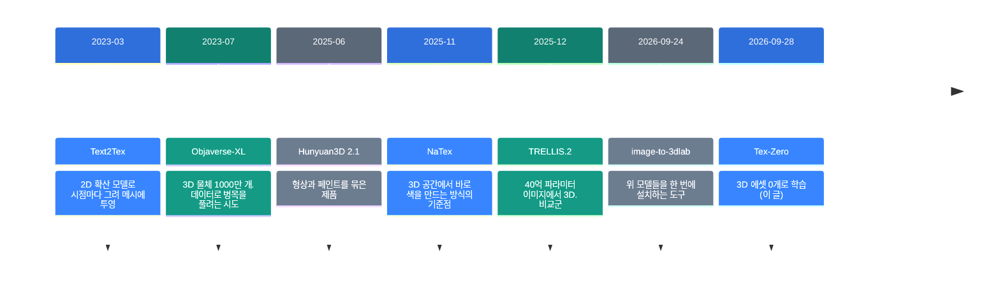
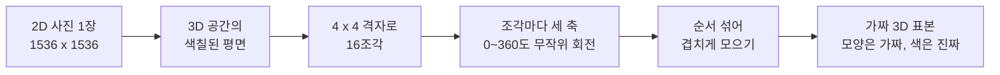
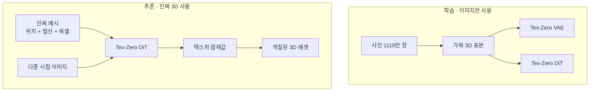

![[tex-zero.mp4]]

[원문](https://arxiv.org/abs/2609.34621) · [레포](https://github.com/wangjiangshan0725/Tex-Zero) · [English](https://neocello-ku.github.io/trends/tex-zero)

## 요약

2026년 9월 28일, 논문 한 편이 arXiv에 올라왔습니다. 실제 3D 에셋을 한 개도 쓰지 않고 3D 텍스처 생성 모델을 학습했다는 내용입니다.

이 이야기가 지금 나온 이유는 분명합니다. 3D 생성의 병목은 모델이 아니라 학습용 3D 데이터이기 때문입니다.

결론부터 말하면, 관점은 새롭지만 오늘 쓸 수 있는 것은 없습니다. 코드도 가중치도 공개되지 않았습니다. 용어가 낯설면, 아래 "처음이라면" 섹션부터 읽으세요.

## 흐름 속 위치: 왜 지금 이 이야기인가

3D 생성 모델은 2D 이미지 모델보다 늘 한 발 늦습니다. 이유는 데이터 양입니다. 이미지는 수십억 장이 웹에 있지만, 색까지 입힌 3D 에셋은 1000만 개 규모입니다.

그래서 이 분야는 두 갈래로 나뉘었습니다. 한쪽은 3D 데이터를 더 모읍니다. 다른 한쪽은 2D 모델의 능력을 3D로 옮깁니다.



이 논문은 마지막 줄에 있습니다. 2025년 11월부터 "3D 공간에서 바로 색을 만드는" 방식이 쏟아졌습니다. Tex-Zero는 그 방식을 **더 잘 만들지 않고, 더 싸게 학습**합니다.

지난 글 [image-to-3dlab v0.3.7](https://neocello-ku.github.io/trends/image-to-3dlab) (2026-10-07)은 이 표의 모델들을 설치해서 쓰는 쪽이었습니다. 이 글은 그 모델들을 만드는 쪽입니다.

### 이 기술은 무엇이 새로운가

| 무엇 | 새로운 정도 | 이유 |
| --- | --- | --- |
| 이미지를 3D 학습 표본으로 바꾸기 (기법) | 중간 | 평면을 조각내 무작위로 돌리는 방식은 새 조합입니다. 2D로 3D를 푸는 큰 흐름은 2022년부터 있었습니다. |
| 쓸 수 있는 도구 (제품) | 낮음 | 코드, 가중치, 데모가 모두 없습니다. |
| 학습 데이터 조달 (인프라) | 중간 | 3D 수집 병목을 우회하는 방법을 보였습니다. 검증은 내부 테스트셋 하나뿐입니다. |

정리하면, 새 발명보다는 관점 제안입니다. "3D 모델을 학습하려면 3D 데이터가 필요하다"는 전제에 반례를 하나 댔습니다.

## 처음이라면: 이게 무슨 이야기인가요

### 3D 물체는 '모양'과 '색'으로 나뉩니다

찰흙 인형을 떠올려 보세요. 먼저 모양을 빚습니다. 그다음 물감을 칠합니다.

컴퓨터 3D도 같습니다. 모양을 **메시**라고 부릅니다. 메시에 칠한 색을 **텍스처**라고 부릅니다.

3D 생성 AI도 보통 이 둘을 따로 만듭니다. 이 논문은 색을 칠하는 쪽만 다룹니다.

### 색을 칠하는 두 가지 방법

| 방법 | 비유 |
| --- | --- |
| 역투영 방식 | 인형 사진을 여섯 방향에서 그리고, 그 그림을 인형에 붙입니다. |
| 네이티브 방식 | 인형의 겉면 점 하나하나에 바로 색을 정합니다. |

역투영은 붙인 자리마다 이음매가 생깁니다. 네이티브는 이음매가 없지만, 학습에 색칠된 3D 에셋이 많이 필요합니다.

### 이 논문이 깬 전제

학습용 3D 에셋을 모으는 일은 비쌉니다. 스캔하거나 사람이 만들어야 합니다.

저자들은 이렇게 생각했습니다. 텍스처를 배우려면 좋은 **색**이 필요합니다. 그런데 **모양**은 진짜가 아니어도 될지 모릅니다.

그래서 사진 한 장을 3D 공간의 평면 한 장으로 놓았습니다. 그 평면을 16조각으로 나누고, 조각마다 아무 방향으로 돌렸습니다. 조각들을 겹쳐 모으니 울퉁불퉁한 가짜 3D 덩어리가 됩니다.

색은 원본 사진 그대로입니다. 모양만 가짜입니다. 이 가짜 표본으로 학습한 모델이 진짜 3D 에셋을 다룹니다.

### 좋은 점 세 가지

- 학습 데이터를 사진에서 얻습니다. 논문은 1110만 장을 썼습니다.
- 3D 에셋 수집 비용이 들지 않습니다.
- 사진의 세밀한 색이 그대로 학습에 들어갑니다.

### 이런 곳에 씁니다

- 게임, 영화용 3D 소품에 색 입히기
- 스캔한 메시의 빠진 면 색 채우기
- 디지털 트윈의 설비 모델 외형 만들기

### 이 글에 나오는 이름들

| 용어 | 쉬운 뜻 |
| --- | --- |
| 메시 | 3D 물체의 모양. 삼각형을 이어 붙인 껍데기. |
| 텍스처 | 메시 겉면에 입힌 색과 무늬. |
| 네이티브 3D 텍스처 생성 | 2D 그림을 거치지 않고 3D 공간에서 바로 색을 정하는 방식. |
| 역투영 | 여러 방향에서 그린 2D 그림을 메시 표면에 되쏘아 붙이는 방식. |
| VAE | 큰 데이터를 작은 숫자 묶음으로 줄였다가 되살리는 모델. |
| 잠재 공간 | VAE가 줄여 놓은 작은 숫자 묶음이 사는 공간. |
| DiT | 잠재 공간에서 새 내용을 만들어 내는 확산 모델. |
| 복셀 | 3D 공간을 네모 칸으로 나눈 격자의 칸 하나. |
| LPIPS | 사람 눈에 비슷해 보이는 정도. 낮을수록 좋습니다. |
| PSNR | 픽셀 값이 수치로 얼마나 맞는지. 높을수록 좋습니다. |

## 동작 방식

### 학습 데이터 만들기



회전각은 세 축마다 따로 뽑습니다. 범위는 0도 이상 360도 미만입니다. 조각을 겹쳐 모으는 이유가 있습니다. 조각이 떨어져 떠 있으면 학습이 되지 않기 때문입니다.

### 학습과 추론



VAE는 2D 이미지와 3D 텍스처를 **같은 잠재 공간**에 넣습니다. 그래서 조건으로 들어오는 다중 시점 이미지도 평면으로 바꿔 같은 VAE로 인코딩합니다. 표현 차이가 줄어서 생성 품질이 올라간다는 설명입니다.

### 입력을 오해하지 마세요

논문 원문은 이렇습니다. `Tex-Zero takes a real 3D geometry and its multi-view images as input.`

사진 한 장만 넣는 도구가 아닙니다. 앞에 두 단계가 더 붙습니다.

1. 새 시점 합성으로 다중 시점 이미지를 만듭니다.
2. 그 이미지로 메시를 재구성합니다.
3. 메시와 이미지를 Tex-Zero에 넣습니다.

Tex-Zero는 파이프라인의 마지막 칸입니다.

### 모델 크기

| 부분 | 설정 |
| --- | --- |
| VAE | 해상도 5단계, 채널 폭 128·256·512·512·512 |
| VAE 축소 | 공간 16배 축소, 잠재 채널 16개 (f16c16) |
| DiT 블록 | 듀얼 스트림 12개 + 싱글 스트림 24개 |
| DiT 폭 | 은닉 1024, 어텐션 헤드 8개 |

논문은 파라미터 수를 밝히지 않았습니다. 폭 1024로 계산하면 DiT는 약 6억 개입니다. 블록 하나가 약 12 × 1024²이고, 듀얼은 그 두 배입니다. 비교하면 TRELLIS.2는 40억 개입니다.

## 오늘 할 수 있는 것

**실행 명령어를 쓸 수 없습니다.** 레포에 코드가 없기 때문입니다.

레포 파일은 여섯 개가 전부입니다.

```
README.md
data-construction.png
main-results.png
method.png
overview-comparison.png
teaser.png
```

| 항목 | 2026-10-08 기준 |
| --- | --- |
| 코드 | 없음 |
| 가중치 | 없음. Hugging Face에도 없음 |
| 설치 파일 | 없음 |
| 데모 | 없음. 프로젝트 페이지가 이 레포입니다 |
| LICENSE | 파일 없음. 기본값은 모든 권리 보유 |
| 공개 요청 | 이슈 1건 (2026-10-03). 답변 없음 |

### 공개되면 확인할 것

1. 추론 VRAM을 먼저 확인하세요. 논문에 수치가 없습니다.
2. 다중 시점 이미지를 어떤 모델로 만드는지 확인하세요.
3. 라이선스를 확인하세요. 상업적 사용 조건이 아직 없습니다.
4. 내부 테스트셋 160개 대신 내 데이터로 재 보세요.

### 지금 대신 할 일

기준선을 먼저 만들어 두세요. 그러면 공개되었을 때 바로 비교할 수 있습니다.

TRELLIS.2나 Hunyuan3D로 내 물체 몇 개에 색을 입혀 보세요. 설치는 지난 글 [image-to-3dlab](https://neocello-ku.github.io/trends/image-to-3dlab)에 있습니다.

## 팩트체크

| 주장 | 확인 결과 | 판정 |
| --- | --- | --- |
| 3D 에셋 없이 학습할 수 있다 | 표 1에서 이미지만 학습한 VAE가 진짜 3D 에셋을 재구성합니다. 3D LPIPS 0.0154~0.0316 | 일치 |
| VAE가 3D 에셋을 고품질로 재구성한다 | 같은 설정끼리 보면 LPIPS는 세 번 다 이기고, PSNR-PC는 세 번 다 집니다 | 조건부 |
| NaTex보다 낫다 | 6시점 LPIPS 0.0340 대 0.0754. 단 내부 테스트셋 160개입니다 | 조건부 |
| 제목: 3D 에셋이 꼭 필요한가 | 논문 표 3은 2D+3D가 3D만보다 낫다고 보입니다 | "없어도 된다"가 정확 |
| 이미지 1110만 장, 1536×1536 | 논문에 명시되어 있습니다 | 일치 |
| 학습·추론 하드웨어 | 논문과 README 모두에 없습니다 | 근거 없음 |
| 코드와 가중치를 쓸 수 있다 | README와 PNG 5장뿐입니다 | 오늘 기준 불가 |
| 사진 한 장만 넣으면 된다 | 입력은 메시 + 다중 시점 이미지입니다 | 오해 주의 |

### 같은 설정끼리 짝지어 보기

이 표가 이 글의 핵심입니다. 설정을 섞어 비교하면 결론이 달라집니다.

| VAE 설정 | 이미지 학습 LPIPS↓ | 3D 학습 LPIPS↓ | 이미지 학습 PSNR-PC↑ | 3D 학습 PSNR-PC↑ |
| --- | --- | --- | --- | --- |
| f8c16 | **0.0154** | 0.0208 | 34.03 | **36.55** |
| f16c32 | **0.0229** | 0.0343 | 32.59 | **33.67** |
| f16c16 | **0.0316** | 0.0345 | 30.10 | **30.90** |

세 설정이 모두 같은 방향입니다. 이미지로만 학습한 쪽이 지각 지표는 다 이깁니다. 색 수치 지표는 다 집니다. 초록과 README는 이기는 쪽만 말합니다.

해석하면 이렇습니다. 가짜 모양으로 학습한 모델은 "사람 눈에 그럴듯한 색"을 잘 만듭니다. "원본 색값과 정확히 같은 색"은 덜 잘 만듭니다.

### 제목의 질문에 대한 답

논문 표 3을 보세요. DiT의 LPIPS가 3D만 학습하면 0.0302이고, 2D와 3D를 함께 쓰면 0.0216입니다.

논문 본문도 이렇게 씁니다. `Image-derived data remains beneficial when textured 3D assets are available.`

즉 저자들도 3D 에셋이 쓸모없다고 말하지 않습니다. 답은 "없어도 된다"이지 "필요 없다"가 아닙니다.

### 검증의 한계

| 항목 | 상태 |
| --- | --- |
| 평가셋 | 내부 160개. 공개되지 않아 재현할 수 없습니다 |
| 비교군 설정 | 공개 체크포인트와 기본 설정을 썼습니다 |
| 사용자 평가 | 없습니다 |
| 공개 벤치마크 | 이 분야에 공용 벤치마크를 찾지 못했습니다 |
| 이해 관계 | NaTex 1저자가 이 논문의 프로젝트 리드입니다 |

마지막 줄이 중요합니다. 자기 팀의 이전 모델을 비교군으로 삼았습니다. 독립 비교가 아닙니다.

## 언제 무엇을 쓰나

| 상황 | 쓸 방법 |
| --- | --- |
| 지금 3D 에셋에 색을 입혀야 한다 | TRELLIS.2 또는 Hunyuan3D |
| 이음매 없는 텍스처가 필요하다 | 네이티브 방식 (NaTex, TRELLIS.2) |
| 3D 학습 데이터가 없어 모델을 못 만든다 | 이 논문의 데이터 만들기 방식을 참고 |
| 색값이 수치로 정확해야 한다 | 3D 에셋으로 학습한 모델 |
| 사람 눈에 자연스러우면 된다 | 이미지로 학습한 모델도 후보 |

## 출처

- [논문: Does Native 3D Texture Generation Necessarily Require 3D Assets for Training? (arXiv:2609.34621)](https://arxiv.org/abs/2609.34621)
- [논문 HTML 전문](https://arxiv.org/html/2609.34621v1)
- [GitHub: wangjiangshan0725/Tex-Zero](https://github.com/wangjiangshan0725/Tex-Zero)
- [NaTex: Seamless Texture Generation as Latent Color Diffusion (arXiv:2511.16317)](https://arxiv.org/abs/2511.16317)
- [Text2Tex (arXiv:2303.11396)](https://arxiv.org/abs/2303.11396)
- [Objaverse-XL (arXiv:2307.05663)](https://arxiv.org/abs/2307.05663)
- [지난 글: image-to-3dlab v0.3.7](https://neocello-ku.github.io/trends/image-to-3dlab)

## 이어지는 글

- [[trends/image-to-3dlab|image-to-3dlab v0.3.7: 엔비디아 리눅스에 3D 경로 세 개, 한국에서는 두 개]]
- [[trends/image-blaster|image-blaster: 사진 한 장을 3D 공간으로]]

