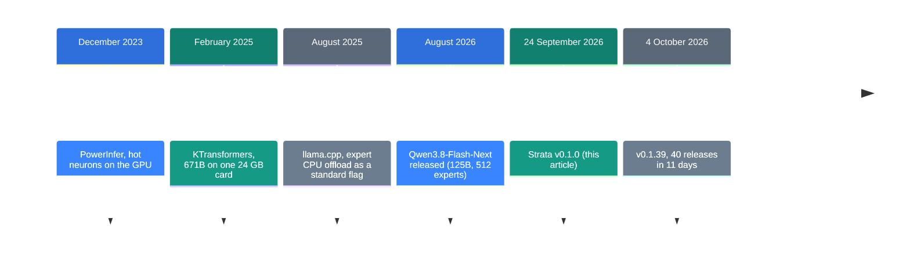
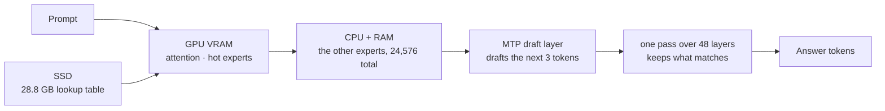

![[strata.en.mp4]]

[Source](https://github.com/Niko1221/Strata) · [Repo](https://github.com/Niko1221/Strata) · [[trends/strata|한국어]]

## Summary

Strata came out on 24 September 2026. It is an open-source engine that runs a 125B model on a 12 GB graphics card and ordinary PC memory. It collected 13,900 stars in 12 days.

Tools that do the same job have been around for three years. What is new is not the method. It is the install experience. One script does everything if you have a current driver.

New to these terms? Start with the "If you are new" section below.

## Where it fits: why this story now

Ways to run a large model on a small graphics card already existed. The problem was the user. You had to know the command-line flags.



Strata is the fifth step. It puts an installer on top of the method the first three steps built.

### What is new here

| What | How new | Why |
| --- | --- | --- |
| Splitting experts between GPU and CPU (method) | Low | PowerInfer published the same idea in December 2023. |
| Own engine and kernels (infrastructure) | Medium | It uses part of ggml and writes the rest from scratch. The adaptive expert cache and KV streaming are its own. |
| Double-click install and a local API (product) | High | One script checks the hardware, fetches the model, and starts the server. |

So Strata is not a new invention. It is the first time a three-year-old method became a double-click product.

## If you are new: what is this about

### Why large models only ran on servers

Model size is counted in parameters. 125B means 125 billion parameters. Those numbers have to sit in memory before the model runs.

Normally they all go into graphics card memory. This model is 354 GB when it is not compressed. A gaming card holds 12 GB to 24 GB.

### Mixture of experts: not everything runs at once

Large models today use an MoE design. They hold many small pieces called experts and use only a few of them.

Qwen3.8-Flash-Next has 24,576 experts. Only 10 of them work on each token.

Think of a large hospital. It can have 20,000 doctors, but one patient meets only 10. You do not need 20,000 exam rooms.

### What Strata does: seating

Strata uses this property. It keeps the most-used experts on the graphics card and the rest in PC memory.

- **Graphics card (VRAM)**: the parts every token needs, plus a few thousand hot experts
- **System RAM**: all 24,576 experts
- **CPU**: computes the experts the card does not hold, at the same time as the GPU
- **SSD**: a 28.8 GB lookup table. It reads a few rows per token

Which experts stay on the card keeps changing while you chat.

### Compression: down to 2 bits

354 GB is too much to use as it is. So the precision of each number is cut. This is called quantization.

The original uses 16 bits per weight. The files Strata uses run from 2 bits to 3.5 bits. That brings the size down to 66 GB or 84 GB.

Cutting precision also cuts quality. The fact check below gives the numbers.

### Why it is good

- You run a large model on your own PC with no monthly fee.
- Your text never leaves the PC.
- The API matches OpenAI and Anthropic, so your apps connect as they are.

### Where it fits your work

- Repeated bulk code work
- Documents that must not leave the building
- A cheap default for a coding agent

### Names in this article

| Term | Plain meaning |
| --- | --- |
| Token | The smallest piece a model reads and writes. About 3/4 of a word in English. |
| Parameter | A number the model learned. 125B means 125 billion of them. |
| MoE | Mixture of experts. Many small pieces, a few used per token. |
| Expert | One piece of an MoE. This model has 24,576. |
| Quantization | Cutting the precision of weights to make the files smaller. |
| VRAM | The memory on the graphics card. |
| Context | How much text the model keeps in mind at once. |
| Speculative decoding | A small layer drafts first, the large model checks. |
| tok/s | Tokens per second. The speed unit. |

## How it works



### Draft, then check

The model has a small draft layer called MTP. It drafts the next 3 tokens.

Then the large model makes one pass over 48 layers and checks all three at once. It keeps what matches and writes the next token itself.

One pass yields 2.4 to 3.2 tokens on average. The repository reports 1.6x to 1.8x from this.

### Reading long text

Prompts are read in chunks of up to 8,192 tokens. The next layer's experts stream over PCIe while this happens.

So a long document reads at over 1,000 tokens per second. The first message takes about one minute per 30,000 tokens. Later messages start in seconds.

## What you need

| Item | Requirement |
| --- | --- |
| Graphics card | NVIDIA RTX 20, 30, 40 or 50 series, or AMD RX 6800/6900 and 7700 XT upward. 12 GB of VRAM or more |
| System RAM | 32 GB or more. 64 GB fits every size |
| CPU | x86-64 with AVX2. AVX-512 is a little faster |
| Disk | 70-80 GB for the model plus about 6 GB for the draft layer. An NVMe SSD is advised |
| Driver | NVIDIA 580 or newer, or a current AMD driver |

There is one trap. The model loads into system RAM, not into VRAM. A 12 GB card will not help if the PC has under 32 GB of RAM.

## Install and run

### Step 1. Download it

```bash
git clone https://github.com/Niko1221/Strata
cd Strata
```

On Windows you can download the zip and unpack it.

### Step 2. Run the setup script

```bash
./setup.sh
```

On Windows, double-click `START-HERE.bat`.

The script reads your card and RAM and recommends a size. Press Enter at each question to take the recommendation.

Then it downloads about 70 GB. Run it again if the download stops. It picks up where it left off.

### Step 3. Wait for the first start

The PC can look frozen for 1 to 3 minutes while the model loads. It is moving 35 to 55 GB into RAM. Do not close the window.

Your browser then opens `http://127.0.0.1:8080`.

### Step 4. Connect the apps you already use

| App type | Setting |
| --- | --- |
| OpenAI-compatible | Base URL `http://127.0.0.1:8080/v1` |
| Anthropic-compatible | `http://127.0.0.1:8080/v1/messages` |
| Claude Code | `ANTHROPIC_BASE_URL=http://127.0.0.1:8080` |
| Codex CLI | `/v1/responses` |

Any API key and any model name work.

### To switch sizes

```bash
./setup.sh --setup
./setup.sh --setup --family coder
./setup.sh --setup --host 0.0.0.0 --api-key <secret>
```

The first line opens the menu. The second installs the coding model for 32 GB of RAM. Always set a key before you open the server to other machines.

## Fact check

| Claim in the README | What we found | Verdict |
| --- | --- | --- |
| It runs a 125B model on a gaming PC | True. The file is compressed to 2-3.5 bits, and you also need 32 GB of RAM and 80 GB of disk | Conditional |
| 94 tok/s on an RTX 5070 12 GB | The machine, the engine version and the raw data path are all given. It is a self-measurement | Matches |
| 1.6x to 1.8x from speculative decoding | It agrees with the stated 2.4-3.2 tokens per pass. No outside reproduction exists | Grounded, not verified |
| Larger sizes are a bit smarter | IQ2_XS scores 89.16 against IQ3_S at 93.26. That is more than "a bit" | Understated |
| IQ3_S matches the original on the published tests | 93.26 against 93.12, so yes. The measurement comes from the team that made the quantization | Matches |
| The Coder reaches 91% of the original on SWE-bench | The reported value is 91.3%. The README states it is weaker outside code and in Chinese | Matches |
| It reads pictures | You can turn this on. On AMD it runs on the CPU and on Linux only | Conditional |

### How much does 2 bits cost

This is the question that matters. ISTA-DASLab, which made the quantization, published the numbers.

| Size | Bits per weight | Size on disk | Task average | LiveCodeBench v6 |
| --- | ---: | ---: | ---: | ---: |
| BF16 original | 16.0 | 354 GB | 93.12 | 87.43 |
| Q2_0 | 2.40 | 66.4 GB | 89.07 | 81.14 |
| IQ2_XS | 2.50 | 68.0 GB | 89.16 | 83.43 |
| IQ3_XXS | 3.00 | 75.8 GB | 92.57 | 86.29 |
| IQ3_S | 3.50 | 83.6 GB | 93.26 | 86.86 |

Read it this way. From 3 bits up the scores stay close to the original. The 2-bit sizes drop about 4 points, and more on code.

The installer recommends IQ2_XS on a 64 GB PC. So the default is the 89-point file, not the original. Pick IQ3_S if you have 96 GB of RAM.

One caveat. The team that made the quantization also made this table. We found no independent measurement outside the repository.

### Can you trust the speed numbers

The repository states the machine, the engine version and the raw data path. That part is good.

Two community reports also sit inside the repository. The RTX 5090 report shows a median decode of 179.4 tok/s with IQ2_XS. That is faster than the 5070 numbers in the README.

Both reports are pull requests inside the repository. No third-party benchmark exists yet.

### Test image input first

Image input is optional. On AMD cards it works on Linux only, and on the CPU. Windows cannot do it yet.

Repository issue #767 reports that the CPU path caps an image at 300 tokens. llama.cpp asks for 1,024 tokens or more on this model family. Test pointing and small text before you trust it.

## When to use what

| Situation | Take |
| --- | --- |
| 32 GB of RAM, mostly code work | Coder |
| 48 GB of RAM | Q2_0 or IQ2_XS |
| 64 GB of RAM, general use | IQ2_XS |
| 96 GB of RAM or more, quality first | IQ3_S |
| You want the answer sooner | Swift 1.5 |
| Quality matters more than cost | An API, not local |

## Sources

- [Strata repository](https://github.com/Niko1221/Strata)
- [Strata DETAILS.md](https://github.com/Niko1221/Strata/blob/main/docs/DETAILS.md)
- [Strata MODELS.md](https://github.com/Niko1221/Strata/blob/main/docs/MODELS.md)
- [Qwen3.8-Flash-Next model card](https://huggingface.co/Qwen/Qwen3.8-Flash-Next)
- [ISTA-DASLab GSQ-RCO GGUF quantizations](https://huggingface.co/ISTA-DASLab/Qwen3.8-Flash-Next-GSQ-RCO-GGUF)
- [PowerInfer paper (December 2023)](https://arxiv.org/abs/2312.12456)
- [KTransformers](https://github.com/kvcache-ai/ktransformers)
- [Strata issue #767](https://github.com/Niko1221/Strata/issues/767)
