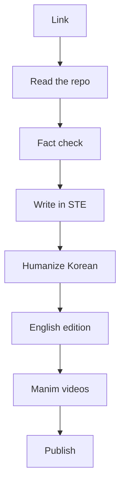

<a href="https://neocello-ku.github.io/ko/how-it-works">한국어로 읽기</a>

Every trend note starts from one link: a post on X, a GitHub repo, or a release page. An automated pipeline turns that link into a note in two languages and two short videos. This page explains each step and what it checks.

The notes are drafted by AI. The pipeline is built so that every claim is held up against a source you can open yourself.

## 1. Read the source

- Posts on X are read through the public fxtwitter API. No login is used.
- The repo is cloned shallow. The pipeline reads only the README, install files, example scripts and the license.
- If the post has no repo, the pipeline uses the official repo, docs and latest release of the library the post depends on. A release counts only if the release files contain the feature, not just the docs.

## 2. Fact check

Each claim in the post goes into a table: the claim, what the repo or docs actually say, and a verdict.

| Verdict | Meaning |
|---|---|
| Matches | The source says the same thing. |
| With conditions | True, but only for a certain size, setup or measurement. |
| No evidence | The source does not support it, or it is not possible yet. |

Numbers in the post are recalculated. Superlatives from the post are not copied into the note.

The note also rates **how new** the thing is, in three layers: method, infrastructure and product. A product can be new even when the method is decades old.

## 3. Write in STE

The notes follow about 80% of [ASD-STE100](https://www.asd-ste100.org/), the Simplified Technical English standard written for aircraft maintenance manuals.

- Descriptive sentences: 25 words or fewer. Instructions: 20 words or fewer.
- One idea per sentence. One name per concept.
- Conditions come first: "If you have two GPUs, run …".
- No hype words. A claim needs a number or a feature behind it.

A script checks every sentence before the next step. The Korean edition has its own version of these rules.

## 4. Humanize the Korean edition

Korean drafts from language models have patterns that read as machine-made: translated phrasing, stacked commas, uniform rhythm. The pipeline runs [humanize-korean](https://github.com/epoko77-ai/im-not-ai), an open-source rewriter, on the Korean guide only.

Two guards run after it:

- A protection check confirms that code blocks, diagrams, URLs, numbers, headings and table rows did not change.
- The STE check runs again. If the rewrite merged two sentences past the limit, they are split back.

## 5. English edition

The English note is written as English, not translated line by line. It has the same sections, the same fact-check rows and the same verdicts, and it goes through its own STE check.

## 6. Manim videos

Each note has a 2-minute video in each language, rendered with [Manim](https://www.manim.community/) at 1080p.

The video is not hand-animated. The note produces a short script, and the script fills 8 fixed scene templates: title, flow, chain, steps, code, table, bars and summary. Bar charts that start above zero are labeled as zoomed. Frames are checked for text that runs off the screen.

## 7. Publish

The notes go to this site, built with [Quartz](https://quartz.jzhao.xyz/) and hosted on GitHub Pages. English is the main site and Korean lives under `/ko`. The home page reads the fact-check rows directly, so the numbers at the top are always the current totals.

You can also request a note from a phone. Send a link to a Slack bot. The note, the videos and the links come back in the same thread.

## What this does not do

- It does not run the code. Install commands are copied from the README, not tested. Running them on real hardware is the next step.
- "Matches" means the source agrees with the post. It does not mean an independent lab reproduced the result.
- Sources can be wrong or change after the note is written. Every note links to them so you can check.
