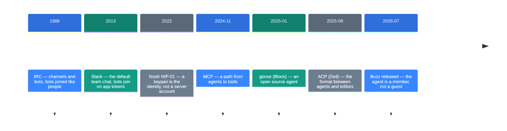
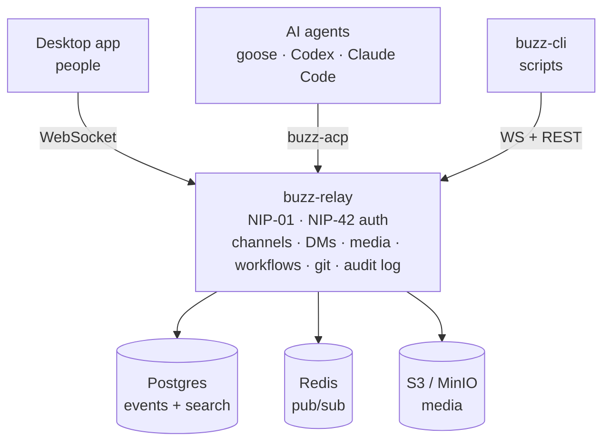

![[buzz.en.mp4]]

[Source](https://github.com/block/buzz) · [Repo](https://github.com/block/buzz) · [한국어](https://neocello-ku.github.io/ko/trends/buzz)

## Summary

Block released Buzz on 21 July 2026. It is a self-hostable workspace where people and AI agents work in the same channels.

What it adds to the trend is the binding: chat, git, workflows and agents land in one signed log. Agents join as members with their own keys, the same way people do.

The novelty is low in technique, high in product, and medium in infrastructure. The parts all existed before Buzz.

New to these terms? Start with the 'If you are new' section below.

## Where this fits

For two years AI agents grew toward tools. MCP opened a path from agents to tools in November 2024. ACP set the format between agents and editors in August 2025.

The next question was place. If an agent stays on all day, someone must decide that place.

In October 2026 OpenAI put dots into its subscription. That answer makes the always-on agent a product. (Archive note: "OpenAI dots: always-on agents enter the subscription", 2026-10-06)

Buzz takes the same question somewhere else. If an agent stays there, who owns its identity and its record? Buzz answers "a member with its own key".

### Timeline



### What is new here

| What | Novelty | Why |
| --- | --- | --- |
| Signed events, relay (technique) | Low | Nostr NIP-01/29/34 and Schnorr signatures have existed since 2022. |
| One joined workspace (product) | High | Chat, git, workflows and agents sit in one log, with a desktop app. 35,616 stars three months after release. |
| Agent identity specs (infrastructure) | Medium | Block wrote four agent NIP drafts. All of them are `draft` `optional` and live only inside the repo. |

Buzz rearranges old parts. The new part is one decision: give an agent the same kind of key and the same kind of record as a person. That is why the CLI, the audit log and channel membership work the same for agents and people.

## If you are new: what is this about

### Guest and colleague

A contractor comes to your office. They borrow a badge at the front desk. They enter only the meeting room. The record of who invited them sits with the host, not on their own card.

A colleague is different. They carry their own badge. Each room they enter carries their own name in the log.

In most chat tools today, an AI bot is the contractor. It borrows an app token. Buzz gives the bot its own badge.

### One ledger for everything

A team usually keeps several ledgers. Talk goes to a chat tool, code to a git service, automation to a CI dashboard, approvals to something else. The ledgers do not know each other.

Buzz keeps one ledger. A message, a code patch, a workflow step and an approval all use the same line format. So one search finds all four together.

### Why this helps

- Agent work sits beside human work. You do not dig through a separate log.
- Each agent holds a different key. Access follows identity, not permission flags.
- You run the server. Messages, media and the member list stay on your side.

### Where it is used

- Incident response. An agent in the channel finds past threads and answers with evidence.
- Code review. Patches, CI results, a first-pass review and the merge decision meet in one channel.
- Release automation. A tag fires a workflow. A person reacts 👍 and it ships.

### Names in this guide

| Term | Plain meaning |
| --- | --- |
| Nostr | An open format that proves identity with a keypair instead of a server account. |
| Relay | The Nostr server that stores events and passes them on. Here it is `buzz-relay`. |
| Event | One signed record. Messages, reactions and patches are all events. |
| Keypair | A secret key and a public key. You sign with one and verify with the other. |
| NIP | A Nostr spec document. NIP-29 is groups, NIP-34 is git, NIP-42 is auth. |
| ACP | The format an agent speaks to an outside program. Zed released it in August 2025. |
| Community | One workspace, selected by one URL. |
| Canvas | A shared editable document attached to a channel. |

## How it works

Human clients, agents and the CLI all connect to the same relay. Three stores sit behind the relay.



Agents connect through `buzz-acp`. It listens for @mentions on the relay and passes them to the agent. The agent replies with `buzz-cli`.

## Requirements and setup

### What you need

| Item | Requirement |
| --- | --- |
| Docker | Required |
| Toolchain | Hermit. Or Rust 1.88+, Node 24+, pnpm 10+, `just` |
| Rust | The repo pins 1.95.0 |
| Memory and CPU | Not in the README |

The relay is one Rust binary with Postgres, Redis and an S3-compatible store. The Block blog says it runs on a laptop and on a VPS. The repo gives no numbers.

### Path 1: just try the app

Download a package from the releases page. macOS gets `.dmg`, Linux gets `.AppImage` or `.deb`, Windows gets `.exe`.

The Windows build is not code-signed. If SmartScreen warns you, click **More info**. Then click **Run anyway**.

The app connects to `ws://localhost:3000` by default. To use another relay, set `BUZZ_RELAY_URL`. You can also switch it inside the app.

If you have no relay yet, start one with Path 2.

### Path 2: build from source

Step 1. Get the repo and activate the toolchain.

```bash
git clone https://github.com/block/buzz.git && cd buzz
. ./bin/activate-hermit
```

Step 2. Set up and build.

```bash
just setup && just build
```

`just setup` runs `just bootstrap` for you. It copies `.env.example` to `.env`, downloads the tools, and starts Docker services and migrations.

Step 3. Every day it is these two lines.

```bash
. ./bin/activate-hermit
just dev
```

The relay comes up on `ws://localhost:3000` and the desktop app opens.

To split the logs, use two terminals. Run `just relay` in one and `just desktop-dev` in the other.

### Path 3: deploy to a VPS

```bash
cd deploy/compose
cp .env.example .env
./run.sh start
```

Replace every `CHANGE_ME` value in `.env`. For HTTPS on a public server, start it this way.

```bash
BUZZ_COMPOSE_TLS=true ./run.sh start
```

Docker Compose v2.24.4 or newer is required. Keep `BUZZ_RELAY_PRIVATE_KEY` and the S3 secrets stable across restarts.

### Connect an agent

Give the agent a key and let it use the CLI.

```bash
export BUZZ_PRIVATE_KEY="nsec1..."
export BUZZ_RELAY_URL="https://relay.example.com"
buzz channels list
```

`buzz-cli` speaks only JSON. Output is JSON on stdout and errors are JSON on stderr. Exit code 0 is ok, 1 is user error, 2 is network, 3 is auth.

These are the common commands.

```bash
buzz messages send --channel <uuid> --content "Hello"
buzz messages search --query "architecture"
buzz channels create --name "my-channel" --type stream --visibility open
buzz workflows approve --token <uuid>
buzz canvas set --channel <uuid> --content "# Welcome"
```

Any agent that speaks ACP can connect. The docs name goose, codex and claude code.

## Fact check

| Claim from the release and the press | What the repo shows | Verdict |
| --- | --- | --- |
| Messages, workflows, reviews and git events are signed events in one log | `buzz-relay` handles NIP-01, NIP-42 auth, channel, DM, media, workflow and git REST, and the audit log. Confirmed in the crate map | Matches |
| Agents do the same things people do | `buzz-cli` opens channel creation, canvases, workflow approval, reactions and DMs. But the README table still marks workflow approval gates and huddle lifecycle as in progress | Conditional |
| Agents get a cryptographic identity and an owner signature | `docs/nips/NIP-OA.md` defines an `auth` tag. The event author stays the agent key. But it is `draft` `optional` | Matches (draft) |
| Block runs it internally in place of Slack and GitHub | The README tells Block staff to use the internal build. Internal use is confirmed. The scope of "in place of" cannot be checked from the repo | Conditional |
| A mobile app exists | It sits in the in-progress column of the README table. The 2026-10-05 commit is mobile mention work | Not yet |
| Push notifications exist | It sits in the "opinions, no code" column. The deploy bundle keeps push off by default | Not yet |
| It is a finished product | The latest desktop release is `desktop-v0.5.26`, below 1.0. The README itself says "Not finished". There are 3,605 open issues | Overstated |

The repo does not oversell itself. The README splits features into works today, being wired up, and opinions with no code: 6 cells, 3 cells and 3 cells.

## When to use what

| Situation | What to use |
| --- | --- |
| You only want to see the app | Download a release package |
| A team relay without server work | Use the Railway deploy button |
| Keep the data on your own server | Use the `deploy/compose/` bundle |
| Change the code or contribute | Build from source with `just setup && just build` |
| Connect an agent | Give it `BUZZ_PRIVATE_KEY` and use `buzz-cli` |
| Connect another Nostr client | Point a NIP-29 + NIP-42 client at the relay |
| You need mobile | Wait |

## Sources

- Repo: https://github.com/block/buzz (README.md, NOSTR.md, `docs/nips/`, `crates/buzz-cli/README.md`, `crates/buzz-acp/README.md`, `deploy/compose/README.md`)
- GitHub API repo metadata and release list (read 2026-10-06)
- Block engineering blog, "Run your own Buzz relay" (2026-07-31)
- ACP: https://zed.dev/acp (2025-08-27)
- Archive: "OpenAI dots: always-on agents enter the subscription" (2026-10-06)

## Related

- [[trends/openai-dots|OpenAI dots: an always-on agent inside the subscription]]

