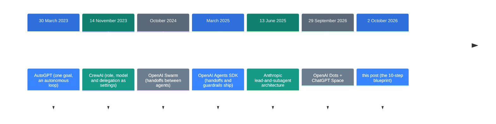
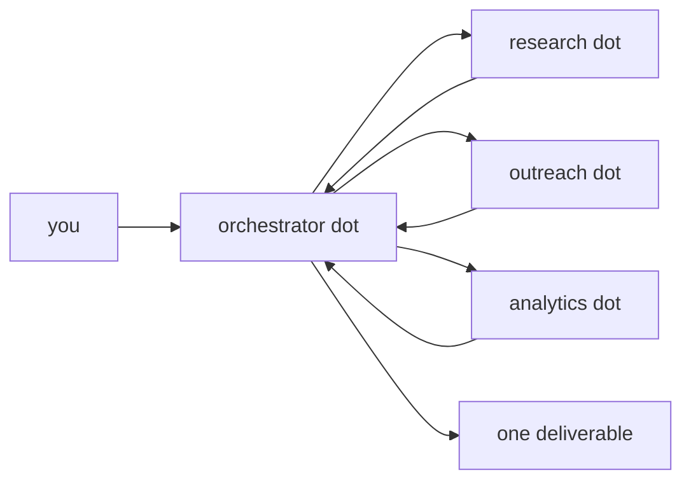
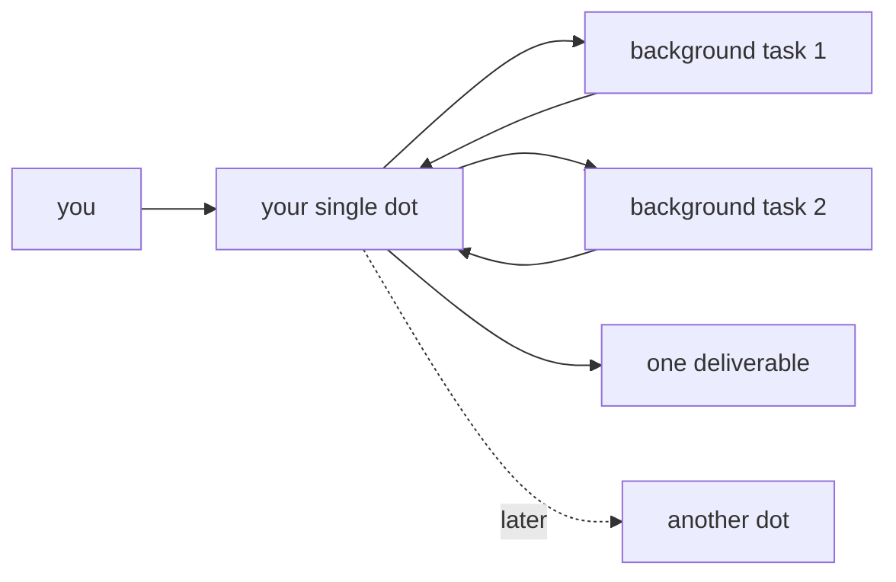

![[dots-blueprint.en.mp4]]

[Source](https://x.com/0xwhrrari/status/2106021402197319848) · [한국어](https://neocello-ku.github.io/ko/trends/dots-blueprint)

## Summary

On 2 October 2026 rari posted a 10-step operating design for OpenAI Dots.

It restates a 2023 multi-agent pattern under a 2026 product name, and 2 of the 10 steps assume features the product does not have. New to these terms? Start with the "If you are new" section below.

## Where this sits in the arc

Designs that group several agents into a team go back to 2023. The design stayed the same; the container changed. On 29 September 2026 OpenAI shipped Dots, and the container became a managed product. This post came three days later.

The second entry is the clearest match. A CrewAI agent took a role, a goal, a backstory, a model, tools and a delegation toggle. Steps 2 and 8 of this post name almost the same list.

Anthropic's entry is the other match. In June 2025 it described a lead agent that spawns subagents. Steps 3 and 4 of this post describe that shape.

### What is actually new here

| What | How new | Why |
| --- | --- | --- |
| The 10-step design (technique) | Low | Orchestrator-worker and approval limits are public patterns from 2023 to 2025. |
| What you can run today (product) | Low | You get one dot per person. There is no model setting. |
| Dots and Space (infrastructure) | Medium | A resident agent and a shared workspace now ship as one product. |

The post restates a 2023 pattern under a 2026 product name, so the technique is old. And 2 of the 10 steps describe work you cannot do today.

That medium rating credits OpenAI, not the post.

### Reading this with the earlier posts

I wrote [OpenAI dots: an always-on agent inside the subscription](/trends/openai-dots) on 2026-10-06. That post covers the product this one assumes.

[Open Dot: running OpenAI Dots on your own Mac](/trends/open-dot) went up the same day. That one moves the same product onto your own computer.

The first is the product, the second is a clone, and this one is a claim about how to use it. All three reach the same verdict on the technique: it is not new.

## If you are new: what is this about

### One AI worker is not an AI company

A chatbot answers questions. An agent does the work instead. It reads mail, books time and signs in to websites.

One worker does the jobs in order. With several workers, a lead splits the job and hands out the parts. This post draws the second picture, and OpenAI still sells one worker.

### Why would several beat one

- On a broad question each worker digs in a different direction.
- Each worker sees only its own context. Nothing piles into one long chat.
- Nobody copies results from one window into the next.

### Where people use this

- Research 10 competitors overnight and get back one table
- Read mail and calendar each morning and build a task list
- Watch for an event, research it, and leave a draft ready

### Names you will meet

| Term | Plain meaning |
| --- | --- |
| dot | One resident agent that you name and shape. |
| agent | A program that does the work instead of only answering. |
| orchestrator | The lead that splits a job and merges the results. |
| worker | The one that takes a single part of the job. |
| delegation | The lead handing a part of the job to a worker. |
| context isolation | Each worker sees only what its own part needs. |
| plugin | The connector that lets a dot use an outside app. |
| Custom Rules | Your list of which actions need a question or a block. |
| Auto-review | A separate check that runs before an action. |
| proactive research | Background reading and notes the dot does unasked. |
| ChatGPT Space | A shared area where people and dots edit the same pages. |

## How it works

Here is the shape the post draws.

Dots gives you this shape today.

The two shapes look alike, but the boxes hold different things.

In the post each worker is its own dot. Today each worker is a background task that your one dot started. Permissions and price differ too.

OpenAI's documents say approval rules and Auto-review still apply to those background tasks.

## What works today and what does not

Follow the 10 steps as written and you stop at two of them. Read the blocked points first, then reorder the rest.

### What you really set on one dot

| Item | Is it there | Detail |
| --- | --- | --- |
| Name, avatar, pet | Yes | The default handle is `@yourname-dot`. |
| Goal | Yes | You give it in conversation, not in a settings form. |
| Connected apps | Yes | Permissions are **shared** with ChatGPT, Work and Codex. |
| A Slack account for the dot | Yes | At launch there is no mail address of its own. |
| Custom Rules | Yes | You pick one of four values. See the table below. |
| Scheduled tasks | Yes | You ask for them, then edit them under Scheduled. |
| Event triggers | No | They do not appear in the documents. |
| Model choice | No | Every dot runs GPT-6 Astra. |
| A working-style field | No | Memory does this job instead. |

### The four values of a Custom Rule

| Value | Meaning |
| --- | --- |
| Take action without asking | It just does it, every time. |
| Take action if pre-approved | Only when you named it in your prompt. |
| Ask before taking action | It asks each time. |
| Hand off to you | The dot stops and you finish the action. |

Changing a password and moving money always stay with you. No Custom Rule changes that.

### Reorder the steps like this

1. Give the dot one narrow goal.
2. Connect only the apps it needs.
3. Set the approval limits first.
4. Ask for repeat work as a scheduled task.
5. Keep shared material on a ChatGPT Space page.
6. Keep delegation inside the single dot.

Check the repeat interval under Scheduled. Background tasks show up in Activity View.

Skip steps 3 and 8 of the post. Those two are not in the product today.

## Fact check

I compared the 10 steps against the launch post and two official help articles.

| Claim | What I found | Verdict |
| --- | --- | --- |
| 1. A resident environment with its own browser, files and memory | Matches the official documents. | Matches |
| 2. Each dot gets a domain, sources, style, approval limit and trigger | Only 1 of the 5 is a real setting. | Overstated |
| 3. An orchestrator dot delegates to specialist dots | You get one dot per person today. | No basis |
| 4. Isolated delegation returns a structured result | It works inside one dot only. | Conditional |
| 5. Connect Slack, Teams, Workspace and internal APIs | It works. The app list is not public. | Matches |
| 6. Recurring routines and event triggers | Recurring works. Event triggers do not exist. | Conditional |
| 7. Automate what can be reversed, gate what cannot | The product default already does this. | Matches |
| 8. Match the model to the cost of the work | There is no setting to choose a model. | No basis |
| 9. One shared memory for the company | Not through dot memory. Space does this. | Conditional |
| 10. Tie the loop to revenue | An operating suggestion, not a feature. | Suggestion |
| Build a 24/7 AI company | You can buy one dot today. | Overstated |

### Step 3: you cannot build a team of dots yet

The launch post says you start with your primary dot today. The next sentence adds that OpenAI envisions teams of dots over time. The help article also says you can add more dots in the future.

Specialist dots with set responsibilities do exist. But those run as enterprise pilots with OpenAI engineers on the project. No ordinary user creates one, and the price of an extra dot is still undisclosed.

### Step 8: you cannot choose the model

Every dot runs GPT-6 Astra. No model choice appears in the launch post, the help article or the privacy FAQ.

Since November 2023 a CrewAI agent has taken a `model` attribute. When you assembled the parts yourself, that setting was a given. The managed product removed the knob, and the post still tells you to turn it.

### Step 2: you cannot give a dot its own sources

The privacy FAQ says plugin permissions are shared across dots, ChatGPT, ChatGPT Work and Codex.

So you cannot say "this dot reads only this material". Your dot sees every app you connect. The one split you get is a Slack account for the dot.

### Step 9: this is Space, not memory

You cannot view or edit a single dot memory. To clear them you delete the dot. A company spec does not belong there.

The shared workspace is ChatGPT Space. It shipped the same day as Dots and replaces Library. People and dots edit the same page there.

The post never mentions Space. It names the right goal and the wrong feature.

### Nobody knows the cost

Anthropic published one number in June 2025. Its lead-and-subagent setup used about 15 times the tokens of an ordinary chat. Its advice was to spend that only on work worth the cost.

OpenAI has not published the size of the deep-work allowance for Dots. The extended limit also ends in late October 2026. So nobody can price a full run of the 10 steps.

### Three things the post gets right

1. Splitting automation by what can be reversed is a good line. The Dots default draws it the same way.
2. A human carrying results between agents is a real bottleneck.
3. "A general helper is a role with undefined context" is a fair sentence.

## When to use what

| Situation | Approach |
| --- | --- |
| You need a resident agent right now | One dot, one narrow role. Drop steps 3 and 8. |
| You need a team of agents today | Assemble it yourself with CrewAI or the Agents SDK. |
| Each role needs its own model and budget | Dots cannot. Assemble it yourself. |
| You need an event to wake the agent | Dots has none. Add an outside trigger service. |
| People and agents must edit one document | ChatGPT Space, not dot memory. |
| You want the structure before paying $100 a month | Read steps 2, 4 and 7. Those hold without the product. |

## Sources

- [Post: rari, 2026-10-02](https://x.com/0xwhrrari/status/2106021402197319848)
- [OpenAI: Introducing dots](https://openai.com/index/introducing-dots/)
- [OpenAI help: Getting started with your dot](https://help.openai.com/en/articles/20001530-getting-started-with-your-dot)
- [OpenAI help: Dots privacy, security, and safety FAQs](https://help.openai.com/en/articles/20001529-dots-privacy-security-and-safety-faqs)
- [Anthropic: multi-agent research system (2025-06-13)](https://www.anthropic.com/engineering/multi-agent-research-system)
- [CrewAI (2023-11-14)](https://en.wikipedia.org/wiki/CrewAI)
- [VentureBeat: Dots and ChatGPT Space](https://venturebeat.com/technology/openai-launches-dots-always-on-ai-agent-coworkers-and-chatgpt-space-where-they-can-collaborate-with-human-teams)

## Related

- [[trends/openai-dots|OpenAI dots: an always-on agent inside the subscription]]
- [[trends/open-dot|Open Dot: running OpenAI Dots on your own Mac]]

