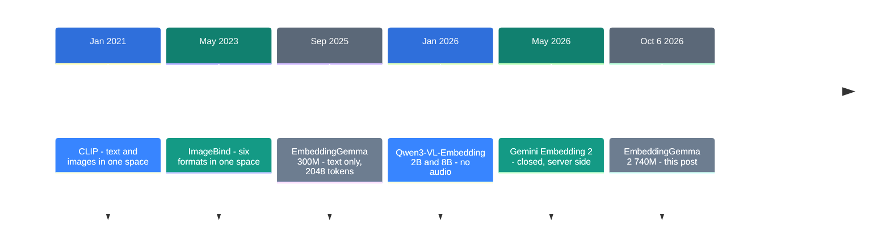
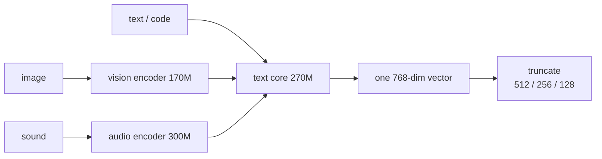

[Source](https://blog.google/innovation-and-ai/technology/developers-tools/embeddinggemma-2/) · [한국어](https://neocello-ku.github.io/ko/trends/embeddinggemma-2)

## Summary

On October 6, 2026, Google released EmbeddingGemma 2. It is a 740M parameter model that maps text, code, images, video, and audio into one 768-dimension space.

In the wider flow, the "many formats, one space" line that CLIP opened has now reached phone size. The method is old. The size and the license are what changed.

New to these terms? Start with the "If you are new" section below.

## Where it sits in the flow

Search is splitting into two directions. One puts bigger models on a server. The other puts small models inside the device.

EmbeddingGemma 2 takes the second road. This time sound and video join the text in one coordinate system.



This post sits at step six. A closed model showed the design in May, and five months later the same shape arrives as open weights.

### What is new here

| What | Novelty | Why |
| --- | --- | --- |
| Many formats in one space (method) | Low | It comes from CLIP (2021) and ImageBind (2023). Dimension truncation (MRL) is a 2022 paper. |
| Sub-1B with audio under Apache 2.0 (product) | High | We found no other open sub-1B model that puts sound in the same space. Version 1 needed the Gemma terms and an access approval. |
| Detachable encoders (infrastructure) | Medium | You load only the formats you use. But the audio path is not open yet in every runtime. |

This model adds no new method. A five-year-old idea shrank to phone size and got a license that needs no approval.

It also connects to two earlier posts. [Strata](/trends/strata) (2026-10-06) pulled a 125B model down to a gaming PC. The direction is opposite but the destination is the same. [Letting a local LLM pick an answer](/trends/jev-local) (2026-10-06) gave a local model a job other than writing. Embedding fits that same shift.

## If you are new: what is this about

### An embedding turns meaning into coordinates

Think of a library. The librarian does not shelve books at random. Cookbooks go next to cookbooks, travel books next to travel books.

An embedding model does this with numbers. It turns one sentence into 768 numbers, and close meanings give close numbers.

That list of numbers is a **vector**. Measure how far two vectors point the same way, and you get how close two texts are.

### The new part is the single shelf

Until now, text matched only text, and images matched only images. The shelves sat apart.

EmbeddingGemma 2 merges the shelves. The words "ocean waves" and an actual recording of waves land near each other.

So you can ask in words and get a video back, or ask with a recording and get a photo.

### Three good points

- The work stays on the device. Photos and recordings do not leave.
- It is small. For text alone you load only the 270M part.
- You can cut the vector short. 768 numbers down to 256 keeps text quality almost flat.

### Three places to use it

- Type "dog on a rainy day" to find a photo in your gallery
- Find one moment in a three-hour meeting recording by describing it
- Find a function in your own code base from a plain-English line

### Names in this post

| Term | Plain meaning |
| --- | --- |
| Embedding | The meaning of a text or image, turned into a list of numbers. |
| Vector | That list of numbers. Here it holds 768 numbers. |
| Dimension | How many numbers the vector holds. |
| MRL | Training so that the first part of a vector still carries the meaning. |
| Encoder | The part that turns an image or a sound into model input. |
| Token | One unit the model counts. A word piece, an image patch, a sound slice. |
| Task prefix | A short line put in front of text input. Example: `task: search result \| query:` |
| bfloat16 | A 16-bit number format with a wide range. |
| MTEB, MMEB, MAEB | Public test sets for text, image, and audio embeddings. |

## How it works

Whatever goes in, one vector comes out.



You can detach the three encoders. Load only what you use and memory drops.

| Formats in use | Size |
| --- | --- |
| Text only | 270M |
| Text + image | 440M |
| Text + sound | 570M |
| All | 740M |

One input can also mix formats. Write `<|image|>`, `<|video|>`, or `<|audio|>` in the text and the media goes in at that spot. The result is still one vector.

### All formats share 8,192 tokens

Every format draws from one context window. Each has a fixed rate.

| Format | Cost | Maximum on its own |
| --- | --- | --- |
| Text | 1 token per word piece | 8,192 tokens |
| Image | 280 tokens each | about 29 images |
| Video | 140 tokens per frame | about 58 frames |
| Audio | 25 tokens per second | about 327 seconds |

Mixed input splits the same budget. Video defaults to one frame per second, and audio goes in as 16 kHz mono.

## What you need and how to run it

### Requirements

| Item | Requirement |
| --- | --- |
| Memory | The model card gives no requirement table. The bf16 weights are 1.49GB, so plan for 2GB to 3GB. |
| Python packages | sentence-transformers 6.1.0 or later, transformers 5.18 or later |
| Precision | bfloat16 or float32. Do not use float16. |
| License | Apache 2.0. No access approval. |

### Step 1. Install the packages

```bash
pip install -U "sentence-transformers[image,audio,video]" transformers
```

### Step 2. Compare two texts

```python
from sentence_transformers import SentenceTransformer

model = SentenceTransformer("google/embeddinggemma-2")

query = "What causes the northern lights?"
document = "The northern lights are caused by charged particles from the sun."

query_emb = model.encode(query, prompt_name="SearchQuery")
doc_emb = model.encode(document, prompt_name="Document")
print(model.similarity(query_emb, doc_emb))
```

`prompt_name` picks the task prefix. Queries take `SearchQuery` and corpus items take `Document`. Omit the prefix and it still runs, but quality drops.

Format titled documents yourself. The pattern is `title: {title} | text: {content}`. `prompt_name="Document"` puts `none` in the title slot.

### Step 3. Turn off encoders you do not need

```python
text_only = SentenceTransformer(
    "google/embeddinggemma-2",
    config_kwargs={"vision_config": None, "audio_config": None},
)
```

This cuts memory, not download size. The Hugging Face repo holds one 1.49GB weight file.

### Step 4. Search images and sound with words

```python
image_emb = model.encode({"image": "sunset_beach.jpg"})
audio_emb = model.encode({"audio": "ocean_waves.wav"})
query_emb = model.encode("ocean waves at sunset", prompt_name="SearchQuery")

print(model.similarity(query_emb, image_emb))
print(model.similarity(query_emb, audio_emb))
```

Prefixes apply to text only, so media inputs take none.

### Step 5. Cut the vector short

```python
emb = model.encode(query, prompt_name="SearchQuery",
                   truncate_dim=256, normalize_embeddings=True)
```

Keep `normalize_embeddings=True` on. A truncated vector is no longer unit length. Skip the step and ranking quality drops with no error.

Queries and documents must share one dimension. A 768-dim query cannot score against a 128-dim index.

### A lighter path

Ollama ships separate tags per size.

```bash
ollama pull embeddinggemma-2:270m
ollama pull embeddinggemma-2:740m
```

The llama.cpp GGUF build splits text and media into separate files. The text Q8_0 file is 309.9MB. The mmproj Q8_0 file with vision and audio is 554.8MB.

## Fact check

| Claim in the launch post | What we found | Verdict |
| --- | --- | --- |
| Version 1 passed 20 million downloads | HF API all-time count is 20,799,432 (checked 2026-10-07) | Matches |
| 740M = text 270M + vision 170M + audio 300M | The weight file is 1,488.9MB, so 1,488.9 / 2 bytes is about 744M | Matches |
| 8K context, 4x version 1 | Version 1 config says 2048, this one says 8192. Exactly 4x | Matches |
| 5.5 min audio, 29 images, 58 video frames | Our own math: 327.7 seconds, 29.3 images, 58.5 frames | Matches |
| Up to 6x storage reduction | 768 / 128 is 6. But at 128 dims MMEB falls from 59.01 to 45.65 | Conditional |
| MTEB Code 68.76 to 78.68 | Same as the model card. That is a 14.4% gain | Matches |
| Apache 2.0, free for commercial use | No access approval. Version 1 used the Gemma terms plus approval | Matches |
| Best for its size, and it catches larger models | MMEB v2 overall is 59.01 here. Qwen3-VL-Embedding-2B is 73.2 | Overstated |
| 191MB and 567MB on a Pixel 11 Pro | Only in the blog post. The quantization method is not stated | Not published |
| Serve it right away on Ollama and more | All 17 Ollama tags list Text or Text, Image input | Conditional |
| Multilingual text holds at version 1 level | 61.36 against 61.15. A gap of 0.21 points | Matches |

### A closer look at the numbers

"It catches larger models" depends on the format. For images and video it does not hold. Qwen3-VL-Embedding-2B, from January 2026, scores 73.2 on MMEB v2 overall. This model scores 59.01. The size gap is about 2.7x.

Code is the opposite case. Gemini Embedding 2, the closed sibling, scores 84.0 on MTEB Code. This model scores 78.68, which is 93.7% of it. The size gap is far larger.

Audio is too early to call. The MAEB paper from February 2026 measured 53 models. Whisper-medium averaged 46.7% overall there. This model scores 49.39 on MAEB. The two use different aggregation, so no ranking follows.

For text-only work, measure other candidates too. Qwen3-Embedding-0.6B reports 64.33 on multilingual. The test editions differ, so the two do not sit in one table. Still, this model is not an automatic first pick for plain text.

### Two traps to know first

- Running in float16 gives NaN or degraded embeddings that raise no error. The model card warns about this directly.
- The Ollama tag page lists a 256K context window. The real value in the model card is 8,192 tokens. Design against 8K.

## When to use what

| Situation | What to use |
| --- | --- |
| Text search on the device | Text-only 270M at 256 dims |
| Find photos by describing them | Text + vision 440M |
| Find a spot in a recording | Text + audio 570M |
| Image or video quality comes first | Measure a larger dedicated model first |
| Vector storage cost is the problem | Cut to 256 dims. 128 dims for text only |
| You need top quality on a server | Use the closed larger model |

## Sources

- [Google launch post: EmbeddingGemma 2](https://blog.google/innovation-and-ai/technology/developers-tools/embeddinggemma-2/)
- [Hugging Face model card: google/embeddinggemma-2](https://huggingface.co/google/embeddinggemma-2)
- [Google developer guide: EmbeddingGemma 2](https://developers.googleblog.com/embeddinggemma-2-the-developer-guide/)
- [Gemma documentation](https://ai.google.dev/gemma/docs/embeddinggemma)
- [Ollama library: embeddinggemma-2](https://ollama.com/library/embeddinggemma-2)
- [llama.cpp GGUF build](https://huggingface.co/ggml-org/embeddinggemma-2-GGUF)
- [Qwen3-VL-Embedding paper (2026-01)](https://arxiv.org/abs/2601.04720)
- [Gemini Embedding 2 paper (2026-05)](https://arxiv.org/abs/2605.27295)
- [MAEB paper (2026-02)](https://arxiv.org/abs/2602.16008)

## Related

- [[trends/strata|Strata: a 125B model on a gaming PC]]
- [[trends/jev-local|Let a local LLM pick an answer instead of writing one]]

