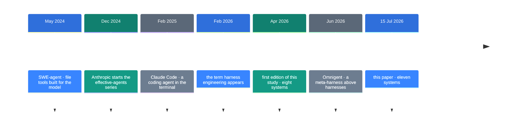
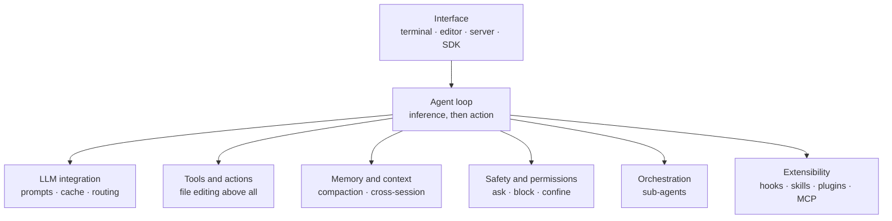

![[harness-engineering.en.mp4]]

[Source](https://x.com/polydao/status/2107347369763156099) · [한국어](https://neocello-ku.github.io/ko/trends/harness-engineering)

## Summary

In July 2026 a paper landed that reads the source code of eleven coding agents. It puts Claude Code, Codex and Gemini CLI into the same seven boxes.

Harness engineering got its name in February 2026, and people have argued over it ever since. This is the first large audit of what the products actually contain.

There is no new technique here. The method is the contribution, along with the eighteen recommendations it produces. New to these terms? Start with the 'If you are new' section below.

## Where this sits

Coding agents have been around since 2024. Since then the argument has moved.

Through 2025 people argued about model scores. In 2026 they argue about the runtime wrapped around the model. That runtime is the harness.

The name arrived in February 2026, and blog posts and guides followed within weeks. Audits of the actual product source stayed rare.



The paper sits at the last step. Earlier steps built the products and the vocabulary, and this one counts them.

Two earlier notes belong to the same arc. [Building a research machine](https://neocello-ku.github.io/trends/research-engineering) (7 October 2026) covered the rules outside a research loop. [The ten-step Dots blueprint](https://neocello-ku.github.io/trends/dots-blueprint) (2 October 2026) asked whether a design works today.

This paper runs the other way. It reads eleven shipping products and derives the design backwards from them.

### What is new here

| What | Novelty | Why |
| --- | --- | --- |
| The harness concept and the seven-box split (technique) | Low | No new algorithm. It is a descriptive study of existing products, and it borrows the definition from earlier work. |
| 29 patterns, 18 recommendations, a 90-line scaffold (method) | High | The first evidence-based practitioner guide that is not a single-vendor whitepaper. Every recommendation names the systems behind it. |
| The same eight systems diffed twice, three months apart (measurement) | Medium | A controlled longitudinal sample. But the eleven systems never ran against a shared task set. |

The work here is collection. Scattered product decisions end up in one table where you can compare them.

## If you are new: what is this about

### Think of an engine and a car

Engine specs make good marketing. Horsepower and torque come as numbers.

Put the same engine in two cars and you get two different cars. The brakes, the gearbox, the seatbelts and the dashboard all differ.

A harness is the car minus the engine. The model is the engine, and the harness is all the rest.

### Why the rest matters

- The same model with different tools and permissions gives different results.
- A model that cannot stop running bills you. Stop conditions live in the harness.
- A model has a fixed context window. The harness decides what goes in and what gets dropped.

### Where you would use this

- Choosing what to build first when you write an in-house coding agent
- Setting comparison criteria before you switch tools
- Deciding how far the safety controls go in an automated loop

### Names in this guide

| Term | Plain meaning |
| --- | --- |
| Harness | The runtime that wraps a model and makes it an agent. Everything except the model. |
| Agent loop | The cycle that alternates thinking and acting. Stop conditions live here too. |
| Tool | A function the model can call, such as reading a file or running a command. |
| Compaction | Swapping the early part of a long conversation for a summary. |
| Skill | A folder of instructions and scripts, with one `SKILL.md` at its centre. |
| MCP | A protocol that attaches outside programs as tools, such as Slack or a database. |
| ACP | A protocol between editors and agents. It now also joins one harness to another. |
| Sandbox | A fence that confines commands, built on operating-system features. |
| Meta-harness | A layer that coordinates several harnesses. It runs no edit loop of its own. |

## How it works

The paper splits a harness into seven boxes. All eleven systems take a position on each.



A deliberate absence counts as a position: Aider has no orchestration at all, by design.

Within one box the range spans three orders of magnitude.

| Box | Smallest | Largest |
| --- | --- | --- |
| Loop | Mini-SWE-Agent: one while over one bash tool | OpenHands: event sourcing over a persistent event log |
| LLM integration | Mini-SWE-Agent: one call, one template | Hermes: five owned transports, 29 provider profiles |
| Tools | Mini-SWE-Agent: bash only | Claude Code: 43 typed tools |
| Memory | Mini-SWE-Agent: unbounded linear history | Codex: an agent-maintained cross-session memory pipeline |
| Safety | Mini-SWE-Agent: cost and step limits | Codex: policy rules, an LLM approval reviewer, three OS sandboxes |
| Orchestration | Aider: none | Claude Code: recursive composition |
| Extensibility | Mini-SWE-Agent: structural typing | Pi: a runtime where everything is an extension |

The paper's first conclusion falls out of this table. A more elaborate loop does not raise benchmark scores.

Mini-SWE-Agent fills all seven boxes in roughly 100 lines. It still reports scores in the same range as the leaders.

Elaboration predicts something else: safety, user experience and extensibility. No benchmark measures any of those.

### The two absences

The paper's most careful section covers what is missing from all eleven systems.

Across roughly four million lines, two things never appeared.

| Missing | Count | Used instead |
| --- | --- | --- |
| Agentic frameworks (LangChain, LangGraph, AutoGen, CrewAI and others) | 0/11 | Hand-rolled async loops and raw provider SDK calls |
| Vector retrieval over code | 0/11 | `ripgrep`, glob, tree-sitter and file traversal |

Even Gemini CLI skips Google's own frameworks. The authors write that they spent several weeks hunting counterexamples before accepting the result.

Code is the reason. It carries fixed structure in paths and syntax trees, and it changes by the minute, so an index goes stale.

### Skills won the extensibility race

| Standard | Adoption | Note |
| --- | --- | --- |
| Skills (`SKILL.md`) | 9/11 | Only Aider and Mini-SWE-Agent abstain |
| MCP | 8/11 | Pi broke the tie by taking skills and rejecting MCP |
| ACP | 6/11 | Beyond editors, it now hosts one harness inside another |

## What you need, and how to run it

This paper is not a product. There is nothing to install and no weights to fetch.

| Item | Requirement |
| --- | --- |
| Hardware | None |
| To read | arXiv 2609.00006 (83 pages, 7 figures, 18 tables) |
| To apply | The 18 recommendations in §16 and the 90-line scaffold in §16.10 |
| Code repository | None |

The paper gives an order of work instead. Its recommendations follow the sequence you actually hit while building.

### Step 1. Start with a linear while loop

One plain loop is enough. Leave middleware out for now.

Split it once three or more turn-level policies appear. Turn caps, cost caps and auto-compaction are the usual three.

### Step 2. Start with bash as your only tool

Add tools only after you see a failure. The paper gives the order too.

Add file read and write once output truncation hurts. Add grep and glob once bash search feels awkward. Add a partial replace once whole-file writes waste tokens.

Adopt deferred loading past fifteen tools. In Claude Code it cut the initial prompt by about 40%.

### Step 3. Match the edit contract to the model tier

Frontier models do better with exact matching. The search string must occur exactly once in the file.

Weaker or open models do better with a fuzzy cascade. OpenCode goes down nine stages.

Either way, do not edit by line number. Models drift on line numbers more than on surrounding text.

### Step 4. Discover context files up the tree

Collect files such as `AGENTS.md` from every parent folder. Put the top-level content near the front of the system prompt.

Inject a nested file only when a tool touches its folder. Reading your neighbours' filenames is now the norm.

### Step 5. Compact a little below the limit

Keep the recent tail verbatim. Merge each new summary into the previous one.

Re-summarising from scratch loses early decisions. Wire the same routine to context-overflow errors.

### Step 6. Write safety rules as data, not code

For a developer tool, three approval modes are enough: plan, default and allow-all. Scope patterns handle the rest.

For shared or automated contexts, go as far as an OS sandbox. Keep a floor underneath any allow-all mode.

Hermes keeps twelve hard rules alive under `--yolo`. It freezes the bypass flag at import time.

### A sketch of the minimum harness

Listing 3 in the paper is a Python scaffold of about 90 lines. Below is a shortened sketch of its shape, rewritten.

```python
# A sketch of the structure in §16.10. Not the paper's code.
async def run(self, task: str) -> str:
    self.messages = [
        {"role": "system", "content": f"{SYSTEM}\n\n{discover_context()}"},
        {"role": "user", "content": task},
    ]
    while True:
        self.check_limits()        # turn cap, cost cap
        await self.maybe_compact() # swap in a summary below the limit
        resp = await self.model.complete(self.messages, tools=TOOL_SCHEMAS)
        self.messages.append(resp)
        if not resp.get("tool_calls"):
            return resp.get("content", "")
        for call in resp["tool_calls"]:
            self.messages.append(run_tool(call))
```

Four tools are enough to start: bash, read file, write file and partial replace.

## Fact check

I checked each claim in the post against the paper itself.

| Claim | What I found | Verdict |
| --- | --- | --- |
| It takes apart Claude Code, Codex, Gemini CLI and more | Correct. Eleven systems plus one meta-harness, split across seven dimensions. | Holds |
| It covers Claude Code on Opus 5.5 | The word "Opus" appears zero times in the paper. It reads harnesses, not models. The Claude Code analysis uses a March 2026 source snapshot. | No support |
| It boils them down to one line: agent = model + harness | The definition is right. But the paper did not coin that line. It credits a LangChain series from early 2026. | Overstated |
| You learn what a harness actually is | §2 gives the definition and the seven boxes. It also separates four things a harness is not. | Holds |
| You learn how today's coding agents are built | Sections 6 to 12 are the per-system source analysis. | Holds |
| The patterns every one of them repeats | The 29 patterns are real. But all eleven do not share all 29. The middleware pipeline has one user, and lineage compaction has one. | Overstated |
| Where the whole category is heading | §14 answers that. It argues the turn from tool to platform finished in the first half of 2026. | Holds |
| Their checklist for building your own | §16 holds 18 recommendations plus a 90-line scaffold. It is more concrete than the post suggests. | Holds |
| The model gets the headlines, the harness decides whether the agent works | The paper is more careful. Loop sophistication does not predict benchmark scores. It predicts production readiness. | Overstated |
| Loop and graph engineering on top of it | Loop engineering is a separate term from June 2026, and the paper says it is not a synonym. Graph engineering appears zero times. | Overstated |
| The article is linked below the post | The public API returns an empty link list. The only attachment is a 24-second video. I could not find the address. | Unconfirmed |

The limits the authors state deserve equal weight.

- Only Claude Code rests on a March 2026 snapshot rather than a public release. That is the weakest link for reproducibility.
- The framework sweep covered manifests and import greps. Dynamic loading and transpiled builds went unchecked.
- The eleven systems never ran against one shared task set. The comparison is qualitative.
- The authors separate inventory claims from structural ones. Tool counts and version pins go stale in weeks.

Rombaut's taxonomy of thirteen open-source scaffolds is the closest independent work from the same period. The paper reports that the framework-absence result came out the same way there.

## When to use what

| Situation | Approach |
| --- | --- |
| You are building your first agent | One linear `while`, one bash tool |
| Turn policies passed three | Split them into a middleware pipeline |
| Tools passed fifteen | Add deferred loading and a tool search |
| You only target frontier models | Edit by unique exact string replacement |
| You also accept open models | Edit through a staged fuzzy cascade |
| You need to find code | Use `ripgrep` and tree-sitter, not embeddings |
| It runs on your own machine | Three approval modes are enough |
| It runs on a shared server or in CI | Add an OS sandbox, a policy file and an audit trail |
| You want to capture a work procedure | Write it as a skill |
| You want to attach an outside system | Attach it over MCP |
| You want editors or other harnesses to drive it | Ship an ACP server |
| Nothing in the task splits in parallel | Stay single-agent. Multi-agent costs about 15 times the tokens |

## Sources

- [Harness Engineering: Anatomy, Architecture, and Evolution of Coding Agents (arXiv:2609.00006)](https://arxiv.org/abs/2609.00006)
- [Full HTML text of the paper](https://arxiv.org/html/2609.00006v1)
- [The original post (@polydao, 6 October 2026)](https://x.com/polydao/status/2107347369763156099)

## Related

- [[trends/research-engineering|Building a research machine: put the evidence ledger first]]
- [[trends/dots-blueprint|A 10-step blueprint for OpenAI Dots: how much of it works today]]

