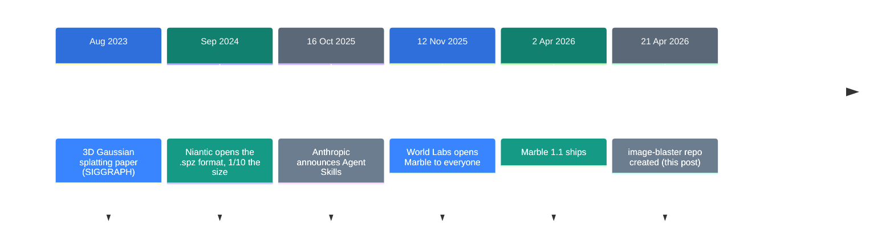
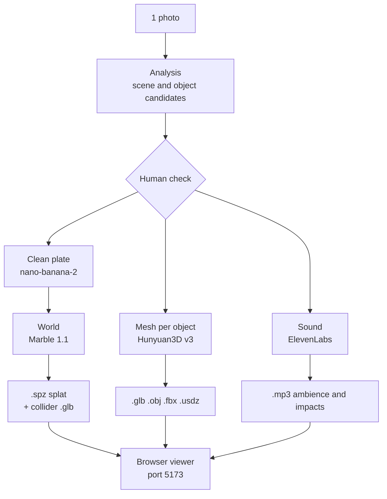

![[image-blaster.en.mp4]]

[Source](https://github.com/neilsonnn/image-blaster) · [Repo](https://github.com/neilsonnn/image-blaster) · [한국어](https://neocello-ku.github.io/ko/trends/image-blaster)

## Summary

image-blaster appeared in April 2026. You drop in one photo, and Claude Code builds a 3D space you can walk through, plus object meshes and sound effects. The repo collected 9,679 stars in five months.

There is no new model here. Four commercial APIs already existed, and a set of Claude skills calls them in order. Agent Skills arrived in October 2025, and this assembly became possible right after.

The method is not new, and one run costs about five dollars. The rule file teaches more than the 3D output does.

New to these terms? Start with the "If you are new" section below.

## Where this fits: why this story now

Turning a photo into a 3D space is an old problem. The pieces arrived one at a time from 2023. The last piece was a container.



The model side was ready in November 2025. The open question was who would call the models in order. A skill folder took that seat.

### Similar work at the same time

Several bundles appeared in 2026. blender-kiln, Ludo MCP and 3D-Agent are three of them. All three drive Blender to produce meshes.

image-blaster produces something else. It builds a space you can walk through first, then fills it with objects and sound.

### What is new here

| What | How new | Why |
| --- | --- | --- |
| Generation method | Low | No new model and no new algorithm. It calls four company APIs as they are. |
| Scripts and file rules (infrastructure) | Medium | The repo's own code is 21 .mjs files. The generation index and the resume design are worth reusing. |
| An agent acting as the pipeline (product) | High | It works with no install step. One Claude Code session is the UI, the orchestrator and the check. |

The value of image-blaster is in the instruction design inside the `.claude/` folder, not in the 3D output.

### A link to the last post

The last post was [Strata: a 125B model on a gaming PC](/trends/strata), from 6 October 2026.

The direction is the opposite. Strata pulls a large cloud model down onto your own PC. image-blaster keeps nothing local and ties four cloud services together.

Both collected around ten thousand stars in the same year.

## If you are new: what is this about

### Two ways to build a 3D space

Think about a film set. Walls and floors stay where they are built. Chairs and cups move with the actors.

A 3D space works the same way. A fixed background and a liftable object need different treatment. image-blaster splits the two and builds them separately.

### The background: made of scattered points

The background uses a method called Gaussian splatting. It scatters hundreds of thousands of small blobs in the air, each with a colour and an opacity. From a distance the result looks like a photo.

This differs from the older way of building walls out of triangles. It copies what you see instead of carving the shape. That makes it good at leaves and glass, which are hard to carve.

The cost is that a cloud of blobs has no physical collision. So you also get a separate frame for collisions.

### Objects: real meshes

A chair or a cup is different. Those become real triangle meshes. You need surfaces to grab, throw and bump into things.

### The plate: a background photo with the objects erased

The source photo has a chair in it. If you also build the chair as a mesh, you end up with two chairs.

So the pipeline first makes a photo with the chair erased. This is called a clean plate. The term comes from film compositing.

### Skills: a work order for the agent

A Claude skill is one markdown file. It states when to use the skill and what order the steps follow.

Claude reads the file only when it is needed. This repo holds nine of them.

### Why it helps

- One photo gives you a draft space, with no 3D tool skills.
- Background, objects and sound all arrive together.
- A request log survives an interruption, so you do not pay twice.

### Where people use it

- Draft levels for games, or location scouting for film
- Practice spaces for robots and simulators
- Architectural renders you can walk through

### Names in this post

| Term | Plain meaning |
| --- | --- |
| Gaussian splat | A 3D scene made of coloured blobs scattered in the air. |
| .spz | The file that holds those blobs. About 10x smaller than PLY. |
| Mesh | An ordinary 3D model made of triangle faces. |
| Collider | An invisible frame that only computes bumps. |
| Clean plate | A background photo with the objects erased. |
| PBR | Textures that carry metal and roughness data. |
| GLB | A 3D format that holds mesh and textures in one file. |
| Skill | A work order the agent reads when it needs it. |
| World slug | The working folder name. Output lands in `worlds/<slug>/`. |

## How it works



### It stops before it spends

The analysis step is free. Claude looks at the photo directly and writes down object candidates.

Then it stops and waits for a person to pick which objects to build. Paid calls go out only after that.

If you say "do it all at once", it switches to one-shot mode. In that mode it runs to the end with no stop.

### Objects come out one at a time

Each object starts with a reference cut. That is a photo of the object alone on a white background.

The rules are strict. Clustering is not allowed, so a table and its chairs never become one model. Fixed parts such as floors and walls are skipped.

If a person can lift it or push it, it is an object.

### Generation runs in parallel, scripts run one at a time

Each generation request goes out as a background agent. The world, the meshes and the sound run together.

The script inside never runs in the background. The agent waits for the script to finish and reads the result.

### The filename is the state

Output files carry a generation number. `0-room.png` is the source, and `1-room-plate.png` is the next generation.

A hidden request file sits beside it. That file is `.1-room-plate-request.json`. The provider response lands there.

If only the file is missing, that record pulls it down again. No new generation is created, so no money goes out twice.

## What you need and how to run it

### What you need

| Item | Requirement |
| --- | --- |
| Claude Code | `curl -fsSL https://claude.ai/install.sh \| bash` |
| World Labs key | platform.worldlabs.ai. Minimum top-up 5 dollars |
| FAL key | fal.ai. Pay as you go |
| bun | For the viewer |
| ffmpeg | For sound post-processing. Not listed in the README |
| GPU | Generation is remote. WebGL2 is enough to view the result |

### Step 1. Get the repo

```bash
git clone https://github.com/neilsonnn/image-blaster
cd image-blaster
claude
```

### Step 2. Hand over the keys

Say hello to Claude, then paste the two keys into the chat. Claude writes the `.env` file.

A session start hook checks the keys first. If a key is missing, it reports the sign-up address.

### Step 3. Add a photo and ask

Put a photo in the `input/` folder. Then say this.

```text
blast it and confirm each step with me
```

Claude stops at each step for your confirmation. Use this mode on your first run.

The viewer opens on its own. `bun install && bun run dev` runs and the browser opens.

### Step 4. Pick the objects

Claude shows the scene description and the object candidates. Pick only what you want to build.

Money starts moving after that pick. The object count sets almost the whole bill.

### Where the output lands

```text
worlds/<slug>/
  source/   source photos, analysis JSON, clean plate
  output/
    world/  .spz splat, collider .glb, panorama
    sfx/    ambient loop
    <object>/ mesh files and impact sound
```

### Tuning

```bash
--face-count 50000          face count. 40000 to 1500000
--generate-type Geometry    white geometry only. The cheapest option
--generate-type LowPoly     polygon reduction
--enable-pbr false          turn material textures off
```

The defaults are `--face-count 50000`, `--enable-pbr true` and `--generate-type Normal`.

## Fact check

The README says nothing about cost. The numbers below come from the official price pages.

| README claim | What I found | Verdict |
| --- | --- | --- |
| It works from a single image | One image works, but one is not the cap. A path reads several images and merges them | Understated |
| Under 5 minutes | I could not time it. The default mode stops for a human check. The number holds in one-shot mode only | Conditional |
| A fully meshed 3D environment | The background is not a mesh. You look at a splat, and the only mesh is a collider | Overstated |
| 3D models as .glb and .obj | True, and understated. FBX and USDZ come down too | Understated |
| Embed it under any game engine | The repo has no importer or plugin. Major engines do not read .spz on their own | Conditional |
| Claude skills, World Labs and FAL | True. FAL is a broker. The models come from Google, OpenAI, Tencent and ElevenLabs | Matches |
| The bill for one run | The README says nothing. A five-object scene costs about five dollars | No basis |

### The background is not a mesh

The biggest gap is in the README phrase "a fully meshed 3D environment".

The world script collects four things. Those are the `.spz` splat, a panorama, a thumbnail and one collider mesh.

A collider is a rough frame that only computes bumps. No textured background mesh comes down.

In practice, a splat looks good but resists editing. Moving a wall in Blender, or baking the light again, does not fit this output.

### The cost

| Item | Unit price | Basis |
| --- | ---: | --- |
| One Marble 1.1 world | 1.20 USD | 1,500 credits ÷ 1,250 |
| One nano-banana-2 edit | 0.08 USD | fal price page |
| One Hunyuan3D mesh | 0.675 USD | 0.375 base + 0.15 PBR + 0.15 face count |
| Ambient loop | 0.04 USD | two 10-second clips × 0.002 per second |
| One object impact sound | 0.008 USD | four 1-second clips × 0.002 per second |

One run on a scene with five objects adds up like this.

| Step | Count | Amount |
| --- | ---: | ---: |
| Clean plate | 1 | 0.08 |
| Object reference cuts | 5 | 0.40 |
| World | 1 | 1.20 |
| Meshes | 5 | 3.38 |
| Ambience | 1 | 0.04 |
| Impact sounds | 5 | 0.04 |
| Total | | about 5.14 USD |

Claude tokens cost extra. Three objects come to about 3.6 dollars, and eight to about 7.4.

A mesh has a base price of 0.375 dollars, but 0.675 dollars actually goes out.

The skill always passes PBR and a face count together. Each of those adds 0.15 dollars. So the default setting raises the bill by 1.8x.

If you only need white geometry, pass `--generate-type Geometry`. The base price drops to 0.225 dollars.

The price page does not say whether the face count surcharge applies to every value other than the default. If it does not apply, a five-object scene comes to about 4.4 dollars.

### The rule file is the real lesson

The four model companies set the output quality. The repo sets the order and the prohibitions, and that second part teaches more.

Four rules stand out in `.claude/rules/project.md`.

- It writes the stopping point down: analysis is free, generation is paid.
- It forbids reading generated images, so checks run on script output and filenames.
- Background work happens per agent, and scripts stay synchronous so the result gets read.
- Resume is part of the design. A request JSON stays behind so only files come down again.

## When to use what

| Situation | What to use |
| --- | --- |
| You need a background you can walk through | image-blaster |
| You need an environment mesh you can edit | Not a fit. Photogrammetry or hand modelling |
| You need object meshes only | Call fal Hunyuan3D directly |
| You want to stay inside Blender | An MCP bundle such as blender-kiln |
| You want it in Unreal or Unity today | Object meshes only. Check a splat plugin first |
| You want a smaller bill | Fewer objects, plus `--generate-type Geometry` |

## Sources

- [image-blaster repo](https://github.com/neilsonnn/image-blaster)
- [World Labs API pricing](https://docs.worldlabs.ai/api/pricing)
- [World Labs model list](https://docs.worldlabs.ai/marble/models)
- [fal Hunyuan3D v3 model page](https://fal.ai/models/fal-ai/hunyuan3d-v3/image-to-3d)
- [fal pricing](https://fal.ai/pricing)
- [Anthropic Agent Skills announcement](https://www.anthropic.com/news/skills)
- [Agent Skills engineering post](https://www.anthropic.com/engineering/equipping-agents-for-the-real-world-with-agent-skills)
- [Niantic SPZ format release](https://scaniverse.com/news/spz-gaussian-splat-open-source-file-format)
- [Marble 1.1 coverage](https://radiancefields.com/world-labs-releases-marble-1.1-and-marble-1.1-plus)
- [VP Land story (2026-05-16)](https://www.vp-land.com/stories/image-blaster-turns-one-image-into-a-full-3d-scene-using-claude-code)

## Related

- [[trends/strata|Strata: a 125B model on a gaming PC]]

