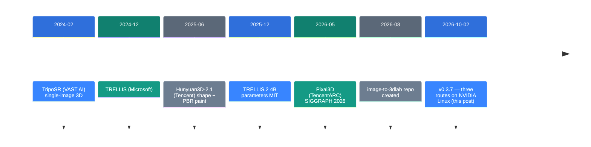
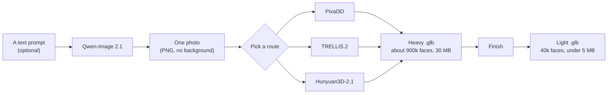

![[image-to-3dlab.en.mp4]]

[Source](https://github.com/Bingeljell/image-to-3dlab/releases/tag/v0.3.7) · [Repo](https://github.com/Bingeljell/image-to-3dlab) · [한국어](https://neocello-ku.github.io/ko/trends/image-to-3dlab)

## Summary

On 2 October 2026, image-to-3dlab shipped v0.3.7. Three routes that turn one photo into a 3D model now run on Linux with an NVIDIA card. Until now it mostly ran on Apple Silicon.

This repo trains no models of its own. It puts four other people's 3D models behind one viewer and one CLI. The new work is the bundling. Every generation method comes from somewhere else.

If you read this from South Korea, the count changes. Of the three routes, Hunyuan3D-2.1 excludes South Korea from its licence. Two routes are left. New to these terms? Start with the "If you are new" section below.

## Where this sits in the flow

Making a 3D model from one photo improved quickly from 2024 onward. By 2026 the harder question is whether you can run it on your own machine.



### How this connects to an earlier post

This is the same field as the earlier post "image-blaster: one photo into a 3D space". That post is from 6 October 2026. Both repos turn one photo into 3D, and both call Hunyuan3D.

They differ in cost and in where the work happens. image-blaster calls cloud APIs and spends about 5 dollars per scene. image-to-3dlab does every calculation on your machine. In exchange you download 15 to 20 GB of weights and spend time on setup.

### What is new here

| What | How new | Why |
| --- | --- | --- |
| Generation method | Low | It trains no models. The README says so directly: "This repo trains nothing and invents nothing." |
| Six backends in one bundle (product) | High | Four models and six routes sit behind one viewer. Setup is a single command. We found no comparable public bundle. |
| Repeatable setup and provenance (infrastructure) | Medium | Commits and package versions are pinned. Each result gets a file with hashes and a licence class. |

This release ties scattered research code into a tool one person can use. v0.3.7 is the step that took that bundle off the Mac.

## If you are new: what is this about

### A photo has no back side

Picture one photo of a chair. You see the front, not the back. A person fills in the back easily, and assumes four legs and a backrest.

An image-to-3D model does that guessing for you. It takes the visible faces from the photo. It fills the hidden faces from what it learned. The result is a `.glb` file you can drop into a game engine.

### Why run it on your own machine

- The photo never leaves. That matters for company assets or unreleased designs.
- There is no per-run fee. A hundred runs cost only electricity.
- You can repeat and change settings. The same seed gives the same result.

### Where people use this

- First drafts of props and characters for an indie game
- Turning product photos into 3D previews
- Filling a space mock-up with placeholder objects

### Names in this post

| Term | Plain meaning |
| --- | --- |
| Backend | The model and code that does the work. This lab has six. |
| Route | One way to use a backend. The Mac and NVIDIA paths differ for the same model. |
| Weights | The numbers a model learned. Usually files of several gigabytes. |
| `.glb` | A 3D model file format. Unity, Unreal and Blender read it. |
| PBR | Physically based rendering. It carries material data such as metalness and roughness. |
| Retopology | Rebuilding a model that has too many faces with fewer faces. |
| Provenance | A record saved next to the result. It holds settings, hashes and licences. |
| Gated model | A model you must be approved for before download. DINOv3 is one. |

## How it works

The lab has three stages: make an image, make a 3D model, finish it.



Finish does four things. It cuts the face count, optionally repaints, copies the source pixels back, and compresses the textures.

Generators redraw the text and logos in your photo as lookalikes. Pixel Match copies the real pixels onto every surface the photo can see, so the lettering stays exact.

## What you need and how to run it

### What you need

| Item | Detail |
| --- | --- |
| Machine | Apple Silicon Mac (32 GB advised) or Linux with an NVIDIA card |
| VRAM | Tested at 24 GB. The README says Pixal3D's authors run it on 16 GB |
| CUDA toolkit | Needed to compile TRELLIS.2 extensions and the Hunyuan rasteriser |
| Blender | 4.2 or later, for Finish and rigging |
| Disk | 15 to 20 GiB per route |
| Also | `uv` and Python 3.11 |

Windows has had little testing. TRELLIS.2 and Hunyuan3D-2.1 block Windows outright. WSL appears nowhere in the repo.

### Step 1. Install

```bash
curl -fsSL https://raw.githubusercontent.com/Bingeljell/image-to-3dlab/main/install.sh | bash
```

This command installs the code and Python 3.11, then opens the viewer. It downloads no model weights. The install folder is `~/image-to-3dlab`.

If a script or an agent runs it, turn the questions off.

```bash
curl -fsSL https://raw.githubusercontent.com/Bingeljell/image-to-3dlab/main/install.sh \
  | bash -s -- --yes --dir ~/lab
```

To start it again, run `./lab` in the install folder.

### Step 2. Set up one route

Use the buttons on the viewer's Setup & Status page. These commands do the same work.

```bash
python scripts/bootstrap_pixal3d.py
python scripts/bootstrap_trellis_cuda.py
```

Start with Pixal3D. The README names it the default route.

TRELLIS.2 uses the DINOv3 encoder. Meta approves access to it by hand. Request access on Hugging Face first. Approval takes time, so do this before anything else.

### Step 3. Make a model

Drop a PNG with no background into the viewer's Generate 3D page. The CLI works too.

```bash
python scripts/pixal3d_generate.py input.png output.glb --seed 42
```

TRELLIS.2 uses its own Python inside the install folder.

```bash
vendor/trellis-cuda/.venv/bin/python \
  scripts/trellis_cuda_generate.py input.png output/out.glb
```

### Step 4. Finish

```bash
python scripts/retopo_repaint.py generated.glb source.png finished.glb \
  --faces 40000 --skip-paint
```

Drop `--skip-paint` and the repaint stage runs. The time goes from seconds to about 6 minutes.

## Fact check

| Claim in the release notes | What we found | Verdict |
| --- | --- | --- |
| Three routes install and run on Linux with an NVIDIA card | The CHANGELOG says both routes were tested end to end on an RTX 3090. But the README, even at the newer v0.3.9, still calls both routes "not yet tested on real hardware". The two documents disagree | Conditional |
| Hunyuan3D-2.1 does shape and paint in one run on a 24 GB card | The setup script states the numbers. Shape needs about 10 GB and paint about 21 GB. Shape unloads before paint loads, so 24 GB is enough | Matches |
| Not licensed in the EU, the UK or South Korea | True. The code classes Hunyuan as territory-restricted and shows a warning. It does not block the install or the run. The call is left to you | Matches |
| Pixal3D uses a ready-made build, with no compiling | Only on driver 575 or newer. Below that it compiles locally. The ready-made build also runs 12 steps instead of 8 | Conditional |
| One install command and the viewer opens | Correct. The install script starts the viewer at the end. If `uv` is missing, it asks once before installing it | Matches |
| Every download states its size and licence, and asks first | Correct. Each route lists file names and byte counts in the code. Without `--yes` the script prints and stops | Matches |
| Hunyuan3D-2.1 download about 19.5 GB | We added it up: 8.03 + 6.89 + 4.55 + 0.07 + 0.21 = 19.75 GiB. The CHANGELOG figure of 19.7 GB is right and the README is low | Conditional |
| TRELLIS.2 download about 15 GB | We added it up: about 16.7 GiB. The README is 1.7 GiB low. A code comment flags the same problem | Conditional |
| "The most complete open-source image-to-3D pipeline (Oct 2026)" | This is from the repo description. It names no benchmark and no comparison set. We cannot check it | No basis |

## When to use what

### Picking a route

| Situation | Route |
| --- | --- |
| First time | Pixal3D. One pass, and colours hold better |
| Quality matters most | TRELLIS.2, but it takes 15 to 35 minutes on a Mac |
| Objects with text or logos | Pixal3D plus Pixel Match in Finish |
| The source is a flat illustration | Avoid TRELLIS.2. Colours drift badly |
| You have no photo | Make one in the Generate Image tab with Qwen-Image 2.1 |

### What is usable in South Korea

| Route | In South Korea | Note |
| --- | --- | --- |
| Pixal3D | Yes | MIT plus the DINOv3 licence. Commercial use is conditional |
| TRELLIS.2 | Yes | MIT plus the DINOv3 licence. Commercial use is conditional |
| Hunyuan3D-2.1 (NVIDIA) | No | The Tencent community licence excludes South Korea |
| Both Hunyuan3D-MLX routes | No | The weights carry the same licence |
| Stable Fast 3D | Mac only | Commercial registration is required |
| Qwen-Image 2.1 | Non-commercial | Running the model is non-commercial only |

The repo's own code is Apache-2.0. Every restriction comes from someone else's model weights.

## Sources

- Release v0.3.7: https://github.com/Bingeljell/image-to-3dlab/releases/tag/v0.3.7
- Repo: https://github.com/Bingeljell/image-to-3dlab (Apache-2.0)
- CHANGELOG 0.3.7 section, README.md, `viewer/backend_catalog.py`, `image_to_3dlab/provenance.py`
- TRELLIS.2 release (16 December 2025): https://comfyui-wiki.com/en/news/2025-12-18-microsoft-trellis2-3d-generation
- Pixal3D: https://github.com/TencentARC/Pixal3D
- Earlier post: image-blaster (6 October 2026)

## Related

- [[trends/image-blaster|image-blaster: one photo into a 3D space]]

