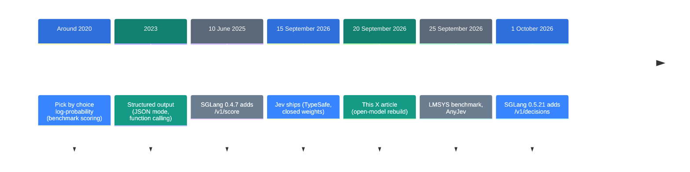
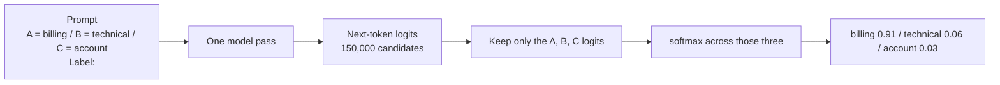

![[jev-local.en.mp4]]

[Source](https://x.com/_avichawla/status/2101563610644496464) · [Repo](https://github.com/sgl-project/sglang) · [한국어](https://neocello-ku.github.io/ko/trends/jev-local)

## Summary

TypeSafe released Jev on 15 September 2026. It is a closed model that makes decisions and writes no prose. Five days later, this X article rebuilt the same inference path on open models.

In the larger story, this is the step from "make the LLM write well" to "make it choose well". The method itself matches how benchmarks scored choices around 2020. What is new is that the same calculation is now a built-in route in an inference server.

New to these terms? Start with the "If you are new" section below.

## Where this sits in the story

Most LLM calls inside software do not need new prose. The code already knows the list of valid answers. Ticket routing, review scoring and document screening all work that way.



This article sits in the fifth slot. In the week after Jev shipped, 1,865 new repositories appeared. Kev 4B, LLM2Jev and AnyJev are rebuilds from the same weeks.

An earlier post here covers [Strata: a 125B model on a gaming PC](/trends/strata), dated 6 October 2026. That one was about fitting a large model onto your own machine. This one is the next question. Once the model is up, how should you call it?

### What is actually new here

| What | Novelty | Why |
| --- | --- | --- |
| Label logits + restricted softmax (method) | Low | Benchmarks have scored choices this way since about 2020. |
| Jev, a decision-only model (product) | Medium | The math is old. The calibration and the dedicated training are new. The weights are closed, so nobody outside can check. |
| `/v1/decisions` (infrastructure) | Medium | The server now does the label assignment and the single-token check. It landed 16 days after Jev shipped. |

So this is not an invention. A benchmark calculation got a product name, and two weeks later it became a built-in server route. The lesson is not a new technique. It is the choice of call path.

## If you are new: what is this about

### An LLM is a next-word guesser

Think of the autocomplete on your phone keyboard. You type three words and it offers the fourth. An LLM works the same way.

The model reads the text so far and picks one piece. It appends that piece and picks the next one. A long answer is that loop run hundreds of times. Each piece is a **token**.

### It scores every candidate before it picks

To pick the next piece, the model gives a score to every token it knows. Qwen2.5 has more than 150,000 candidates. Those scores are **logits**. A higher logit means a stronger preference.

### Essay questions and multiple choice

There are two ways to give an LLM a job. An exam is a good comparison.

- **Essay**: you ask "which team owns this ticket?" The model writes a sentence. Your code digs the answer out of that sentence. It costs time, and the answer is sometimes off the list.
- **Multiple choice**: you ask "pick A billing, B technical support, or C account". You read the A, B and C scores at the position where the answer would start. The model writes nothing.

This guide covers the multiple-choice path.

### Why the multiple-choice path helps

- The model runs once. It generates zero tokens.
- The answer is always on the list. No stray sentence gets in.
- Confidence comes back as a number. Example: billing 91%, technical 6%, account 3%.

### Where people use it

- Routing customer tickets to the right team
- Deciding whether a review is positive or negative
- Screening applications or expense claims against fixed rules

### Names in this guide

| Term | Plain meaning |
| --- | --- |
| Token | The smallest piece a model reads and writes. A word or part of one. |
| Logit | The score the model gives each next-token candidate. |
| softmax | The step that turns scores into shares that add up to 100%. |
| Label | The short marker on each choice. Here it is A, B or C. |
| SGLang | Open-source software that serves a model on your own machine. |
| Endpoint | The address you post a request to. Example: `/v1/score` |
| Jev | The closed decision model TypeSafe shipped in September 2026. |

## How it works: generation against scoring

Say a support ticket goes to billing, technical support or account access. The usual path makes the model write a sentence or a JSON object. Then your code pulls the answer out of those characters.

The scoring path writes nothing. You attach a one-token label to each choice and read only those label scores.



If the three logits are 8.2, 5.5 and 4.8, the shares are 0.91, 0.06 and 0.03. That is a split across the three choices. It is not the chance of being right.

Structured output is a different thing. It also constrains the shape, but it still emits the opening brace and then each token. Scoring skips that loop.

### Four rules to follow

- A label must be exactly one token. `"A"` and `" A"` are different tokens.
- Add an `OTHER` choice when the right answer may be missing.
- 0.91 is not an accuracy. Measure accuracy on labelled examples.
- Keep the automation threshold in code. Example: top above 0.80, lead above 0.20.

## What you need and how to run it

| Item | Requirement |
| --- | --- |
| GPU | One CUDA GPU. The article does not state the memory it needs. |
| Python | A virtual environment is advisable. |
| SGLang | 0.5.10.post1 (the article) or 0.5.21 (the easier path) |
| Model | Qwen/Qwen2.5-0.5B-Instruct (the article's example) |

The example model holds about 1 GB of bf16 weights. An 8 GB card is enough. That figure is my own arithmetic and does not appear in the article.

### Path 1. Build it yourself on `/v1/score`

#### Step 1. Install the packages and start the server

```bash
python3 -m venv .venv
source .venv/bin/activate
pip install "sglang[all]==0.5.10.post1" "requests==2.34.2"
python -m sglang.launch_server \
  --model-path Qwen/Qwen2.5-0.5B-Instruct \
  --host 127.0.0.1 --port 30000
```

The first launch downloads the model. The server then listens on port 30000. Run the next step in a second terminal.

#### Step 2. Save this script as `decide.py`

```python
import requests

URL = "http://127.0.0.1:30000"
MODEL = "Qwen/Qwen2.5-0.5B-Instruct"

CHOICES = {
    "A": "billing and payments",
    "B": "technical support",
    "C": "account access",
}
ticket = "I was charged twice for the same subscription."

options = "\n".join(f"{k} = {v}" for k, v in CHOICES.items())
prompt = (
    f"Ticket:\n{ticket}\n\n"
    "Question:\nWhich category matches the ticket?\n\n"
    f"Allowed labels:\n{options}\n\n"
    "Return only the label.\nLabel:\n"
)


def token_id(label):
    r = requests.post(
        f"{URL}/tokenize",
        json={"model": MODEL, "prompt": label, "add_special_tokens": False},
        timeout=30,
    )
    r.raise_for_status()
    ids = r.json()["tokens"]
    if len(ids) != 1:
        raise ValueError(f"{label!r} is {len(ids)} tokens: {ids}")
    return ids[0]


label_ids = [token_id(k) for k in CHOICES]

r = requests.post(
    f"{URL}/v1/score",
    json={
        "model": MODEL,
        "query": prompt,
        "items": [""],
        "label_token_ids": label_ids,
        "apply_softmax": True,
    },
    timeout=120,
)
r.raise_for_status()
scores = r.json()["scores"][0]

probs = {name: round(p, 3) for name, p in zip(CHOICES.values(), scores)}
print(max(probs, key=probs.get), probs)
```

The `token_id` function stops the script when a label is not one token. An empty `items` entry means you score the position right after the prompt.

#### Step 3. Run it

```bash
python decide.py
```

The article reports billing 0.678, technical 0.311 and account 0.011. Hardware and precision shift the digits a little. At a 0.70 threshold this ticket goes to a human.

### Path 2. Let `/v1/decisions` do the work

SGLang 0.5.21 added `/v1/decisions`. That release went out on 1 October 2026. The route applies the chat template, assigns the labels and checks the single token on the server. The `/tokenize` step disappears.

```bash
pip install "sglang[all]==0.5.21" "requests==2.34.2"
python -m sglang.launch_server \
  --model-path Qwen/Qwen2.5-0.5B-Instruct \
  --host 127.0.0.1 --port 30000
```

```python
import requests

r = requests.post(
    "http://127.0.0.1:30000/v1/decisions",
    json={
        "input": "I was charged twice for the same subscription.",
        "questions": [
            {
                "id": "team",
                "type": "choice",
                "question": "Which team should handle this ticket?",
                "options": [
                    {"name": "billing", "description": "Payments and subscriptions"},
                    {"name": "technical", "description": "Bugs and integrations"},
                    {"name": "account", "description": "Login and access"},
                ],
            }
        ],
    },
    timeout=60,
)
r.raise_for_status()
print(r.json()["answers"]["team"])
```

The `choice` field holds the top option. The `probabilities` field holds the share per option. The `label_mass` field holds how much full-vocabulary probability the labels hold together. A low value means the model prefers something outside your list.

There are three question types. `choice` takes 2 to 26 options, `score` takes 2 to 10 levels, and `yes_no` takes a yes or a no. The docs name only two validated models: Qwen3.8-27B and Qwen3.5-35B-A3B. For any other model the server checks each request and returns a 400 when a condition fails.

One detail deserves a warning. The docs still tell you to install a nightly build until a release carries the route. The 0.5.21 wheel already carries it. The docs trail the release here.

## Fact check

| Claim in the article | What I found | Verdict |
| --- | --- | --- |
| Logits 8.2, 5.5, 4.8 give 0.91, 0.06, 0.03 | My own arithmetic gives 0.9086, 0.0611, 0.0303 | Matches |
| Logits 25.278, 24.498, 21.189 give 0.678, 0.311, 0.011 | My own arithmetic gives 0.677762, 0.310879, 0.011359 | Matches |
| A, B and C are tokens 32, 33, 34 on Qwen2.5-0.5B | Confirmed in the published vocab.json | Matches |
| `"A"` and `" A"` can differ | The vocab.json has no `" A"` entry | Matches |
| `/v1/score` returns label scores | Confirmed inside the 0.5.10.post1 wheel | Matches |
| Scoring beats generation on speed | The article gives no timing. Its comparison path emits 32 tokens | No numbers given |
| The title: build your own Jev | The body states it rebuilds the inference path only | The title overstates |

Speed depends on the comparison. Against a path that writes a long answer, scoring wins clearly. Against a path that emits one answer token, the picture changes.

LMSYS published an independent measurement on 25 September 2026. The setup was one H200, 16 candidates and low load. On Qwen3-8B, multi-item scoring took 20.6 ms. One-token generation took 54.1 ms and single-item scoring took 53.1 ms. Single-item scoring and one-token generation sit close together.

The same post adds limits. The scoring advantage grows with load, and it is not always ahead at low load. With only two options, single-item scoring edges ahead of multi-item scoring on the smaller models.

I checked one more thing in the source. The `/v1/decisions` route refuses a server started with `--enable-mis`. So the headline multi-item number is not what that route gives you today.

The firmest gain is the contract, not the clock. You always get a score for every label you asked for. One-token generation can drop a label from the top list.

## What to use when

| Situation | Path |
| --- | --- |
| You know the answer list ahead of time | Scoring (this guide) |
| You cannot know the answer ahead of time | Normal generation |
| You only need a fixed shape | Structured output |
| Many options and heavy traffic | Scoring, where the gain is largest |
| Two options and light traffic | Close either way. Measure and pick |

## Sources

- [Original X article: Build your own Jev (100% local)](https://x.com/_avichawla/status/2101563610644496464)
- [SGLang repository](https://github.com/sgl-project/sglang)
- [SGLang docs: Decision models](https://docs.sglang.io/docs/supported-models/decision_models)
- [SGLang docs: Native APIs](https://docs.sglang.io/docs/basic_usage/native_api)
- [SGLang releases on PyPI](https://pypi.org/project/sglang/)
- [LMSYS: Scaling decision models with SGLang (25 September 2026)](https://www.lmsys.org/blog/2026-09-25-sglang-decision-models)
- [What Jev is (DataCamp)](https://www.datacamp.com/blog/system-one-models-jev)
- [Jev in the Wild (arXiv 2609.30216)](https://arxiv.org/pdf/2609.30216)

## Related

- [[trends/strata|Strata: a 125B model on a gaming PC]]

