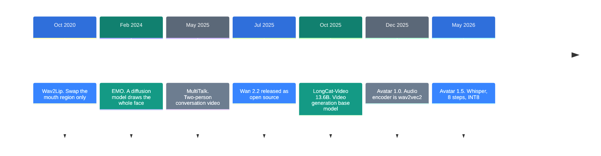
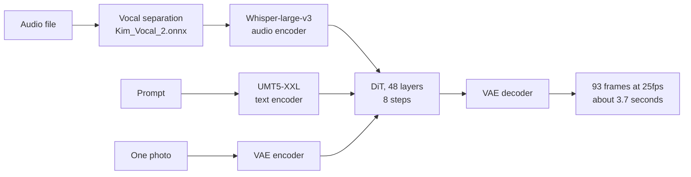

![[longcat-avatar-15.en.mp4]]

[Source](https://x.com/Dontgiveup_26/status/2106524415353909566) · [Repo](https://github.com/meituan-longcat/LongCat-Video) · [한국어](https://neocello-ku.github.io/ko/trends/longcat-avatar-15)

## Summary

On 21 May 2026, Meituan released LongCat-Video-Avatar 1.5. You give it a photo and an audio file. It returns a video of that person speaking. The weights carry the MIT license.

Talking-head generation has moved from research into product shape. There is no new technique here, and the authors say so in their own technical report. The engineering work went into production readiness. The bundle is commercial grade, and the weights are open.

New to these terms? Start with the 'If you are new' section below.

## Where this sits in the flow

People have driven faces from audio for six years. Early methods cut out the mouth region and pasted a new one. Models now draw the person and the background from scratch.



Two lines of work meet at the last step.

One line is the video base model. LongCat-Video uses the Wan VAE and the Google UMT5-XXL text encoder. I checked the demo code and the README acknowledgements.

The other line is two-person conversation. The Avatar project page is on `meigen-ai.github.io`. The MeiGen-AI team that built MultiTalk worked on this model.

### What is new here

| What | How new | Why |
| --- | --- | --- |
| Model architecture (technique) | Low | A swapped audio encoder, distillation, and INT8 are all prior work. The authors do not claim architectural novelty. |
| The released bundle (product) | High | Two-person audio, stylized domains, and long video ship together, with MIT weights. The baselines are HeyGen and Kling Avatar 2.0. |
| Cost to run (infrastructure) | Medium | DiT evaluations drop about 19x, and DiT weights drop by half. You still need two GPUs. |

Two earlier posts connect here. [Strata](https://neocello-ku.github.io/trends/strata) (2026-10-06) put a large model on a small GPU. The same INT8 trick appears here. [image-blaster](https://neocello-ku.github.io/trends/image-blaster) (2026-10-06) turned one photo into 3D. This model turns one photo into video.

The release packs scattered techniques into one bundle at commercial quality.

## If you are new: what is this about

### Two ways to make a talking video

- The old way: You already have footage of an actor. You cut out the mouth and draw a new mouth for the new lines. The mouth matches, but the face and the gestures stay old.
- The new way: You give one photo and one voice recording. The model draws the scene from scratch. The head nods and the hands move.

Avatar 1.5 is the new way.

### The part that hears the sound

A model cannot read an audio file directly. It needs a part that turns sound into numbers. That part is the **audio encoder**.

Version 1.0 used wav2vec2. Version 1.5 switched to Whisper-large-v3 from OpenAI. Whisper targets transcription. It separates speech sounds more sharply.

### Why this release is good

- One audio file and one photo are enough. You need no source footage.
- You may use it commercially. The MIT license covers the weights too.
- The model handles two speakers taking turns. Interview and panel formats work.

### Where people use it

- Turn a recorded announcement into a person speaking it
- Turn a podcast recording into a two-person conversation video
- Give a character drawing a voice and make a short clip

### Names in this guide

| Term | Plain meaning |
| --- | --- |
| DiT | The main model that draws the video. Short for Diffusion Transformer. |
| VAE | The part that shrinks video into small numbers and expands it back. |
| Text encoder | The part that turns the prompt into numbers. Here it is UMT5-XXL. |
| Audio encoder | The part that turns sound into numbers. In 1.5 it is Whisper-large-v3. |
| Step | How many times the model refines a noisy frame. More steps are slower. |
| Distillation | Teaching a model to copy a many-step result in few steps. |
| INT8 | Storing each number in one byte. Memory drops by half. |
| Segment | One chunk of generated video. Here it is 93 frames. |

## How it works

There are three inputs. A prompt, one photo, and an audio file.



The audio goes through vocal separation first. Background music would blur the mouth shapes. The run stops if no vocal track is found.

Longer video comes from joined segments. Each new segment reads the last 13 frames of the one before it. That keeps the scene from jumping.

The demo code has the length formula.

```
length (s) = 93/25 + (segments - 1) * 80/25
```

One segment gives 3.72 seconds. Five segments give 16.5 seconds.

## Requirements and steps

### Requirements

| Item | Requirement |
| --- | --- |
| GPU | Two CUDA GPUs. Every avatar example in the README assumes two. |
| VRAM | Not in the README. My own estimate is about 33GB per card. |
| Python | 3.10 (a conda environment is suggested) |
| PyTorch | 2.6.0 with cu124 |
| Disk | About 158GB for both repositories |

The VRAM math appears under fact-check item 8.

### Step 1. Clone the repo and make the environment

```shell
git clone --single-branch --branch main https://github.com/meituan-longcat/LongCat-Video
cd LongCat-Video
conda create -n longcat-video python=3.10
conda activate longcat-video
```

### Step 2. Install the dependencies

```shell
pip install torch==2.6.0+cu124 torchvision==0.21.0+cu124 torchaudio==2.6.0 \
  --index-url https://download.pytorch.org/whl/cu124
pip install ninja
pip install psutil
pip install packaging
pip install flash_attn==2.7.4.post1
pip install -r requirements.txt
conda install -c conda-forge librosa
conda install -c conda-forge ffmpeg
pip install -r requirements_avatar.txt
```

### Step 3. Download both weight sets

```shell
pip install "huggingface_hub[cli]"
huggingface-cli download meituan-longcat/LongCat-Video \
  --local-dir ./weights/LongCat-Video
huggingface-cli download meituan-longcat/LongCat-Video-Avatar-1.5 \
  --local-dir ./weights/LongCat-Video-Avatar-1.5
```

You need the base weights too. The demo code reads the tokenizer, the text encoder, and the VAE from the `LongCat-Video` folder.

### Step 4. Make a single-speaker video

```shell
torchrun --nproc_per_node=2 run_demo_avatar_single_audio_to_video.py \
  --context_parallel_size=2 \
  --checkpoint_dir=./weights/LongCat-Video-Avatar-1.5 \
  --stage_1=ai2v \
  --input_json=assets/avatar/single_example_1.json \
  --use_distill --model_type avatar-v1.5 --use_int8
```

Version 1.5 requires `--use_distill`. Drop it and the step count returns to 50. `--use_int8` works only with 1.5.

The input JSON follows the shipped example.

```json
{
  "prompt": "A western man stands on stage under dramatic lighting...",
  "cond_image": "assets/avatar/single/man.png",
  "cond_audio": { "person1": "assets/avatar/single/man.mp3" }
}
```

### Step 5. Raise the segment count for a longer clip

```shell
torchrun --nproc_per_node=2 run_demo_avatar_single_audio_to_video.py \
  --context_parallel_size=2 \
  --checkpoint_dir=./weights/LongCat-Video-Avatar-1.5 \
  --stage_1=ai2v \
  --input_json=assets/avatar/single_example_1.json \
  --num_segments=5 --ref_img_index=10 --mask_frame_range=3 \
  --use_distill --model_type avatar-v1.5 --use_int8
```

Five segments run about 16.5 seconds. Short audio gets padded with silence.

### Step 6. Switch scripts for a two-person conversation

```shell
torchrun --nproc_per_node=2 run_demo_avatar_multi_audio_to_video.py \
  --context_parallel_size=2 \
  --checkpoint_dir=./weights/LongCat-Video-Avatar-1.5 \
  --input_json=assets/avatar/multi_example_1.json \
  --use_distill --model_type avatar-v1.5 --use_int8
```

Put `person1` and `person2` in the input JSON. The `para` mode sums the two clips. They must have equal length. The `add` mode joins them in order. Unequal lengths are fine.

### Options worth knowing

| Situation | Option |
| --- | --- |
| Lip sync is off | `--audio_guidance_scale` 3 to 5 (fixed at 1.0 in distill mode) |
| The same motion repeats | `--ref_img_index=30` or a larger `--mask_frame_range` |
| You want more detail | `--resolution 720p` (768x1280) |
| VRAM is tight | `--use_int8` (1.5 only) |

## Fact-check

I checked each claim in the source post against the repo.

| Claim in the post | What I found | Verdict |
| --- | --- | --- |
| 1. Zero color distortion | The README says "without color drifting or quality degradation". There is no 0% figure and no measurement. | Overstated |
| 2. Minutes-long video, extended forever | The base demo defaults to 11 segments with the comment "1 minute video". Avatar segments are 3.2 seconds each. You can raise the count, but "forever" has no basis. | Conditional |
| 3. T2V, I2V, and lip sync in one 13.6B model | The 13.6B model unifies T2V, I2V, and continuation. Lip sync lives in separate weights. The avatar DiT is about 15.9B and downloads on its own. | Overstated |
| 4. Matches or beats Veo3, PixVerse, Wan 2.2 | In the README's own scoring, text-to-video overall is Veo3 3.48 against LongCat 3.38. Image-to-video puts LongCat last at 3.17. That table also covers the 2025 base model, not Avatar 1.5. | Overstated |
| 5. Whisper-large-v3 as the audio encoder | Correct. The code calls `WhisperModel` and the checkpoint holds `whisper-large-v3`. The config `audio_channel` of 1280 matches. | Matches |
| 6. Two-person conversation support | Correct. There is an example JSON and two `audio_type` modes. No quality measurement backs it up. | Conditional |
| 7. Faster through 8-step distillation | Steps drop from 50 to 8 and CFG turns off. By DiT evaluation count that is about 19x. No wall-clock figure is published. | Conditional |
| 8. INT8 cuts the VRAM load | DiT weights drop from 31.71GB to 15.89GB. The text encoder and Whisper stay, so about 33GB per card remains. | Conditional |
| 9. MIT license, free for commercial use | Correct. The LICENSE file is MIT and the README extends it to the weights. | Matches |
| 10. Grab it from Hugging Face and integrate | You can. You also need the base repo, and the two repositories total about 158GB. | Conditional |

### Where the speed number comes from

Turning on `--use_distill` overwrites three values. Steps become 8. Text CFG becomes 1.0. Audio CFG becomes 1.0.

When both CFG values are 1.0, classifier-free guidance turns off. With CFG on, each step evaluates the DiT three times. With CFG off, each step evaluates it once.

```
before: 50 steps x 3 = 150 evaluations
after:   8 steps x 1 =   8 evaluations
```

That is about 18.8x. This compares DiT evaluation counts. It is not measured wall-clock time.

### Where the VRAM number comes from

I computed it from Hugging Face file sizes. The INT8 files are exactly half the bf16 files, so the originals use bf16.

| Part | Size |
| --- | --- |
| DiT INT8 | 15.89 GB |
| Distillation LoRA | 2.52 GB |
| UMT5-XXL (as bf16) | 11.37 GB |
| Whisper-large-v3 | 3.09 GB |
| VAE | 0.26 GB |
| **Total** | **33.13 GB** plus activations |

The demo moves everything onto the GPU and never offloads to CPU. `--context_parallel_size` splits the spatial axis, so every GPU holds a full weight copy. Two cards still need 33GB each.

### No independent measurement yet

The technical report compares against three commercial services. They are HeyGen, OmniHuman 1.5, and Kling Avatar 2.0. It uses more than 500 cases. The authors ran that evaluation themselves. The README score table also says "our internal benchmark". As of 6 October 2026 I found no third-party benchmark.

## When to use what

| Situation | What to use |
| --- | --- |
| You need a talking video driven by audio | Avatar 1.5 (this guide) |
| You need plain video from text or a photo | The base LongCat-Video model |
| You want to extend an existing clip | `run_demo_video_continuation.py` |
| You have only one GPU | A commercial API or a smaller model |
| License terms matter to you | Avatar 1.5 (MIT, weights included) |

## Sources

- [LongCat-Video repository](https://github.com/meituan-longcat/LongCat-Video)
- [Avatar 1.5 project page](https://meigen-ai.github.io/LongCat-Video-Avatar-1.5-Page/)
- [Avatar 1.5 technical report (arXiv 2605.26486)](https://arxiv.org/abs/2605.26486)
- [LongCat-Video technical report (arXiv 2510.22200)](https://arxiv.org/abs/2510.22200)
- [Avatar 1.5 weights on Hugging Face](https://huggingface.co/meituan-longcat/LongCat-Video-Avatar-1.5)
- [MultiTalk repository (MeiGen-AI)](https://github.com/MeiGen-AI/MultiTalk)
- [Wav2Lip paper (ACM MM 2020)](https://arxiv.org/abs/2008.10010)
- [Source post](https://x.com/Dontgiveup_26/status/2106524415353909566)

## Related

- [[trends/strata|Strata: a 125B model on a gaming PC]]
- [[trends/image-blaster|image-blaster: one photo into a 3D space]]

