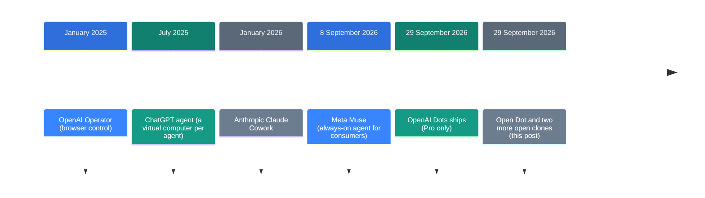
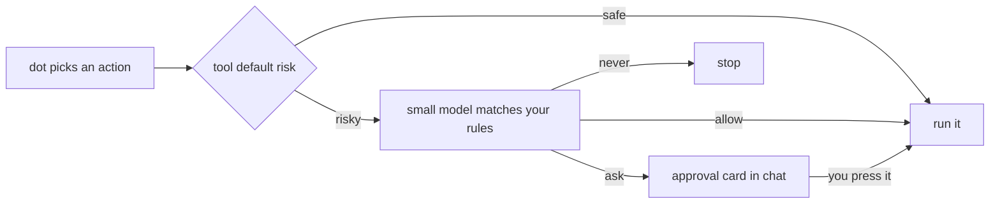

![[open-dot.en.mp4]]

[Source](https://x.com/KaranVaidya6/status/2105334408932954604) · [Repo](https://github.com/composio-community/open-dot) · [한국어](https://neocello-ku.github.io/ko/trends/open-dot)

## Summary

The Composio team published Open Dot on 29 September 2026. It is a Mac desktop app that does what OpenAI Dots does, and it runs on your own API key.

It is one of three open clones that appeared the day the paid product shipped. Every part of it already existed; what is new is how fast someone put the parts together. The claim of "the same capabilities" does not hold yet. New to these terms? Start with the "If you are new" section below.

## Where this sits in the story

OpenAI shipped Dots on 29 September 2026. It went only into plans that start at 100 dollars a month. That price is what set off the open source side.



This post is the last entry in that list. The first four added capability, and this one changes who owns it.

The Open Dot repo went up at 16:34 UTC, CopilotKit's OpenDots at 17:13, and feder-cr's dots at 23:06. All three landed within seven hours of the launch.

### What is new here

| What | How new | Why |
| --- | --- | --- |
| The agent loop (technique) | Low | It calls the built-in `computer` and `web_search` tools of the OpenAI Responses API. |
| The Mac desktop app (product) | Medium | In one day it ties together the app, browser profiles, a password vault, approval cards and voice calls. |
| App connections and sandboxes (infrastructure) | Low | No new infrastructure. It borrows Composio, E2B, Playwright and SQLite. |

This is assembly work, and every part came from somewhere else. The speed is what makes it worth a look, because an alternative appeared on the same day as the paid product.

### Reading this with the earlier post

I wrote [OpenAI dots: an always-on agent inside the subscription](/trends/openai-dots) on 2026-10-06. That post covers the product Open Dot wants to copy. It concluded that the technique stayed at 2025 levels, and that what changed was residency and billing.

Open Dot takes away the billing part but leaves residency where it was. The fact check below covers that.

## If you are new: what is this about

### A dot is one worker who does your tasks

A chatbot answers questions. A dot does the work instead. It opens your inbox, books times, signs in to sites and fills forms.

OpenAI keeps that worker on its own servers and charges rent. Open Dot puts the same worker on your Mac, so you pay the electricity bill instead. Here the bill is API usage.

### Why keep it on your own Mac

- You pay for what you use. A subscription bills you even in a quiet month.
- You can pick the model. Kimi or Qwen can replace OpenAI.
- Chat history and passwords stay on your disk.

### Where people use this

- Get a summary of your inbox and calendar at 08:00 on weekdays
- Wake a dot when your bank sends mail, and let it do the set task
- Hand over repeat work on sites that need a sign-in

### Names in this post

| Term | Plain meaning |
| --- | --- |
| dot | One agent with a name and a job of its own. |
| agent | A program that does the task instead of only answering. |
| routine | A scheduled job that wakes a dot at a set time. |
| trigger | A hook that wakes a dot when an event happens in an app. |
| Composio | A service that handles sign-in and calls for 1,500 apps. |
| E2B | A service that rents you a Linux computer over the internet. |
| computer use | A feature where the model sees the screen and clicks on it. |
| approval card | A box in the chat that asks you before a risky action. |
| Keychain | The built-in vault that locks secret values on a Mac. |

## How it works

Every action a dot wants to take goes through a rule check. Each tool has a default risk level, and your own rules sit on top.



You write rules as sentences, such as "when the dot wants to reply to an email, ask first". When rules overlap, "never" wins, and "ask" comes next. If the review model does not answer, the app plays safe and asks.

## What you need, and how to run it

### What you need

- An Apple Silicon Mac. The only build target is macOS arm64.
- Node 22 or newer, pnpm and Google Chrome.
- An OpenAI API key or an OpenRouter key. Voice calls need an OpenAI key.
- Optional: a Composio project key for triggers, an E2B key for cloud computers.

### Build the Mac app

Clone the repo, then run this.

```bash
pnpm install
pnpm desktop:build
```

You get `dist/Open Dot-<version>-arm64.dmg`. The build is not notarized, so right-click the app and choose **Open** the first time.

### Run it from source

```bash
cp .env.example .env.local
pnpm install
npx playwright install chromium
pnpm dev
```

Open `http://localhost:3100` in a browser. Run `pnpm desktop:dev` as well if you want the desktop window.

### What to do in Settings

1. Paste an OpenAI key or an OpenRouter key. Keys are stored encrypted.
2. Sign in to Composio and connect the apps you want. Sign-in opens in your normal browser.
3. For triggers, get a separate project key. You also reconnect the apps at platform.composio.dev.

### Main environment variables

| Variable | Default | What it does |
| --- | --- | --- |
| `OPENAI_API_KEY` | none | Model and voice calls |
| `OPENROUTER_API_KEY` | none | Kimi, DeepSeek, Qwen, GLM |
| `COMPOSIO_API_KEY` | none | Project key for triggers |
| `DOTS_MODEL` | the best model your key allows | Main model for the dots |
| `DOTS_COMPUTER_TOOL` | `computer` | Set `off` to read pages without seeing the screen |
| `E2B_API_KEY` | none | A cloud computer per dot |
| `DOTS_DATA_DIR` | `.data/` | Where chats, the vault and browser profiles live |

## Fact check

I compared the claims in the post against the repo.

| Claim | What I found | Verdict |
| --- | --- | --- |
| The same capabilities at 1/10th of the cost | The README has no cost figure. See the sum below. | Conditional |
| The same capabilities | Routines and triggers skip when the app closes or the Mac sleeps. | No |
| A browser per dot, stays logged in, secure | This matches the code. | Yes |
| Gmail, Calendar and 1,500 other apps | The count is right. Triggers need a separate key. | Conditional |
| You can call it and talk | It works. Voice needs an OpenAI key. | Conditional |
| Free and open source | There is no LICENSE file. | No |

### I redid the 1/10th sum

ChatGPT Pro starts at 100 dollars a month. One tenth of that is 10 dollars a month.

gpt-5.5 costs 5 dollars per million input tokens and 30 dollars per million output tokens. Assume a 10 to 1 split of input to output. Then 10 dollars buys about 1.2 million input tokens, or about 40,000 per day.

Computer use sends a screenshot and the page text on every turn. So 40,000 tokens a day covers one or two short routines. The system prompt is also rebuilt every turn, so prompt caching rarely helps.

The 1/10th figure therefore holds only for light use. Run it all day and it can cost more than the subscription.

### The always-on part is missing

The largest gap is the clock. Routines run as croner cron jobs, and those jobs live inside the Node process on your Mac.

The README says so too: routines and triggers run only while the app is open. A routine that comes due while the Mac sleeps is skipped.

An E2B key does not change this, because E2B only rents you the computer the dot uses. The clock that wakes the dot still sits on your Mac. With OpenAI Dots that clock is in the cloud too.

### There is no license

As of 6 October 2026 the repo has no LICENSE file. The GitHub API reports the license as empty.

With no license, default copyright applies. Viewing and forking work under the GitHub terms. You have no right to modify the code or redistribute it.

Both clones from the same day chose MIT, and both have more stars. CopilotKit's OpenDots has 3,697, feder-cr's dots 2,620, and Open Dot 578.

## When to use what

| Situation | What to use |
| --- | --- |
| Your Mac stays on and the tasks are light | Open Dot. No subscription fee. |
| Work must continue while you sleep | OpenAI Dots. The clock is in the cloud. |
| You want to modify the code for your product | CopilotKit/OpenDots or feder-cr/dots, both MIT. |
| You need a model other than OpenAI | Open Dot with an OpenRouter key. You give up screen clicks. |
| App credentials must not leave your machine | None of the three fit. Check the Composio path first. |

## Sources

- [Post: Karan Vaidya, 2026-09-30](https://x.com/KaranVaidya6/status/2105334408932954604)
- [Repo: composio-community/open-dot](https://github.com/composio-community/open-dot)
- [Composio pricing](https://composio.dev/pricing)
- [gpt-5.5 pricing](https://openrouter.ai/openai/gpt-5.5)
- [ChatGPT pricing](https://www.eesel.ai/blog/chatgpt-pricing)

## Related

- [[trends/openai-dots|OpenAI dots: an always-on agent inside the subscription]]

