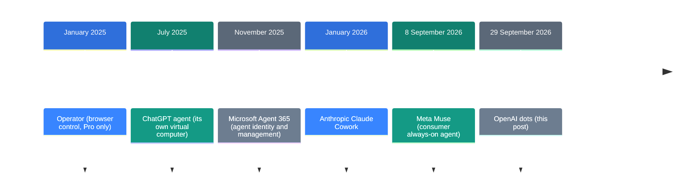
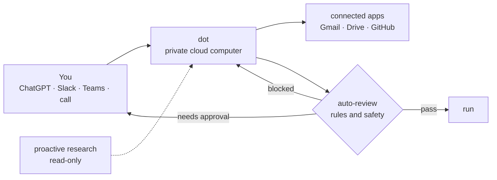

![[openai-dots.en.mp4]]

[Source](https://openai.com/index/introducing-dots/) · [한국어](https://neocello-ku.github.io/ko/trends/openai-dots)

## Summary

OpenAI released dots on 29 September 2026 at DevDay. Each dot gets its own cloud computer and keeps working while you are away.

In the wider story, this packages the 2025 agent parts into one subscription. The method is not new. What is new is that the agent is now resident, not a session. New to these terms? Start with the "If you are new" section below.

## Where this fits

Through 2025 the agent parts arrived one at a time. Browser control, a private virtual computer, long research runs and code work all shipped separately. In 2026 the race became who packages them first.

This launch sits at the last step. An agent with its own computer arrived in July 2025 with ChatGPT agent. dots turned that agent into a resident one. Meta Muse made the same move three weeks earlier.

### What is new here

| Layer | Novelty | Reason |
| --- | --- | --- |
| Virtual computer and browser loop (method) | Low | The same skeleton as ChatGPT agent in July 2025. |
| Resident agent product (product) | Medium | Multi-channel, proactive research and voice calls. Muse came three weeks earlier. |
| Approval and identity layer (infrastructure) | Medium | Auto-review plus enterprise identity. The same track as Agent 365. |

So this is not an invention. It packages the 2025 parts into a subscription that starts at 100 dollars a month.

### Reading it with the earlier posts

Two earlier posts in this archive sit at the opposite end. [Strata: a 125B model on a gaming PC](/trends/strata) is from 2026-10-06. It ran a large model on a 12 GB graphics card. [Scoring with a local LLM instead of writing](/trends/jev-local) is from the same day. It used a small model on a private server as a decision engine.

Both cut cost with your own hardware. dots does the opposite. It needs no hardware and charges a subscription from 100 dollars a month. Both directions are growing at the same time.

## If you are new

### An agent is a program that does the work

A chatbot answers questions. An agent does the task instead. It opens websites, fills forms and creates files.

Think of an adviser against a proxy. An adviser says "file this form". A proxy files the form for you.

### Session agents against resident agents

Agents so far were session agents. You open a window, give a task, and close it when the task ends. It is like a call to a support line. The call ends and the relationship ends.

dots is a resident agent. It is closer to a colleague at the next desk. That colleague keeps working while you are out. Tomorrow it still remembers yesterday.

### What its own computer means

Each dot gets a Linux computer and a Chrome browser inside OpenAI servers. Your laptop stays separate. A dot cannot read your files until you connect it.

This matters because it holds mistakes inside a box. If a dot runs a bad command, the damage stops there.

### Three good points

- Work does not stop. Tasks continue while you sleep.
- You can reach it in several places. ChatGPT, Slack, Teams and voice calls share one dot.
- Context follows you. Start a job in ChatGPT and continue it in Slack.

### Where people use it

- Find the cause as soon as a bug report lands in Slack
- Rerun an analysis and check odd values when new data arrives
- Prepare set documents such as invoices and wait for approval

### Terms in this post

| Term | Plain meaning |
| --- | --- |
| Agent | A program that does tasks instead of only answering. |
| dot | One resident agent that OpenAI sells. You give it a name. |
| GPT-6 Astra | The model behind dots. OpenAI's top model as of September 2026. |
| Proactive research | Background reading that a dot starts without being asked. |
| Sandbox | An isolated space that stops a program from reaching outside. |
| Auto-review | A check on an action before that action runs. |
| Custom Rules | Your rules about which actions a dot may take alone. |
| Prompt injection | An attack that hides commands in a page or an email. |
| Specialist dot | A dot with its own company identity and a fixed job. |

## How it works

The path of one dot has four boxes. You give a goal. The dot plans on its own computer. Auto-review checks the action. Only approved actions run.

Look at the dotted line apart from the rest. That background task uses read-only tools. It cannot send messages or change app content. OpenAI states that this limit is enforced in code.

The arrow back to you matters too. A dot asks first when it needs your approval. Tasks such as a password change always stay with you.

## What you need

You need no hardware. Everything runs in the OpenAI cloud. You do need the right plan and region.

| Item | Condition |
| --- | --- |
| Plan | Pro or Business Premium. Enterprise needs an admin to switch it on |
| Cost | The first dot costs nothing extra. The plan itself starts at 100 dollars a month |
| Region | Pro excludes the EEA, Switzerland and the UK. Business Premium covers every ChatGPT region |
| First setup | ChatGPT desktop app or a desktop browser |
| Mobile | Available after the first setup |

### Step 1. Create your first dot on a desktop

Open the ChatGPT desktop app. Then create a dot and give it a name. The mobile app cannot do the first setup.

### Step 2. Connect your apps

Open the Plugins section in Settings and pick your apps. ChatGPT, ChatGPT Work and Codex share these connections.

One point needs care. Disconnecting an app only stops new information. What the dot already read stays in its context.

### Step 3. Set Custom Rules

Write down which actions a dot may take alone. You can also require approval or block an action.

A rule that is too broad gets rejected. In one outside review only two rules passed. Keep each rule narrow.

### Step 4. Follow the work in Activity View

The desktop app shows running tasks in Activity View. Add context there or change direction. You can also stop a task.

### Step 5. Use secure sign-in for passwords

Supported sites use a secure sign-in form. Your password then stays out of the model context.

A password written in a document or a message is different. The model reads it. OpenAI states this limit in its safety post.

## Fact check

| Claim in the announcement | What I found | Verdict |
| --- | --- | --- |
| It runs on GPT-6 Astra and each dot has its own cloud computer | The launch post and the safety post agree. An outside review opened that computer. | True |
| The first dot costs nothing extra | True. The plan that includes it starts at 100 dollars a month. | True |
| It connects to more than 4,000 apps | Only the official figure exists. The list is not public, so nobody can check it. | Conditional |
| Your dot is always within reach | Pro excludes the EEA, Switzerland and the UK. First setup needs a desktop. | Conditional |
| Dots can do nearly anything | An outside test of 10 tasks averaged 8.8 of 10, with a low of 7.0. | Overstated |
| You are always in control | The design is detailed. In real use the approval requests repeated. | Conditional |
| Proactive research is read-only and enforced in code | OpenAI describes the structure. There is no way to check it from outside. | Conditional |

### Independent measurement at the same time

One review ran 10 business tasks on a ChatGPT Pro account over two days after launch. It scored setup effort, completion, accuracy, output quality and supervision from 0 to 2 each.

| Task | Score |
| --- | --- |
| AI platform comparison | 9.8 |
| Build and publish a webpage | 9.8 |
| Content plan from context | 9.8 |
| Recurring scheduled job | 9.8 |
| Brand skill integration | 9.6 |
| Meeting prep | 9.0 |
| Weekly business brief | 8.6 |
| Inbox triage | 7.5 |
| Spreadsheet build | 7.5 |
| Post-meeting follow-up | 7.0 |

The average is 8.8 out of 10. Two failure types came back again and again.

The first is the container of the output. The content was right but the format was wrong. Text instead of a PDF, chat text instead of a draft ready to send.

The second is the test environment. The spreadsheet passed the dot's own check. The formulas then broke in Google Sheets. The dot did not test it where the file would be used.

A second review gave 3 out of 5. Day-to-day friction scored 2.5 out of 5. Approval requests repeated. The dot did not fetch a 2FA code from an inbox it could read. Neither review could test the defence against prompt injection.

## When to use what

| Situation | Method |
| --- | --- |
| A job whose state changes over several days | dots |
| A single research run or code job | Deep Research, Codex |
| Strict output formats such as formulas | A human checks the result |
| Your data cannot leave the building | A local model (see the Strata and Jev posts) |
| You are an individual in the EEA, Switzerland or the UK | Not available. Business Premium only |

## Sources

- [Introducing dots (OpenAI, 2026-09-29)](https://openai.com/index/introducing-dots/)
- [How we build safety, security, and privacy into dots (OpenAI)](https://openai.com/index/how-we-build-safety-security-and-privacy-into-dots/)
- [OpenAI Dots Review: I Tested 10 Business Tasks](https://www.aiagentslibrary.com/blog/openai-dots-review/)
- [OpenAI Dots review 2026: safety, speed, price, and who it fits](https://www.eesel.ai/blog/openai-dots-review)
- [OpenAI launches Dots AI agents amid safety questions (NBC News)](https://www.nbcnews.com/tech/tech-news/openai-launches-dots-ai-agents-safety-questions-rcna600338)
- [OpenAI launches Dots, its bubbly agentic avatar (TechCrunch)](https://techcrunch.com/2026/09/29/openai-launches-dots-its-bubbly-agentic-avatar/)
- [OpenAI Operator (Wikipedia)](https://en.wikipedia.org/wiki/OpenAI_Operator)
- [Muse, AI agent (Wikipedia)](https://en.wikipedia.org/wiki/Muse_(AI_agent))

## Related

- [[trends/strata|Strata: a 125B model on a gaming PC]]
- [[trends/jev-local|Let a local LLM pick an answer instead of writing one]]

