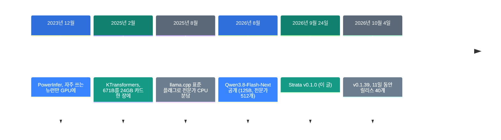
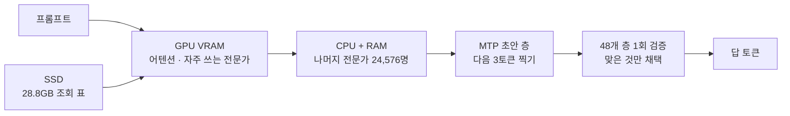

![[strata.mp4]]

[원문](https://github.com/Niko1221/Strata) · [레포](https://github.com/Niko1221/Strata) · [[en/trends/strata|English]]

## 요약

2026년 9월 24일, Strata가 나왔습니다. 그래픽카드 12GB와 일반 PC 메모리로 125B 모델을 돌리는 오픈소스 엔진입니다. 12일 만에 별이 13,900개 붙었습니다.

같은 일을 하는 도구는 3년 전부터 있었습니다. 새로운 것은 기법이 아니라 설치 경험입니다. 드라이버만 깔려 있으면 스크립트 하나로 끝납니다.

용어가 낯설면 아래 "처음이라면" 섹션부터 읽으세요.

## 흐름 속 위치: 왜 지금 이 이야기인가

큰 모델을 작은 그래픽카드에서 돌리는 방법은 계속 있었습니다. 문제는 쓰는 사람 쪽이었습니다. 명령줄 플래그를 알아야 썼습니다.



Strata는 다섯 번째 단계입니다. 앞의 세 단계가 만든 기법 위에 설치기 하나를 얹었습니다.

### 이 기술은 무엇이 새로운가

| 무엇 | 새로운 정도 | 이유 |
| --- | --- | --- |
| 전문가를 GPU와 CPU로 나누기 (기법) | 낮음 | PowerInfer가 2023년 12월에 같은 아이디어를 냈습니다. |
| 자체 엔진과 커널 (인프라) | 중간 | ggml 일부만 쓰고 나머지는 새로 짰습니다. 적응형 전문가 캐시와 KV 스트리밍이 그렇습니다. |
| 더블클릭 설치와 로컬 API (제품) | 높음 | 하드웨어 검사, 모델 내려받기, 서버 실행을 한 번에 합니다. |

정리하면 Strata는 새 발명이 아닙니다. 3년 묵은 기법을 처음으로 더블클릭 가능한 물건으로 만든 사례입니다.

## 처음이라면: 이게 무슨 이야기인가요

### 큰 모델은 왜 서버에서만 돌았나

AI 모델의 크기는 파라미터 수로 셉니다. 125B는 파라미터가 1,250억 개라는 뜻입니다. 이 숫자를 메모리에 올려야 모델이 돕니다.

보통은 그래픽카드 메모리에 전부 올립니다. 이 모델은 압축하지 않으면 354GB입니다. 게임용 카드는 12GB에서 24GB입니다.

### 전문가 섞기: 한 번에 다 쓰지 않습니다

요즘 큰 모델은 MoE 구조입니다. 전문가라고 부르는 작은 조각을 많이 두고 그중 몇 개만 씁니다.

Qwen3.8-Flash-Next는 전문가가 24,576명입니다. 토큰 하나를 쓸 때 10명만 일합니다.

큰 병원을 떠올려 보세요. 전문의가 2만 명이어도 환자 한 명은 10명만 만납니다. 진료실이 2만 개일 필요는 없습니다.

### Strata가 하는 일: 자리 배치

Strata는 이 성질을 씁니다. 자주 찾는 전문가만 그래픽카드에 두고 나머지는 PC 메모리에 둡니다.

- **그래픽카드(VRAM)**: 매번 쓰는 부분과 자주 찾는 전문가 몇천 명
- **시스템 RAM**: 전문가 24,576명 전부
- **CPU**: 카드에 없는 전문가를 직접 계산. GPU와 동시에 돌아갑니다
- **SSD**: 28.8GB짜리 조회 표. 토큰마다 몇 줄만 읽습니다

카드에 누가 남을지는 대화하는 동안 계속 바뀝니다.

### 압축: 2비트로 줄이기

354GB를 그대로 쓸 수는 없습니다. 그래서 숫자의 정밀도를 깎습니다. 이것을 양자화라고 부릅니다.

원본은 가중치 하나에 16비트를 씁니다. Strata가 쓰는 파일은 2비트에서 3.5비트입니다. 용량이 66GB에서 84GB로 줄어듭니다.

깎으면 품질도 깎입니다. 얼마나 깎이는지는 아래 팩트체크에서 숫자로 봅니다.

### 왜 좋은가

- 월 구독료 없이 내 PC에서 큰 모델을 씁니다.
- 글이 밖으로 나가지 않습니다.
- OpenAI와 Anthropic 호환 API라 쓰던 앱을 그대로 붙입니다.

### 이런 곳에 씁니다

- 반복이 많고 양이 큰 코드 작업
- 밖으로 내보내면 안 되는 문서 다루기
- 코딩 에이전트의 값싼 기본값

### 이 글에 나오는 이름들

| 용어 | 쉬운 뜻 |
| --- | --- |
| 토큰 | 모델이 글을 읽고 쓰는 최소 조각. 영어에서 단어의 약 3/4. |
| 파라미터 | 모델이 학습으로 얻은 숫자. 125B는 1,250억 개. |
| MoE | 전문가 섞기. 조각을 많이 두고 몇 개만 쓰는 구조. |
| 전문가 | MoE의 조각 하나. 이 모델은 24,576개. |
| 양자화 | 가중치의 정밀도를 깎아 용량을 줄이는 작업. |
| VRAM | 그래픽카드가 가진 메모리. |
| 컨텍스트 | 모델이 한 번에 기억하는 글의 길이. |
| 추측 디코딩 | 작은 층이 먼저 찍고 큰 모델이 확인하는 가속 방법. |
| tok/s | 초당 토큰 수. 속도 단위. |

## 동작 방식



### 찍고 확인하기

모델 안에는 MTP라는 작은 초안 층이 있습니다. 이 층이 다음 토큰 3개를 먼저 찍습니다.

그다음 큰 모델이 48개 층을 한 번 지나며 3개를 한꺼번에 확인합니다. 맞은 것만 남기고 다음 토큰 하나를 직접 씁니다.

한 번 지날 때 평균 2.4개에서 3.2개가 나옵니다. 레포는 이것으로 1.6배에서 1.8배 빨라진다고 밝힙니다.

### 긴 글 읽기

프롬프트는 최대 8,192토큰씩 묶어서 읽습니다. 이 사이에 다음 층의 전문가가 PCIe로 흘러 들어옵니다.

그래서 긴 문서는 초당 1,000토큰 넘게 읽습니다. 첫 메시지는 3만 토큰당 약 1분 걸립니다. 이어지는 메시지는 몇 초 만에 시작합니다.

## 준비물

| 항목 | 요구 사항 |
| --- | --- |
| 그래픽카드 | NVIDIA RTX 20·30·40·50 시리즈, 또는 AMD RX 6800/6900·7700 XT 이상. VRAM 12GB 이상 |
| 시스템 RAM | 32GB 이상. 64GB면 모든 사이즈가 들어갑니다 |
| CPU | AVX2를 지원하는 x86-64. AVX-512면 조금 빠릅니다 |
| 디스크 | 모델 70~80GB에 초안 층 약 6GB. NVMe SSD 권장 |
| 드라이버 | NVIDIA 580 이상, 또는 AMD 최신 드라이버 |

함정이 하나 있습니다. 모델은 VRAM이 아니라 시스템 RAM에 올라갑니다. 카드가 12GB여도 RAM이 32GB 미만이면 돌지 않습니다.

## 설치하고 실행하기

### 1단계. 내려받으세요

```bash
git clone https://github.com/Niko1221/Strata
cd Strata
```

윈도우는 zip으로 받아서 풀어도 됩니다.

### 2단계. 설치 스크립트를 실행하세요

```bash
./setup.sh
```

윈도우는 `START-HERE.bat`을 더블클릭하세요.

스크립트가 카드와 RAM을 보고 사이즈를 추천합니다. 질문마다 엔터를 누르면 추천값으로 갑니다.

그다음 모델 약 70GB를 내려받습니다. 중간에 끊기면 다시 실행하세요. 받던 곳부터 이어 받습니다.

### 3단계. 첫 실행을 기다리세요

모델이 올라오는 1~3분 동안 PC가 멈춘 것처럼 보입니다. RAM에 35~55GB를 올리는 중입니다. 창을 닫지 마세요.

끝나면 브라우저가 `http://127.0.0.1:8080`을 엽니다.

### 4단계. 쓰던 앱을 붙이세요

| 붙일 곳 | 설정 |
| --- | --- |
| OpenAI 호환 앱 | 기본 주소 `http://127.0.0.1:8080/v1` |
| Anthropic 호환 앱 | `http://127.0.0.1:8080/v1/messages` |
| Claude Code | `ANTHROPIC_BASE_URL=http://127.0.0.1:8080` |
| Codex CLI | `/v1/responses` |

API 키와 모델 이름은 아무 값이나 넣어도 됩니다.

### 다른 사이즈로 바꾸려면

```bash
./setup.sh --setup
./setup.sh --setup --family coder
./setup.sh --setup --host 0.0.0.0 --api-key <secret>
```

첫 줄은 메뉴에서 고르기, 둘째 줄은 RAM 32GB용 코딩 모델입니다. 밖에서 접속하게 열 때는 키를 꼭 거세요.

## 팩트체크

| README의 주장 | 확인 결과 | 판정 |
| --- | --- | --- |
| 125B 모델을 게임용 PC에서 돌린다 | 맞습니다. 단 2~3.5비트로 압축한 파일이고, RAM 32GB와 디스크 80GB가 같이 필요합니다 | 조건 있음 |
| RTX 5070 12GB에서 94 tok/s | 측정 기계와 엔진 버전, 원시 데이터 경로를 밝혔습니다. 자체 측정입니다 | 일치 |
| 추측 디코딩으로 1.6~1.8배 | 패스당 평균 2.4~3.2토큰이라는 숫자와 앞뒤가 맞습니다. 외부 재현은 없습니다 | 근거 있음, 검증 전 |
| 큰 사이즈가 조금 더 똑똑하다 | IQ2_XS 89.16 대 IQ3_S 93.26입니다. "조금"보다 큽니다 | 과소 표현 |
| IQ3_S는 공개 시험에서 원본과 같다 | 93.26 대 93.12로 맞습니다. 측정 주체가 양자화를 만든 팀입니다 | 일치 |
| Coder는 원본 SWE-bench의 91% | 보고값은 91.3%입니다. 코드 밖과 중국어에서 약하다고 직접 밝힙니다 | 일치 |
| 그림도 읽는다 | 켤 수 있습니다. AMD는 리눅스에서 CPU로만 돕니다 | 조건 있음 |

### 2비트는 얼마나 손해인가

이 질문이 제일 중요합니다. 양자화를 만든 ISTA-DASLab이 숫자를 공개했습니다.

| 사이즈 | 비트/가중치 | 용량 | Task 평균 | LiveCodeBench v6 |
| --- | ---: | ---: | ---: | ---: |
| BF16 원본 | 16.0 | 354GB | 93.12 | 87.43 |
| Q2_0 | 2.40 | 66.4GB | 89.07 | 81.14 |
| IQ2_XS | 2.50 | 68.0GB | 89.16 | 83.43 |
| IQ3_XXS | 3.00 | 75.8GB | 92.57 | 86.29 |
| IQ3_S | 3.50 | 83.6GB | 93.26 | 86.86 |

읽는 법은 이렇습니다. 3비트부터는 원본과 거의 같습니다. 2비트대는 4점쯤 떨어지고 코드에서 더 떨어집니다.

설치기의 기본 추천은 RAM 64GB에서 IQ2_XS입니다. 즉 기본값은 원본이 아니라 89점짜리입니다. RAM이 96GB면 IQ3_S를 고르세요.

단서를 하나 답니다. 이 표의 측정 주체는 양자화를 만든 팀입니다. 레포 밖의 독립 측정은 찾지 못했습니다.

### 속도는 믿을 만한가

레포는 측정 기계, 엔진 버전, 원시 데이터 경로를 모두 적어 둡니다. 이 점은 좋습니다.

레포 안에 커뮤니티 보고도 두 건 들어 있습니다. RTX 5090 보고는 IQ2_XS에서 디코드 중앙값 179.4 tok/s였습니다. README의 5070 수치보다 빠릅니다.

다만 두 보고 모두 레포 안의 PR입니다. 독립된 제3자 벤치마크는 아직 없습니다.

### 이미지는 조심하세요

이미지 입력은 선택 기능입니다. AMD 카드는 리눅스에서만, 그것도 CPU로 돕니다. 윈도우는 아직 안 됩니다.

레포 이슈 #767은 CPU 경로가 이미지를 300토큰으로 자른다고 지적합니다. llama.cpp는 같은 모델 계열에 1,024토큰 이상을 권합니다. 좌표 지목이나 작은 글자 읽기는 먼저 시험해 보세요.

## 언제 무엇을 쓰나

| 상황 | 쓸 것 |
| --- | --- |
| RAM 32GB, 코드 작업 위주 | Coder |
| RAM 48GB | Q2_0 또는 IQ2_XS |
| RAM 64GB, 일반 용도 | IQ2_XS |
| RAM 96GB 이상, 품질 우선 | IQ3_S |
| 답을 빨리 받고 싶다 | Swift 1.5 |
| 품질이 비용보다 중요하다 | 로컬 말고 API |

## 출처

- [Strata 레포](https://github.com/Niko1221/Strata)
- [Strata 상세 문서 DETAILS.md](https://github.com/Niko1221/Strata/blob/main/docs/DETAILS.md)
- [Strata 모델 선택 문서 MODELS.md](https://github.com/Niko1221/Strata/blob/main/docs/MODELS.md)
- [Qwen3.8-Flash-Next 모델 카드](https://huggingface.co/Qwen/Qwen3.8-Flash-Next)
- [ISTA-DASLab GSQ-RCO GGUF 양자화](https://huggingface.co/ISTA-DASLab/Qwen3.8-Flash-Next-GSQ-RCO-GGUF)
- [PowerInfer 논문 (2023-12)](https://arxiv.org/abs/2312.12456)
- [KTransformers](https://github.com/kvcache-ai/ktransformers)
- [Strata 이슈 #767](https://github.com/Niko1221/Strata/issues/767)
