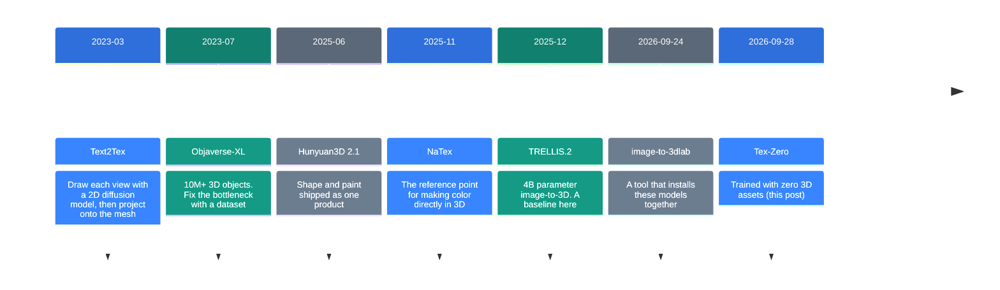
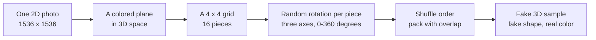
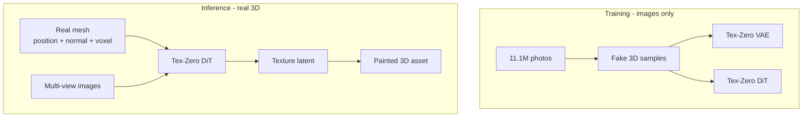

![[tex-zero.en.mp4]]

[Source](https://arxiv.org/abs/2609.34621) · [Repo](https://github.com/wangjiangshan0725/Tex-Zero) · [한국어](https://neocello-ku.github.io/ko/trends/tex-zero)

## Summary

On 2026-09-28, a paper appeared on arXiv. It trained a 3D texture generation model without a single real 3D asset.

That matters because the bottleneck in 3D generation is the supply of 3D training data, not the model.

The idea is worth reading, but you cannot use anything today. There is no code and no checkpoint. New to these terms? Start with the "If you are new" section below.

## Where this fits: why now

3D generative models always trail 2D image models, and the gap is data volume. The web holds billions of images. Textured 3D assets number about ten million.

The field split into two paths over this. One path collects more 3D data. The other moves what 2D models already know into 3D.



This paper sits on the last line. From November 2025, papers that make color directly in 3D arrived in a cluster. Tex-Zero keeps that method and changes what it trains on, which makes training cheaper.

An earlier post, [image-to-3dlab v0.3.7](https://neocello-ku.github.io/trends/image-to-3dlab) (2026-10-07), covered how to install and run these models. This one is about how such a model gets built.

### What is new here

| What | Novelty | Why |
| --- | --- | --- |
| Turning images into 3D training samples (technique) | Medium | Slicing a plane and rotating the pieces at random is a new combination. Using 2D priors for 3D started in 2022. |
| A tool you can run (product) | Low | No code, no checkpoint, no demo. |
| Training data supply (infrastructure) | Medium | It shows a way around 3D collection cost. The proof rests on one internal test set. |

So this is a proposal about where training data comes from. It is one counterexample to an assumption the field treats as settled.

## If you are new: what is this about

### A 3D object splits into shape and color

Think of a clay figure. First you shape it. Then you paint it.

Computer 3D works the same way. The shape is a **mesh**. The paint on that mesh is a **texture**.

3D generative tools usually build these two parts separately. This paper only covers the painting part.

### Two ways to paint a mesh

| Method | Analogy |
| --- | --- |
| Back-projection | Draw the figure from six directions, then stick those drawings onto it. |
| Native 3D | Set a color on each point of the surface directly. |

Back-projection leaves a seam at every join. Native 3D has no seams, but it needs many painted 3D assets for training.

### The assumption this paper breaks

Collecting 3D assets for training costs money. Someone has to scan them or model them by hand.

The authors guessed that texture training needs good color, and that the shape under it may not need to be real.

So they placed one photo as one flat plane in 3D space, cut it into 16 pieces, and gave each piece a random rotation. Packed together, the pieces make a lumpy blob.

The color is the original photo. Only the shape is fake. A model trained on these fake samples then handles real 3D assets.

### Three good points

- Training data comes from photos. The paper used 11.1 million of them.
- No money goes into collecting 3D assets.
- The fine color detail of a photo enters training unchanged.

### Where this gets used

- Painting 3D props for games and film
- Filling in color on missing faces of a scanned mesh
- Building equipment models for a digital twin

### Names in this post

| Term | Plain meaning |
| --- | --- |
| Mesh | The shape of a 3D object. A shell of joined triangles. |
| Texture | The color and pattern on the surface of a mesh. |
| Native 3D texture generation | Setting color directly in 3D, with no 2D drawing step. |
| Back-projection | Sticking 2D drawings from several views back onto a mesh. |
| VAE | A model that shrinks data into a small code and restores it. |
| Latent space | The space where those small codes live. |
| DiT | A diffusion model that creates new content in latent space. |
| Voxel | One cell of a grid that divides 3D space into boxes. |
| LPIPS | How close two images look to a human eye. Lower is better. |
| PSNR | How close pixel values match in numbers. Higher is better. |

## How it works

### Building the training data



Each axis gets its own rotation angle, drawn from 0 up to 360 degrees. The pieces have to overlap, because pieces that float apart do not train the model.

### Training and inference



The VAE puts 2D images and 3D textures into one latent space. The multi-view condition images also become planes and go through the same VAE. The paper says this narrows the representation gap and raises quality.

### Do not misread the input

The paper says: `Tex-Zero takes a real 3D geometry and its multi-view images as input.`

This is not a one-photo tool. Two steps come before it.

1. Novel-view synthesis makes the multi-view images.
2. Those images reconstruct the mesh.
3. The mesh and the images go into Tex-Zero.

So Tex-Zero only works as the last stage of a pipeline you assemble yourself.

### Model size

| Part | Setting |
| --- | --- |
| VAE | 5 resolution levels, channel widths 128, 256, 512, 512, 512 |
| VAE factor | 16x spatial downsampling, 16 latent channels (f16c16) |
| DiT blocks | 12 dual-stream plus 24 single-stream |
| DiT width | Hidden 1024, 8 attention heads |

The paper gives no parameter count. At width 1024, the DiT works out to about 600 million. One block costs roughly 12 x 1024 squared, and a dual block costs twice that. For comparison, TRELLIS.2 has 4 billion.

## What you can do today

There is no run command to give you, because the repository holds no code.

The repository has six files in total.

```
README.md
data-construction.png
main-results.png
method.png
overview-comparison.png
teaser.png
```

| Item | As of 2026-10-08 |
| --- | --- |
| Code | None |
| Checkpoint | None. Nothing on Hugging Face either |
| Install files | None |
| Demo | None. The project page is this repository |
| LICENSE | No file. The default is all rights reserved |
| Release request | One issue, opened 2026-10-03. No reply |

### Check these when it ships

1. Check the inference VRAM first. The paper gives no number.
2. Check which model makes the multi-view images.
3. Read the license. Commercial terms do not exist yet.
4. Measure on your own data, not the internal 160-sample set.

### What to do instead

Build a baseline now, so you can compare on the day it ships.

Paint a few of your own objects with TRELLIS.2 or Hunyuan3D. The install steps are in the earlier [image-to-3dlab](https://neocello-ku.github.io/trends/image-to-3dlab) post.

## Fact check

| Claim | What we found | Verdict |
| --- | --- | --- |
| It trains without 3D assets | In Table 1, an image-only VAE reconstructs real 3D assets. 3D LPIPS 0.0154 to 0.0316 | Matches |
| The VAE reconstructs 3D assets at high quality | Matched settings show LPIPS wins three times and PSNR-PC loses three times | Conditional |
| It beats NaTex | Six-view LPIPS 0.0340 against 0.0754. But the test set is 160 internal samples | Conditional |
| Title: are 3D assets required | Table 3 shows 2D+3D beats 3D alone | "Not required" is the precise reading |
| 11.1M images at 1536x1536 | Stated in the paper | Matches |
| Training and inference hardware | Absent from both the paper and the README | No evidence |
| You can run the code and weights | Only a README and five PNG files | Not possible today |
| One photo is enough as input | The input is a mesh plus multi-view images | Easy to misread |

### Pairing the matched settings

Mixing VAE settings changes the conclusion, so each row below compares two models at the same setting.

| VAE setting | Image-trained LPIPS (lower better) | 3D-trained LPIPS | Image-trained PSNR-PC (higher better) | 3D-trained PSNR-PC |
| --- | --- | --- | --- | --- |
| f8c16 | **0.0154** | 0.0208 | 34.03 | **36.55** |
| f16c32 | **0.0229** | 0.0343 | 32.59 | **33.67** |
| f16c16 | **0.0316** | 0.0345 | 30.10 | **30.90** |

All three settings point the same way. The image-trained model wins every perceptual score and loses every numeric color score. The abstract and README report only the winning side.

So a model trained on fake shapes makes color that looks right to a person. It is weaker at matching the exact original color values.

### The answer to the title question

Table 3 answers it. DiT LPIPS is 0.0302 with 3D data alone. It drops to 0.0216 with 2D and 3D together.

The paper says it directly: `Image-derived data remains beneficial when textured 3D assets are available.`

The authors never claim 3D assets are useless. Their answer is that such assets are not required, which is a weaker claim.

### Limits of the evidence

| Item | Status |
| --- | --- |
| Test set | 160 internal samples. Not public, so nobody can reproduce it |
| Baseline settings | Official checkpoints at default settings |
| User study | None |
| Public benchmark | We found no shared benchmark in this subfield |
| Conflict of interest | The first author of NaTex is the project lead here |

The last row is the one to weigh: the team compared against its own earlier model, so this is not an independent comparison.

## When to use what

| Situation | What to use |
| --- | --- |
| You need to paint a 3D asset today | TRELLIS.2 or Hunyuan3D |
| You need texture with no visible seams | A native method such as NaTex or TRELLIS.2 |
| You lack 3D data to train your own model | Borrow the data construction idea from this paper |
| Exact color values matter | A model trained on 3D assets |
| Looking right to a person is enough | An image-trained model is a candidate |

## Sources

- [Paper: Does Native 3D Texture Generation Necessarily Require 3D Assets for Training? (arXiv:2609.34621)](https://arxiv.org/abs/2609.34621)
- [Paper full text, HTML](https://arxiv.org/html/2609.34621v1)
- [GitHub: wangjiangshan0725/Tex-Zero](https://github.com/wangjiangshan0725/Tex-Zero)
- [NaTex (arXiv:2511.16317)](https://arxiv.org/abs/2511.16317)
- [Text2Tex (arXiv:2303.11396)](https://arxiv.org/abs/2303.11396)
- [Objaverse-XL (arXiv:2307.05663)](https://arxiv.org/abs/2307.05663)
- [Earlier post: image-to-3dlab v0.3.7](https://neocello-ku.github.io/trends/image-to-3dlab)

## Related

- [[trends/image-to-3dlab|image-to-3dlab v0.3.7: three 3D routes on NVIDIA Linux, two of them in South Korea]]
- [[trends/image-blaster|image-blaster: one photo into a 3D space]]

